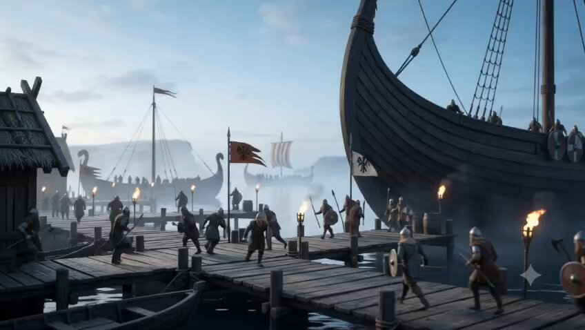
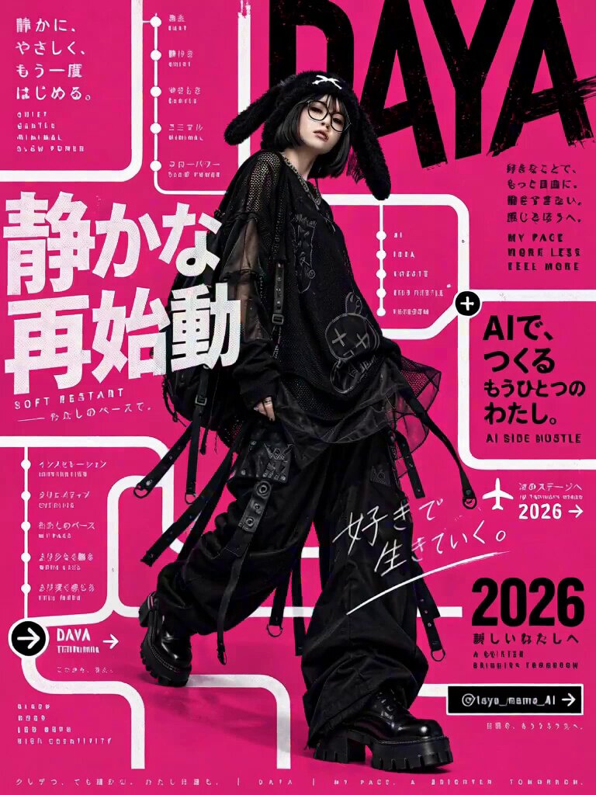
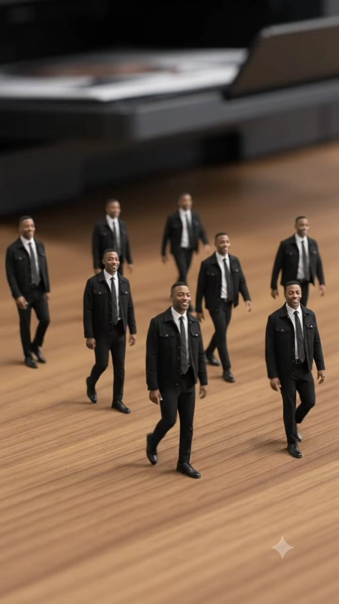
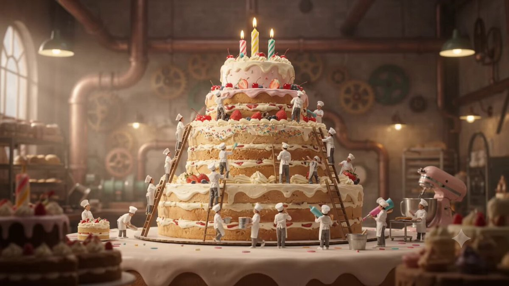
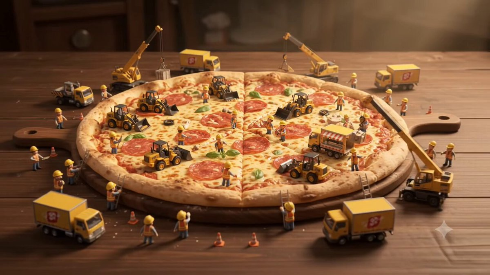

# Gemini · Biblioteca de prompts · Leadde.ai

[](README.md) [](README_zh.md) [](README_zh-TW.md) [](README_ja-JP.md) [](README_ko-KR.md) [](README_th-TH.md) [](README_vi-VN.md) [](README_hi-IN.md) [](README_es-ES.md) [-lightgrey)](README_es-419.md) [](README_de-DE.md) [](README_fr-FR.md) [](README_it-IT.md) [-lightgrey)](README_pt-BR.md) [](README_pt-PT.md) [](README_tr-TR.md)

> **Prompts de calidad seleccionados cada día**

Descubre prompts completos para crear imágenes, vídeos y 3D con IA. Explora por estilo, consulta versiones multilingües y encuentra a los autores originales.

[Explora Leadde.ai →](https://leadde.ai/?utm_source=github&utm_medium=readme&utm_campaign=prompt-library&utm_content=gemini)

## Conoce Leadde.ai

Leadde.ai ayuda a los equipos a convertir documentos, diapositivas y texto en vídeos empresariales con IA para formación, incorporación y marketing.

Marca este repositorio con una estrella para seguir nuestra selección diaria e inspirarte con nuevas ideas.

**5** Prompts · Última incorporación: **2026-09-09**

<a name="catalog"></a>

## Explorar por categoría

[Cine / Fotograma de película](#category-cinematic-film-still) · [Render 3D](#category-3d-render)

<a name="all-prompts"></a>

<a name="category-cinematic-film-still"></a>

## Cine / Fotograma de película

<a name="prompt-2097152276452561325"></a>

### Traducción en curso

Autor：[@MohdAdnanA86218](https://x.com/MohdAdnanA86218) · [Publicación original](https://x.com/MohdAdnanA86218/status/2097152276452561325)

Cine / Fotograma de película · Publicado

**Resumen:** Traducción en curso



**Prompt**

```text
Traducción en curso
```

[↑ Volver a categorías](#catalog)

---

<a name="prompt-2096612096003965254"></a>

### Plano de seguimiento de estilo cinematográfico comercial donde un personaje camina junto a tipografía 3D y rutas visuales que aparecen continuamente, interactuando con elementos de texto en el espacio antes de pasar a la revelación de un logotipo.

Autor：[@taya\_mama\_AI](https://x.com/taya_mama_AI) · [Publicación original](https://x.com/taya_mama_AI/status/2096612096003965254)

Cine / Fotograma de película · Render 3D · Personaje · Texto / Tipografía · Publicado

Publicación original：[@taya\_mama\_AI](https://x.com/taya_mama_AI) · [Publicación original](https://x.com/taya_mama_AI/status/2095076567416451105)

**Resumen:** Plano de seguimiento de estilo cinematográfico comercial donde un personaje camina junto a tipografía 3D y rutas visuales que aparecen continuamente, interactuando con elementos de texto en el espacio antes de pasar a la revelación de un logotipo.



**Prompt**

```text
Película comercial.

Mantén el color de fondo inicial a lo largo de toda la secuencia.

La cámara sigue suavemente al personaje con un movimiento de desplazamiento horizontal continuo, moviéndose a su lado mientras camina.

El texto y las líneas de conexión aparecen progresivamente a través de la pantalla, formando una ruta visual continua.

A medida que el personaje camina, reconoce el texto y los elementos gráficos que aparecen a su alrededor como objetos físicos que existen realmente en el mismo espacio. Interactúa de forma natural con estos elementos a medida que avanza: tocando ocasionalmente el texto cercano con la punta del dedo, mirando hacia arriba a las palabras situadas sobre él, mirando de reojo a los gráficos, apartándose ligeramente para esquivar un elemento, agachándose debajo de uno o deteniéndose brevemente para observar algo.

Una línea continua, semejante a una vía de tren o una ruta visual, conecta un elemento de texto con el siguiente. El texto de la imagen de referencia aparece secuencialmente a lo largo de este camino conectado, siguiendo el orden original.

Los elementos de texto y gráficos no deben parecer decoraciones planas de fondo. Deben sentirse físicamente presentes en el mismo espacio tridimensional que el personaje, con relaciones espaciales e interacción convincentes.

No repitas ni dupliques ningún texto.

Mantén el ritmo general rápido, rítmico y fluido. El movimiento de desplazamiento horizontal debe permanecer continuo e ininterrumpido a lo largo de la secuencia.

Reproduce fielmente todo el texto de la imagen de referencia sin caracteres distorsionados, tipografía corrupta, errores ortográficos o redacción alterada.

Para la transición final, un objeto o elemento gráfico grande en primer plano pasa muy cerca por delante de la cámara, cubriendo por completo todo el encuadre y creando una transición natural de barrido con desenfoque de primer plano.

A medida que el objeto en primer plano despeja el encuadre, revela a la perfección la pantalla final con el logotipo.

El movimiento de cámara debe ser fluido, dinámico y cinematográfico.

Prioriza la interacción entre el personaje y los elementos de texto/gráficos por encima de todo lo demás.

BGM: Música de ritmo rápido, rítmica y con un compás marcado.
```

[↑ Volver a categorías](#catalog)

---

<a name="prompt-2097242290859241833"></a>

### Utiliza la imagen subida del hombre adulto como referencia visual y de identidad principal para el personaje principal en una escena de fotocopiadora de oficina donde emergen clones en miniatura.

Autor：[@abs\_uiux](https://x.com/abs_uiux) · [Publicación original](https://x.com/abs_uiux/status/2097242290859241833)

Cine / Fotograma de película · Personaje · Publicado

**Resumen:** Utiliza la imagen subida del hombre adulto como referencia visual y de identidad principal para el personaje principal en una escena de fotocopiadora de oficina donde emergen clones en miniatura.



**Prompt**

```text
Utiliza la imagen subida del hombre adulto como referencia visual y de identidad principal para el personaje protagonista.

CONSISTENCIA DE IDENTIDAD:
Mantén una fuerte consistencia visual con el hombre adulto subido a lo largo de todo el vídeo. Conserva sus rasgos faciales reconocibles, tono de piel, edad aproximada, estructura facial, peinado, barba o vello facial si lo tuviera, cejas, ojos, nariz, labios, orejas, proporciones corporales y vestimenta.

Todas las versiones en miniatura que aparezcan en la escena deben representar claramente al mismo hombre adulto y permanecer visualmente consistentes con la referencia subida. Evita cambios perceptibles en la estructura facial, peinado, vello facial, edad, vestimenta o apariencia general entre el personaje original y las versiones en miniatura.

ESCENA:
Ambienta la escena dentro de una oficina moderna y de primera categoría, con una decoración contemporánea impecable y una iluminación profesional realista.
Coloca una fotocopiadora/escáner multifunción de alta gama sobre un escritorio de madera.

El hombre adulto camina con paso seguro hacia la máquina con una sonrisa natural. Abre la tapa del escáner y coloca una fotografía impresa de sí mismo boca abajo sobre el cristal del escáner.

Cierra la tapa y pulsa el botón COPY.

Muestra el escáner activándose con una luz móvil realista bajo el cristal.

Luego introduce una divertida transformación mágica: en lugar de las hojas de papel habituales saliendo de la bandeja de salida, comienzan a aparecer desde la máquina, una tras otra, aproximadamente 8–10 versiones en miniatura del mismo hombre adulto.

Cada hombre en miniatura debe medir aproximadamente 20–25 cm de altura y parecerse con claridad a la referencia subida, incluyendo el mismo peinado, vello facial, estilo de vestimenta, tono de piel y apariencia general.

Los personajes en miniatura pisan o saltan con seguridad sobre el escritorio de madera. Sonríen, saludan con la mano hacia el hombre original, caminan juntos, intercambian apretones de manos amistosos, se saludan juguetonamente y miran brevemente hacia la cámara.

El hombre adulto original reacciona con sorpresa y diversión, riendo de forma natural mientras observa las versiones en miniatura de sí mismo interactuar sobre el escritorio.

DIRECCIÓN DE CÁMARA:
Comienza con un plano medio cinematográfico del hombre acercándose a la fotocopiadora.

Corta a un primer plano detallado de él colocando la fotografía sobre el cristal del escáner.

Muestra un primerísimo primer plano de su dedo pulsando el botón COPY.

Captura la luz del escáner moviéndose bajo el cristal.

Realiza una transición a un primer plano dramático de la bandeja de salida cuando aparece la primera versión en miniatura.

Utiliza un breve momento a cámara lenta mientras el primer personaje en miniatura aterriza con seguridad sobre el escritorio.

Incluye tomas macro de los pasos en miniatura caminando sobre la superficie de madera.

Finaliza con un plano cinematográfico más amplio que muestre al hombre adulto original sonriendo mientras varias versiones en miniatura permanecen de pie e interactúan alrededor de la fotocopiadora.

Utiliza un movimiento de cámara suave y profesional, profundidad de campo sutil, comportamiento de lente realista y desenfoque de movimiento natural.

ESTILO VISUAL:
Realismo cinematográfico fotorrealista.
Textura de piel natural y altamente detallada.
Cabello y vello facial realistas.
Textura de tela y movimiento de ropa realistas.
Proporciones humanas precisas.
Escala en miniatura convincente.
Iluminación comercial de primera calidad.
Sombras y reflejos naturales.
Rango dinámico de estilo HDR.
Alta consistencia facial a lo largo de toda la secuencia.

NOTAS IMPORTANTES DE CONSISTENCIA:
Mantén al hombre adulto subido como referencia visual a lo largo de todo el vídeo.

Los personajes en miniatura deben parecer representaciones en miniatura de la misma persona y no personas no relacionadas.

Evita variaciones faciales notorias entre los personajes en miniatura.

No cambies el género del personaje, su edad aparente, peinado, vello facial, tono de piel o vestimenta.

No introduzcas personajes no relacionados.

Mantén a todos los personajes humanos realistas en lugar de estilo de dibujos animados.

Sin subtítulos.
Sin rótulos.
Sin logotipos.
Sin marcas de agua.
Sin texto adicional en pantalla.

Relación de aspecto: 9:16 vertical
```

[↑ Volver a categorías](#catalog)

---

<a name="prompt-2097168437957263851"></a>

### Una indicación para un vídeo cinematográfico ultrarrealista de 10 segundos que retrata una escena en miniatura dentro de una fábrica de tartas gigantesca, donde pasteleros diminutos colaboran para decorar una enorme tarta de cumpleaños de varios pisos.

Autor：[@AiwithBloodline](https://x.com/AiwithBloodline) · [Publicación original](https://x.com/AiwithBloodline/status/2097168437957263851)

Cine / Fotograma de película · Publicado

Publicación original：[@AiwithBloodline](https://x.com/AiwithBloodline) · [Publicación original](https://x.com/AiwithBloodline/status/2096937365260624328)

**Resumen:** Una indicación para un vídeo cinematográfico ultrarrealista de 10 segundos que retrata una escena en miniatura dentro de una fábrica de tartas gigantesca, donde pasteleros diminutos colaboran para decorar una enorme tarta de cumpleaños de varios pisos.



**Prompt**

```text
Crea un vídeo cinematográfico en miniatura ultrarrealista de 10 segundos ambientado en el interior de una fábrica de tartas gigantesca y de fantasía. Diminutos pasteleros vestidos con uniformes blancos de chef y pequeños gorros de pastelero trabajan juntos para decorar una enorme tarta de cumpleaños de varios pisos que se alza imponente sobre ellos.
0–3 s: Plano general de establecimiento de la enorme tarta sobre una mesa de fábrica, con diminutos pasteleros subiendo por escaleras y transportando coloridas herramientas de glaseado.
3–7 s: Plano de seguimiento en primer plano mientras los pasteleros aplican con manga gruesas espirales de crema, añaden fresas y fideos de azúcar, y colocan con cuidado velas gigantes de colores.
7–10 s: Plano de alejamiento cinematográfico dramático que revela la tarta de cumpleaños completamente decorada, brillando cálidamente bajo las luces de la fábrica mientras los diminutos pasteleros lo celebran a su alrededor.
Escala en miniatura sumamente detallada, movimiento humano realista, texturas cremosas de glaseado, decoraciones coloridas, iluminación cálida de pastelería, profundidad de campo reducida, movimiento de cámara cinematográfico, aspecto de fotografía macro, juguetón pero fotorrealista, 4K, 16:9, sin texto, sin logotipos, sin música, únicamente sonidos ASMR naturales de pastelería como crema aplicándose con manga, pasos, tintineo de herramientas y un suave ambiente de fábrica.
```

[↑ Volver a categorías](#catalog)

---

<a name="category-3d-render"></a>

## Render 3D

<a name="prompt-2096885269270237431"></a>

### Una secuencia animada en 3D de obreros de construcción en miniatura ensamblando una pizza gigante.

Autor：[@AiwithBloodline](https://x.com/AiwithBloodline) · [Publicación original](https://x.com/AiwithBloodline/status/2096885269270237431)

Render 3D · Comida / Bebida · Publicado

Publicación original：[@AiwithBloodline](https://x.com/AiwithBloodline) · [Publicación original](https://x.com/AiwithBloodline/status/2096811796074311791)

**Resumen:** Una secuencia animada en 3D de obreros de construcción en miniatura ensamblando una pizza gigante.



**Prompt**

```text
{
  "video_duration": "10 segundos",
  "aspect_ratio": "16:9",
  "sequence": [
    {
      "time": "0-2 s",
      "scene": "Gran montaje",
      "camera": "Plano aéreo cinematográfico amplio con aproximación",
      "action": "Una enorme pizza recién horneada descansa sobre una mesa de madera como si fuera una gigantesca obra en construcción. Docenas de diminutos obreros llegan a toda prisa con cargadoras en miniatura, grúas, camiones de reparto y herramientas, preparándose para construir la pizza perfecta.",
      "sound_design": "Música alegre y juguetona, ruiditos de motores diminutos, ruedas rodando, sutil actividad de construcción."
    },
    {
      "time": "2-4 s",
      "scene": "Capa de salsa y queso",
      "camera": "Plano de seguimiento lateral medio",
      "action": "Un camión de comida en miniatura bombea una rica salsa de tomate roja por toda la pizza mientras pequeños trabajadores la extienden suavemente con pequeñas espátulas. Otro equipo los sigue por detrás, cubriendo la superficie con una gruesa capa de mozzarella rallada.",
      "sound_design": "Suave vertido de salsa, raspado de espátulas, crujido de queso, música rítmica y alegre."
    },
    {
      "time": "4-6 s",
      "scene": "Ingredientes en movimiento",
      "camera": "Primer plano macro con suave cámara lenta",
      "action": "Cintas transportadoras diminutas trasladan ingredientes coloridos, como pepperoni, champiñones, pimientos, aceitunas y albahaca fresca. Los diminutos obreros colocan con cuidado y precisión cada ingrediente sobre la superficie de queso.",
      "sound_design": "Movimiento de cinta transportadora, pequeñas caídas de ingredientes, delicados repiques mágicos, acentos musicales alegres."
    },
    {
      "time": "6-8 s",
      "scene": "Elevación del ingrediente final",
      "camera": "Plano cinematográfico dramático en contrapicado",
      "action": "Una grúa en miniatura eleva una rodaja gigante de pepperoni hacia el centro de la pizza. Abajo, los trabajadores tiran de cuerdas de guía y se hacen señales entre sí mientras el ingrediente se coloca lentamente en su lugar.",
      "sound_design": "Motor de grúa pequeña, sonido de tensión de cuerdas, clics mecánicos, música orquestal cinematográfica en crescendo."
    },
    {
      "time": "8-10 s",
      "scene": "Gran final de la pizza",
      "camera": "Primer plano fluido con giro orbital de 360 grados",
      "action": "El último ingrediente cae perfectamente en su posición. Una explosión de confeti de colores inunda el diminuto mundo mientras los pequeños obreros vitorean y celebran. La cámara gira alrededor de la pizza terminada, revelando su queso fundido brillante, ingredientes coloridos y corteza dorada antes de concluir con un satisfactorio plano estelar.",
      "sound_design": "Estallido de celebración, vítores alegres, silbatos diminutos, final orquestal inspirador."
    }
  ],
  "visual_style": {
    "animation_quality": "Animación 3D prémium inspirada en Pixar",
    "world_design": "Encantador mundo de construcción en miniatura creado alrededor de una pizza gigante",
    "color_palette": "Rojos cálidos, marrones dorados, tonos cremosos de queso y coberturas de colores vivos",
    "lighting": "Iluminación dorada cálida y suave con delicados destellos cinematográficos",
    "detail": "Texturas de comida muy detalladas, maquinaria en miniatura, fundido de queso realista, coberturas crujientes y personajes diminutos muy expresivos",
    "camera": "Movimiento cinematográfico fluido, sensación de macrofotografía, transiciones suaves, profundidad de campo reducida",
    "overall_feel": "Tierno, juguetón, visualmente gratificante, pulido, prémium y caprichoso",
    "resolution": "720p"
  }
}
```

[↑ Volver a categorías](#catalog)

---

[Explora Leadde.ai →](https://leadde.ai/?utm_source=github&utm_medium=readme&utm_campaign=prompt-library&utm_content=gemini)
