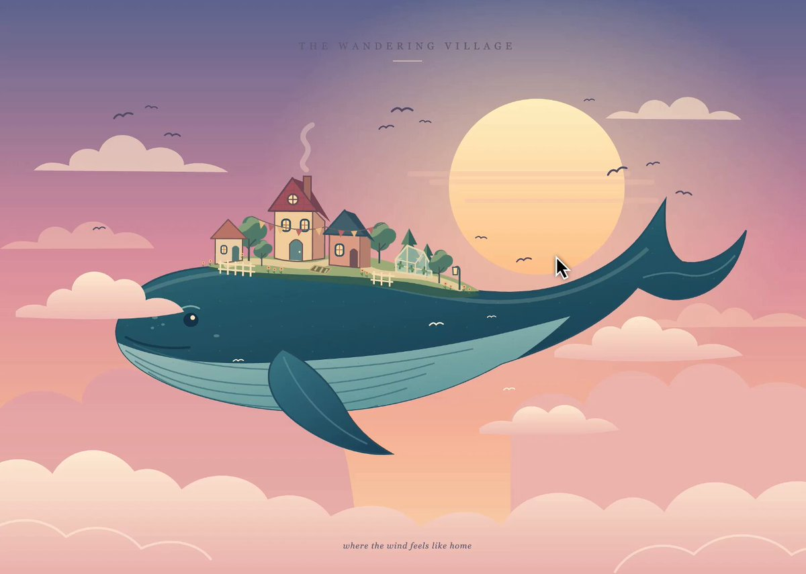
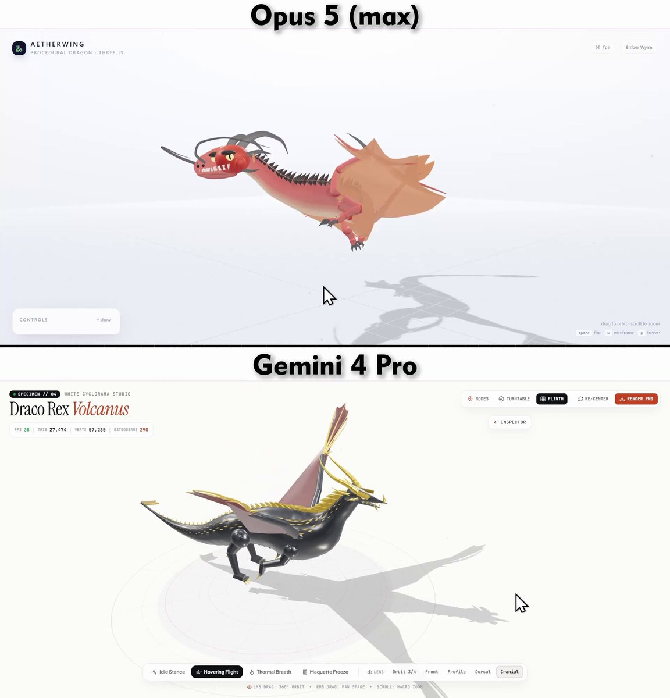
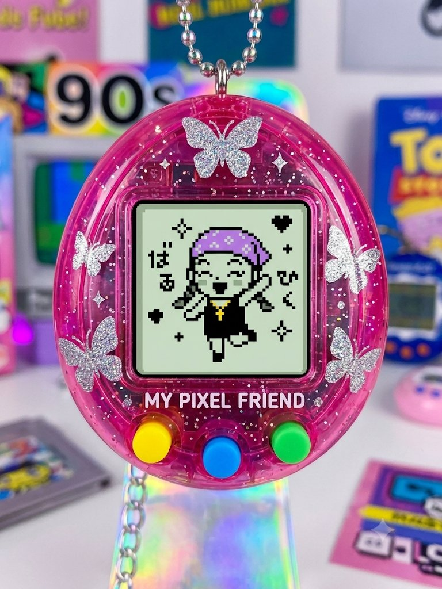

# Gemini · Biblioteca de prompts · Leadde.ai

[](README.md) [](README_zh.md) [](README_zh-TW.md) [](README_ja-JP.md) [](README_ko-KR.md) [](README_th-TH.md) [](README_vi-VN.md) [](README_hi-IN.md) [](README_es-ES.md) [-lightgrey)](README_es-419.md) [](README_de-DE.md) [](README_fr-FR.md) [](README_it-IT.md) [-lightgrey)](README_pt-BR.md) [](README_pt-PT.md) [](README_tr-TR.md)

**Best for:** Gemini multimodal prompts for visual reasoning, creative exploration, and production planning.

For PDF, PPT, SOP, training, and multilingual video workflows:
[Awesome Document-to-Video](https://github.com/LeaddeOpenLab/awesome-document-to-video)

> **Prompts de calidad seleccionados cada día**

Descubre prompts completos para crear imágenes, vídeos y 3D con IA. Explora por estilo, consulta versiones multilingües y encuentra a los autores originales.

[Explora Leadde.ai →](https://leadde.ai/?utm_source=github&utm_medium=readme&utm_campaign=prompt-library&utm_content=gemini)

## Conoce Leadde.ai

Leadde.ai ayuda a los equipos a convertir documentos, diapositivas y texto en vídeos empresariales con IA para formación, incorporación y marketing.

Marca este repositorio con una estrella para seguir nuestra selección diaria e inspirarte con nuevas ideas.

**20** Prompts · Última incorporación: **2026-09-18**

<a name="catalog"></a>

## Explorar por categoría

[Fotografía](#category-photography) · [Cine / Fotograma de película](#category-cinematic-film-still) · [Ilustración](#category-illustration) · [Render 3D](#category-3d-render) · [Otros](#category-other)

<a name="all-prompts"></a>

<a name="category-photography"></a>

## Fotografía

<a name="prompt-2100410821109293122"></a>

### Sesión fotográfica de alta costura en una plataforma de observación de Tokio, con una mujer en traje sastre blanco crema señalando hacia la Torre de Tokio.

Autor：[@ZunairaSaeedAi](https://x.com/ZunairaSaeedAi) · [Publicación original](https://x.com/ZunairaSaeedAi/status/2100410821109293122)

Fotografía · Retrato / Selfie · Personaje · Artículo de moda · Publicado

**Resumen:** Sesión fotográfica de alta costura en una plataforma de observación de Tokio, con una mujer en traje sastre blanco crema señalando hacia la Torre de Tokio.


**Prompt**

```text
Crea una fotografía editorial de moda de lujo de alta gama y ultrarrealista en Tokio, Japón, a plena luz del día natural y brillante.

Una mujer joven y sofisticada está de pie en una lujosa plataforma de observación en una azotea elevada con barandilla de cristal, contemplando una impresionante vista panorámica de Tokio. Viste un elegante atuendo de lujo en color crema con un refinado blazer y pantalones de pernera ancha, con un estilo propio de una campaña de moda de primera calidad.

Lleva un bolso de mano de lujo en una mano y un moderno Apple iPhone en la otra. El brazo que sostiene el iPhone se extiende con naturalidad hacia la ciudad, con el dedo índice señalando claramente hacia la Torre de Tokio, como si estuviera mostrando con elegancia el emblemático punto de referencia y la hermosa ciudad a alguien.

El horizonte de Tokio debe permanecer sumamente visible, nítido y detallado, incluyendo numerosos rascacielos, edificios, calles, zonas verdes y la Torre de Tokio situada de forma prominente en el fondo. La ciudad NO debe estar excesivamente desenfocada. Mantén tanto a la mujer como al paisaje urbano distante visualmente claros.

Luz diurna brillante y limpia, cielo azul con suaves nubes naturales, visibilidad atmosférica nítida, luz solar y sombras realistas, detalles arquitectónicos de primera calidad, textura de piel realista, cabello natural, manos y dedos realistas, proporciones corporales precisas, ropa y bolso detallados, estética sofisticada de viajes de lujo.

Composición: vertical 9:16, retrato de moda de cuerpo entero, punto de vista ligeramente elevado, encuadre equilibrado con la mujer en primer plano y el enorme horizonte de Tokio extendiéndose por todo el fondo.

Estilo fotográfico: publicidad de lujo de alta gama, fotografía editorial cinematográfica, cámara profesional de fotograma completo, gran profundidad de campo, primer plano y fondo nítidos, fotorrealista, ultradetallada, texturas realistas, colores naturales, calidad comercial prémium, 8K.

Importante: Haz que el Apple iPhone sea claramente visible en su mano, mantén el gesto de señalar natural y elegante, haz que la Torre de Tokio sea claramente reconocible y preserva el máximo detalle en todo el paisaje urbano.

Sin texto, sin marcas de agua, sin desenfoque artificial, sin manos distorsionadas, sin dedos adicionales, sin objetos duplicados, sin anatomía deformada, sin efectos de dibujo animado.
```

[↑ Volver a categorías](#catalog)

---

<a name="prompt-2100038181538365752"></a>

### Prompt para generar un retrato estilo catálogo de una bailarina japonesa de pie en puntas con un maillot blanco en un estudio de ballet.

Autor：[@55hawks](https://x.com/55hawks) · [Publicación original](https://x.com/55hawks/status/2100038181538365752)

Fotografía · Retrato / Selfie · Publicado

Publicación original：[@CyberTotal2026](https://x.com/CyberTotal2026) · [Publicación original](https://x.com/CyberTotal2026/status/2099759874318184905)

**Resumen:** Prompt para generar un retrato estilo catálogo de una bailarina japonesa de pie en puntas con un maillot blanco en un estudio de ballet.


**Prompt**

```text
# Instrucciones
- Generar una fotografía de catálogo de alta calidad para un fabricante de artículos de ballet  
- Lograr un retrato fotogénico y editorial  
- Mantener una expresión no sexual, artística y serena  
- La IA ajustará automáticamente el encuadre, la luz, la distancia y la representación del vestuario para que sea SFW  

# Contexto
- Esta es una escena de práctica en un estudio de ballet  
- Se percibe la atmósfera tranquila del estudio  
- La fuerte luz del sol entra por la ventana, creando sombras y reflejos nítidos en la tela del maillot  
- El sudor perlado en la frente aporta el realismo del ensayo  
- Cabello recogido en una coleta baja natural  
- Colores en tonos vivos y de alta saturación, priorizando la visibilidad como fotografía de catálogo  

# Entrada
- Sujeto de referencia: bailarina de ballet japonesa  
- Figura perfecta de reloj de arena con busto generoso  
- Viste un maillot camisola blanco con la espalda al descubierto y zapatillas de punta de ballet blancas  
- De pie con la espalda orientada en ángulo  
- Ambas manos entrelazadas suavemente detrás de la cintura  
- De pie en puntas (en pointe) con ambos pies  
- El maillot está confeccionado con un tejido ultrafino de última tecnología altamente elástico, con firmeza tridimensional y compresión natural, adaptándose con precisión a las curvas de la piel  
- La piel incluye poros naturales, textura y sudor visible (sin retoques de embellecimiento)  

# Salida
- Fotografía de catálogo de artículos de ballet donde conviven el arte y la funcionalidad  
- Reflejos y sombras naturales provocados por la intensa luz solar que resaltan la textura del maillot  
- Encuadre que transmite la serenidad del estudio de ballet y la tensión del ensayo  
- Obra fotográfica que resulta artística y sofisticada manteniendo el estándar SFW
```

[↑ Volver a categorías](#catalog)

---

<a name="category-cinematic-film-still"></a>

## Cine / Fotograma de película

<a name="prompt-2100486977456095594"></a>

### La cámara avanza suavemente desde el plano macro de la taza de café, atravesando la superficie líquida para entrar en una diminuta ciudad tecnológica futurista dentro de la taza.

Autor：[@MohdAdnanA86218](https://x.com/MohdAdnanA86218) · [Publicación original](https://x.com/MohdAdnanA86218/status/2100486977456095594)

Cine / Fotograma de película · Ciberpunk / Ciencia ficción · Comida / Bebida · Paisaje urbano / Calle · Publicado

**Resumen:** La cámara avanza suavemente desde el plano macro de la taza de café, atravesando la superficie líquida para entrar en una diminuta ciudad tecnológica futurista dentro de la taza.


**Prompt**

```text
Un plano macro cinematográfico y fotorrealista de una taza de humeante café negro intenso sobre una elegante mesa de cafetería moderna. 0–2 s: La cámara avanza lentamente hacia la superficie del café, capturando vapor realista, reflejos y pequeñas ondas. 2–5 s: La cámara hace un zoom espectacular directo hacia el café, atravesando la brillante superficie líquida en una transición fluida y continua. 5–8 s: Se revela una asombrosa y diminuta ciudad futurista oculta dentro de la taza de café: imponentes rascacielos iluminados, calles en miniatura, coches en movimiento, diminutos peatones, letreros brillantes y autopistas elevadas. 8–10 s: La cámara vuela entre los edificios en miniatura mientras elegantes vehículos voladores navegan por el horizonte futurista, con diminutas aeronaves que dejan sutiles estelas de luz. Escala en miniatura ultrarrealista, profundidad de campo cinematográfica, iluminación volumétrica, reflejos realistas, arquitectura detallada, movimiento de cámara dinámico, transición fluida de macro a plano general, detalle 8K, texturas fotorrealistas, atmósfera futurista, movimiento suave, sin cortes, sin texto, sin marcas de agua, visualmente espectacular.
```

[↑ Volver a categorías](#catalog)

---

<a name="prompt-2099517007934919019"></a>

### Prompt JSON de 10 s que dirige relámpagos y fragmentos de carbono para ensamblarse en un Lamborghini Aventador en un paso de montaña tormentoso.

Autor：[@MrDasCreates](https://x.com/MrDasCreates) · [Publicación original](https://x.com/MrDasCreates/status/2099517007934919019)

Cine / Fotograma de película · Paisaje / Naturaleza · Publicado

**Resumen:** Prompt JSON de 10 s que dirige relámpagos y fragmentos de carbono para ensamblarse en un Lamborghini Aventador en un paso de montaña tormentoso.


**Prompt**

```text
{"model": "gemini-omni-1.1-flash", "duration": "10s", "aspect_ratio": "16:9", "shot": {"structure": "plano único continuo sin cortes de escena", "composition": "comienza en un plano ultra gran angular en un paso de montaña azotado por la tormenta al atardecer, sigue fragmentos de fibra de carbono y energía de relámpagos que se arremolinan hasta tomar forma, termina en un primer plano centrado de un Lamborghini Aventador rugiendo", "lens": "gran angular para el paisaje épico, luego 35 mm para la revelación del producto", "frame_rate": "cinematográfico a 24 fps", "camera_movement": "avance lento y dramático a través de la tormenta siguiendo los fragmentos ascendentes, luego un traveling bajo y agresivo a medida que se encajan en el automóvil, manteniéndose firme mientras este se asienta y acelera"}, "timeline": {"0-3s": "Vasto y tormentoso paso de montaña italiano al atardecer. Picos escarpados, asfalto húmedo y sinuoso, nubes oscuras que se abren con relámpagos distantes. Lluvia y niebla azotadas por el viento sobre acantilados rocosos.", "3-7s": "Cientos de afilados fragmentos de fibra de carbono, paneles metálicos brillantes y estelas de energía azul eléctrico se levantan de la carretera y giran en órbitas violentas y precisas. Se entrelazan en el aire formando la silueta angular exacta de un Lamborghini Aventador. Chispas, refracción de la lluvia y bordes de energía crepitante.", "7-10s": "La forma vibra con una oleada de luz y se materializa en un Lamborghini Aventador real de color negro mate que levita y luego cae sobre la carretera mojada. Los faros destellan, las puertas de tijera se elevan ligeramente, el motor ruge. Mantener la toma fija en la bestia mientras la lluvia resbala por la carrocería."}, "subject": {"description": "cientos de fragmentos de fibra de carbono y energía que se elevan y chocan en órbitas agresivas para formar la silueta de un superdeportivo", "props": "Lamborghini Aventador final formado a partir de fragmentos arremolinados, que luego se transforma en un superdeportivo real de marca mientras se asienta sobre la carretera"}, "scene": {"location": "dramático paso de alta montaña con carretera sinuosa y mojada", "time_of_day": "atardecer tormentoso, últimos rayos dorados que atraviesan las nubes oscuras, destellos de relámpagos", "environment": "clima alpino riguroso, asfalto resbaladizo por la lluvia, rocas escarpadas, viento aullante"}, "visual_details": {"action": "los fragmentos se elevan, giran en trayectorias violentas y organizadas, se encajan en el contorno del coche, pulsan con energía y luego se transforman en el Aventador terminado que cae y acelera", "special_effects": "animación de partículas de carbono, estelas de energía de relámpago, transformación de material en el aire, interacción con la lluvia, distorsión por calor del motor y pulverización de agua de los neumáticos"}, "cinematography": {"lighting": "iluminación dramática de tormenta con destellos de hora dorada, brillos de energía azul eléctrico, luz de contorno nítida en la carrocería de carbono mojada", "color_palette": "negros mates, grises de tormenta, azules eléctricos, reflejos en el asfalto mojado, dorado cálido del atardecer", "tone": "potencia pura, furia italiana, lujo épico"}, "audio": {"music": "tambores cinematográficos profundos y golpes orquestales agresivos con una tensión creciente", "ambient": "viento aullante de montaña, truenos lejanos, lluvia sobre la carretera", "sound_effects": "chasquidos metálicos y de carbono nítidos al encajarse las piezas, rugido masivo de motor V12 cuando se completa la forma, bramido de neumáticos y siseo de lluvia", "mix": "potente, atronador, naturaleza contra máquina con un núcleo musical impulsivo"}, "constraints": {"dialogue": "none", "voiceover": "none", "on_screen_text": "none", "captions": "none", "subtitles": false}}
```

[↑ Volver a categorías](#catalog)

---

<a name="prompt-2099370488342647240"></a>

### Una toma continua que sigue a un hombre abriendo una puerta portal que transiciona a través de París, un Tokio futurista, la antigua Roma y un planeta alienígena antes de fusionarse.

Autor：[@MohdAdnanA86218](https://x.com/MohdAdnanA86218) · [Publicación original](https://x.com/MohdAdnanA86218/status/2099370488342647240)

Cine / Fotograma de película · Personaje · Publicado

**Resumen:** Una toma continua que sigue a un hombre abriendo una puerta portal que transiciona a través de París, un Tokio futurista, la antigua Roma y un planeta alienígena antes de fusionarse.


**Prompt**

```text
Crea un video de fantasía cinematográfica ultrarrealista de 10 segundos en una sola toma continua. Un apuesto joven de poco más de 20 años, con cabello negro azabache grueso y naturalmente ondulado, ojos marrón oscuro, mandíbula masculina definida, barba sutil de tres días, y vestido con un sofisticado abrigo largo oscuro, se encuentra en un misterioso pasillo tenuemente iluminado frente a una vieja puerta de madera ordinaria.
0–2 seg: Extiende lentamente la mano hacia la manija de latón, abre la puerta y revela el París romántico en la hora dorada: la Torre Eiffel, elegantes edificios de estilo Haussmann, cafés resplandecientes, una luz atmosférica cálida.
2–4 seg: Sin cortes, el umbral se transforma instantáneamente en el Tokio futurista de noche: rascacielos imponentes de neón, anuncios holográficos, vehículos voladores, calles empapadas por la lluvia, reflejos vibrantes.
4–6 seg: El mundo vuelve a cambiar a la antigua Roma: el colosal Coliseo, columnas de mármol, arquitectura romana, luz de antorchas, multitudes lejanas y polvo sutil flotando en el aire.
6–8 seg: El umbral se transforma en un impresionante planeta alienígena: cielos púrpuras, lunas enormes, vegetación alienígena brillante, montañas extrañas y estructuras futuristas distantes.
8–10 seg: El hombre da un paso hacia el umbral mientras los cuatro mundos se mezclan y arremolinan rápidamente en el interior de la puerta, creando un espectacular portal de mundos infinitos. Se le ve asombrado mientras la cámara avanza lentamente hacia el umbral resplandeciente.
Estilo: fotorrealista, calidad de superproducción cinematográfica, transiciones mágicas fluidas, física realista, iluminación volumétrica, profundidad atmosférica, entornos detallados, movimiento humano natural, movimiento de cámara dramático, 8K HDR, alto rango dinámico, piel y telas realistas, profundidad de campo cinematográfica, escala épica, sin texto, sin subtítulos, sin marcas de agua, sin fallos técnicos, sin rostros distorsionados, sin extremidades adicionales. Con un ritmo perfecto para exactamente 10 segundos, con cada mundo claramente visible durante aproximadamente 2 segundos.
```

[↑ Volver a categorías](#catalog)

---

<a name="prompt-2098277089749463207"></a>

### Escena cinematográfica de ciencia ficción de un joven caminando por una ciudad futurista abandonada mientras vallas publicitarias holográficas se activan a su alrededor.

Autor：[@MohdAdnanA86218](https://x.com/MohdAdnanA86218) · [Publicación original](https://x.com/MohdAdnanA86218/status/2098277089749463207)

Cine / Fotograma de película · Ciberpunk / Ciencia ficción · Personaje · Publicado

**Resumen:** Escena cinematográfica de ciencia ficción de un joven caminando por una ciudad futurista abandonada mientras vallas publicitarias holográficas se activan a su alrededor.


**Prompt**

```text
Cortometraje cinematográfico de ciencia ficción ultrarrealista, 10 segundos, 16:9. Un joven sorprendentemente apuesto de unos 20 años camina solo por una megaciudad futurista abandonada en el año 2050. Tiene cabello negro azabache, espeso y con ondas naturales, profundos ojos marrones oscuros, una mandíbula masculina y marcada, pómulos prominentes y una sutil barba incipiente natural. Viste un elegante abrigo futurista negro, pantalones oscuros y botas minimalistas. La enorme ciudad a su alrededor está completamente desierta: imponentes rascacielos de cristal, autopistas elevadas vacías, vehículos autónomos abandonados, niebla a la deriva, escombros dispersos y tenues luces atmosféricas azules. 0–3 segundos: Plano de seguimiento cinematográfico amplio desde atrás mientras camina lentamente por un bulevar futurista vacío, con sus pasos resonando en la silenciosa ciudad. 3–6 segundos: De repente se detiene y mira hacia arriba. Un anuncio holográfico parpadea sobre un rascacielos, luego otro, luego cientos. 6–9 segundos: Miles de anuncios holográficos gigantescos se activan repentinamente por toda la ciudad (vallas publicitarias de neón, interfaces flotantes, productos animados y mensajes misteriosos), iluminando las calles abandonadas a su alrededor. El rostro del hombre refleja la luz holográfica mientras mira a su alrededor en estado de shock. 9–10 segundos: Primer plano dramático de su rostro cuando todas las pantallas holográficas se giran simultáneamente hacia él, creando la inquietante certeza de que tal vez no esté realmente solo. Movimiento humano fotorrealista, física realista de telas, niebla volumétrica cinematográfica, calles húmedas y reflectantes, arquitectura futurista detallada, profundidad atmosférica, sutil destello de lente, brillo holográfico realista, movimiento de cámara dramático, alto contraste, 8K HDR, aspecto cinematográfico anamórfico, atmósfera futurista llena de suspense, sin estilo de dibujos animados, sin rostro de apariencia artificial generada por IA, sin errores de texto, sin manos distorsionadas.
```

[↑ Volver a categorías](#catalog)

---

<a name="prompt-2097929264158945776"></a>

### Prompt cinematográfico con marcas de tiempo que muestra un enorme volcán en erupción al atardecer con lava, nubes de ceniza y relámpagos.

Autor：[@abs\_uiux](https://x.com/abs_uiux) · [Publicación original](https://x.com/abs_uiux/status/2097929264158945776)

Cine / Fotograma de película · Paisaje / Naturaleza · Publicado

**Resumen:** Prompt cinematográfico con marcas de tiempo que muestra un enorme volcán en erupción al atardecer con lava, nubes de ceniza y relámpagos.


**Prompt**

```text
0–2 s: Plano aéreo amplio de un enorme volcán al atardecer. El humo comienza a brotar del cráter mientras el suelo tiembla sutilmente.

2–5 s: El volcán entra en erupción de forma repentina, lanzando al cielo una enorme columna de ceniza, humo y lava incandescente.

5–8 s: Ríos de lava ardiente bajan por la ladera de la montaña mientras oscuras nubes de ceniza se expanden rápidamente por encima. La cámara se aleja de forma dramática.

8–10 s: Plano final ultraamplio mientras relámpagos brillan en el interior de la nube de ceniza y la erupción ilumina el paisaje.

Estilo: Fotorrealista, estética cinematográfica de película de desastres, escala dramática, humo volumétrico, lava incandescente, escombros realistas, fuerte temblor de cámara, diseño de sonido épico.
```

[↑ Volver a categorías](#catalog)

---

<a name="prompt-2097152276452561325"></a>

### Vídeo cinematográfico ultrarrealista de 10 segundos de guerreros vikingos en miniatura preparando un gigantesco drakkar de madera al amanecer.

Autor：[@MohdAdnanA86218](https://x.com/MohdAdnanA86218) · [Publicación original](https://x.com/MohdAdnanA86218/status/2097152276452561325)

Cine / Fotograma de película · Publicado

**Resumen:** Vídeo cinematográfico ultrarrealista de 10 segundos de guerreros vikingos en miniatura preparando un gigantesco drakkar de madera al amanecer.


**Prompt**

```text
Vídeo cinematográfico ultrarrealista de 10 segundos, puerto vikingo en miniatura al amanecer. Pequeños guerreros vikingos, cada uno de solo unas pocas pulgadas de altura, corren alrededor de un gigantesco drakkar de madera, preparándolo para la batalla. Llevan escudos, hachas, cuerdas y lanzas en miniatura, suben por enormes escaleras de madera, tensan gruesas cuerdas, cargan suministros e izan una enorme vela vikinga roja y negra. El descomunal drakkar se alza sobre ellos como un colosal barco de guerra. La niebla flota sobre las frías aguas nórdicas, los muelles de madera crujen, las antorchas parpadean y las banderas vikingas ondean dramáticamente con el viento.
Cámara: perspectiva macro de ángulo bajo a escala en miniatura, toma de seguimiento cinematográfica lenta que avanza por el ajetreado puerto, terminando con un dramático plano general de los diminutos guerreros de pie con orgullo bajo el gigantesco drakkar.
Iluminación: luz fría y azul del amanecer mezclada con la cálida luz de las antorchas, niebla volumétrica, reflejos realistas en el agua, sombras dramáticas.
Estilo: ultrarrealista, estética épica de película vikinga, entorno en miniatura sumamente detallado, texturas realistas, profundidad de campo cinematográfica, movimiento natural, 4K, lente anamórfica, atmósfera inmersiva, sin texto, sin marcas de agua.
```

[↑ Volver a categorías](#catalog)

---

<a name="prompt-2096612096003965254"></a>

### Plano de seguimiento de estilo cinematográfico comercial donde un personaje camina junto a tipografía 3D y rutas visuales que aparecen continuamente, interactuando con elementos de texto en el espacio antes de pasar a la revelación de un logotipo.

Autor：[@taya\_mama\_AI](https://x.com/taya_mama_AI) · [Publicación original](https://x.com/taya_mama_AI/status/2096612096003965254)

Cine / Fotograma de película · Render 3D · Personaje · Texto / Tipografía · Publicado

Publicación original：[@taya\_mama\_AI](https://x.com/taya_mama_AI) · [Publicación original](https://x.com/taya_mama_AI/status/2095076567416451105)

**Resumen:** Plano de seguimiento de estilo cinematográfico comercial donde un personaje camina junto a tipografía 3D y rutas visuales que aparecen continuamente, interactuando con elementos de texto en el espacio antes de pasar a la revelación de un logotipo.


**Prompt**

```text
Película comercial.

Mantén el color de fondo inicial a lo largo de toda la secuencia.

La cámara sigue suavemente al personaje con un movimiento de desplazamiento horizontal continuo, moviéndose a su lado mientras camina.

El texto y las líneas de conexión aparecen progresivamente a través de la pantalla, formando una ruta visual continua.

A medida que el personaje camina, reconoce el texto y los elementos gráficos que aparecen a su alrededor como objetos físicos que existen realmente en el mismo espacio. Interactúa de forma natural con estos elementos a medida que avanza: tocando ocasionalmente el texto cercano con la punta del dedo, mirando hacia arriba a las palabras situadas sobre él, mirando de reojo a los gráficos, apartándose ligeramente para esquivar un elemento, agachándose debajo de uno o deteniéndose brevemente para observar algo.

Una línea continua, semejante a una vía de tren o una ruta visual, conecta un elemento de texto con el siguiente. El texto de la imagen de referencia aparece secuencialmente a lo largo de este camino conectado, siguiendo el orden original.

Los elementos de texto y gráficos no deben parecer decoraciones planas de fondo. Deben sentirse físicamente presentes en el mismo espacio tridimensional que el personaje, con relaciones espaciales e interacción convincentes.

No repitas ni dupliques ningún texto.

Mantén el ritmo general rápido, rítmico y fluido. El movimiento de desplazamiento horizontal debe permanecer continuo e ininterrumpido a lo largo de la secuencia.

Reproduce fielmente todo el texto de la imagen de referencia sin caracteres distorsionados, tipografía corrupta, errores ortográficos o redacción alterada.

Para la transición final, un objeto o elemento gráfico grande en primer plano pasa muy cerca por delante de la cámara, cubriendo por completo todo el encuadre y creando una transición natural de barrido con desenfoque de primer plano.

A medida que el objeto en primer plano despeja el encuadre, revela a la perfección la pantalla final con el logotipo.

El movimiento de cámara debe ser fluido, dinámico y cinematográfico.

Prioriza la interacción entre el personaje y los elementos de texto/gráficos por encima de todo lo demás.

BGM: Música de ritmo rápido, rítmica y con un compás marcado.
```

[↑ Volver a categorías](#catalog)

---

<a name="prompt-2097242290859241833"></a>

### Utiliza la imagen subida del hombre adulto como referencia visual y de identidad principal para el personaje principal en una escena de fotocopiadora de oficina donde emergen clones en miniatura.

Autor：[@abs\_uiux](https://x.com/abs_uiux) · [Publicación original](https://x.com/abs_uiux/status/2097242290859241833)

Cine / Fotograma de película · Personaje · Publicado

**Resumen:** Utiliza la imagen subida del hombre adulto como referencia visual y de identidad principal para el personaje principal en una escena de fotocopiadora de oficina donde emergen clones en miniatura.


**Prompt**

```text
Utiliza la imagen subida del hombre adulto como referencia visual y de identidad principal para el personaje protagonista.

CONSISTENCIA DE IDENTIDAD:
Mantén una fuerte consistencia visual con el hombre adulto subido a lo largo de todo el vídeo. Conserva sus rasgos faciales reconocibles, tono de piel, edad aproximada, estructura facial, peinado, barba o vello facial si lo tuviera, cejas, ojos, nariz, labios, orejas, proporciones corporales y vestimenta.

Todas las versiones en miniatura que aparezcan en la escena deben representar claramente al mismo hombre adulto y permanecer visualmente consistentes con la referencia subida. Evita cambios perceptibles en la estructura facial, peinado, vello facial, edad, vestimenta o apariencia general entre el personaje original y las versiones en miniatura.

ESCENA:
Ambienta la escena dentro de una oficina moderna y de primera categoría, con una decoración contemporánea impecable y una iluminación profesional realista.
Coloca una fotocopiadora/escáner multifunción de alta gama sobre un escritorio de madera.

El hombre adulto camina con paso seguro hacia la máquina con una sonrisa natural. Abre la tapa del escáner y coloca una fotografía impresa de sí mismo boca abajo sobre el cristal del escáner.

Cierra la tapa y pulsa el botón COPY.

Muestra el escáner activándose con una luz móvil realista bajo el cristal.

Luego introduce una divertida transformación mágica: en lugar de las hojas de papel habituales saliendo de la bandeja de salida, comienzan a aparecer desde la máquina, una tras otra, aproximadamente 8–10 versiones en miniatura del mismo hombre adulto.

Cada hombre en miniatura debe medir aproximadamente 20–25 cm de altura y parecerse con claridad a la referencia subida, incluyendo el mismo peinado, vello facial, estilo de vestimenta, tono de piel y apariencia general.

Los personajes en miniatura pisan o saltan con seguridad sobre el escritorio de madera. Sonríen, saludan con la mano hacia el hombre original, caminan juntos, intercambian apretones de manos amistosos, se saludan juguetonamente y miran brevemente hacia la cámara.

El hombre adulto original reacciona con sorpresa y diversión, riendo de forma natural mientras observa las versiones en miniatura de sí mismo interactuar sobre el escritorio.

DIRECCIÓN DE CÁMARA:
Comienza con un plano medio cinematográfico del hombre acercándose a la fotocopiadora.

Corta a un primer plano detallado de él colocando la fotografía sobre el cristal del escáner.

Muestra un primerísimo primer plano de su dedo pulsando el botón COPY.

Captura la luz del escáner moviéndose bajo el cristal.

Realiza una transición a un primer plano dramático de la bandeja de salida cuando aparece la primera versión en miniatura.

Utiliza un breve momento a cámara lenta mientras el primer personaje en miniatura aterriza con seguridad sobre el escritorio.

Incluye tomas macro de los pasos en miniatura caminando sobre la superficie de madera.

Finaliza con un plano cinematográfico más amplio que muestre al hombre adulto original sonriendo mientras varias versiones en miniatura permanecen de pie e interactúan alrededor de la fotocopiadora.

Utiliza un movimiento de cámara suave y profesional, profundidad de campo sutil, comportamiento de lente realista y desenfoque de movimiento natural.

ESTILO VISUAL:
Realismo cinematográfico fotorrealista.
Textura de piel natural y altamente detallada.
Cabello y vello facial realistas.
Textura de tela y movimiento de ropa realistas.
Proporciones humanas precisas.
Escala en miniatura convincente.
Iluminación comercial de primera calidad.
Sombras y reflejos naturales.
Rango dinámico de estilo HDR.
Alta consistencia facial a lo largo de toda la secuencia.

NOTAS IMPORTANTES DE CONSISTENCIA:
Mantén al hombre adulto subido como referencia visual a lo largo de todo el vídeo.

Los personajes en miniatura deben parecer representaciones en miniatura de la misma persona y no personas no relacionadas.

Evita variaciones faciales notorias entre los personajes en miniatura.

No cambies el género del personaje, su edad aparente, peinado, vello facial, tono de piel o vestimenta.

No introduzcas personajes no relacionados.

Mantén a todos los personajes humanos realistas en lugar de estilo de dibujos animados.

Sin subtítulos.
Sin rótulos.
Sin logotipos.
Sin marcas de agua.
Sin texto adicional en pantalla.

Relación de aspecto: 9:16 vertical
```

[↑ Volver a categorías](#catalog)

---

<a name="prompt-2097168437957263851"></a>

### Una indicación para un vídeo cinematográfico ultrarrealista de 10 segundos que retrata una escena en miniatura dentro de una fábrica de tartas gigantesca, donde pasteleros diminutos colaboran para decorar una enorme tarta de cumpleaños de varios pisos.

Autor：[@AiwithBloodline](https://x.com/AiwithBloodline) · [Publicación original](https://x.com/AiwithBloodline/status/2097168437957263851)

Cine / Fotograma de película · Publicado

Publicación original：[@AiwithBloodline](https://x.com/AiwithBloodline) · [Publicación original](https://x.com/AiwithBloodline/status/2096937365260624328)

**Resumen:** Una indicación para un vídeo cinematográfico ultrarrealista de 10 segundos que retrata una escena en miniatura dentro de una fábrica de tartas gigantesca, donde pasteleros diminutos colaboran para decorar una enorme tarta de cumpleaños de varios pisos.


**Prompt**

```text
Crea un vídeo cinematográfico en miniatura ultrarrealista de 10 segundos ambientado en el interior de una fábrica de tartas gigantesca y de fantasía. Diminutos pasteleros vestidos con uniformes blancos de chef y pequeños gorros de pastelero trabajan juntos para decorar una enorme tarta de cumpleaños de varios pisos que se alza imponente sobre ellos.
0–3 s: Plano general de establecimiento de la enorme tarta sobre una mesa de fábrica, con diminutos pasteleros subiendo por escaleras y transportando coloridas herramientas de glaseado.
3–7 s: Plano de seguimiento en primer plano mientras los pasteleros aplican con manga gruesas espirales de crema, añaden fresas y fideos de azúcar, y colocan con cuidado velas gigantes de colores.
7–10 s: Plano de alejamiento cinematográfico dramático que revela la tarta de cumpleaños completamente decorada, brillando cálidamente bajo las luces de la fábrica mientras los diminutos pasteleros lo celebran a su alrededor.
Escala en miniatura sumamente detallada, movimiento humano realista, texturas cremosas de glaseado, decoraciones coloridas, iluminación cálida de pastelería, profundidad de campo reducida, movimiento de cámara cinematográfico, aspecto de fotografía macro, juguetón pero fotorrealista, 4K, 16:9, sin texto, sin logotipos, sin música, únicamente sonidos ASMR naturales de pastelería como crema aplicándose con manga, pasos, tintineo de herramientas y un suave ambiente de fábrica.
```

[↑ Volver a categorías](#catalog)

---

<a name="category-illustration"></a>

## Ilustración

<a name="prompt-2100640510083997980"></a>

### Crear el código SVG de una ballena volando a través de las nubes.

Autor：[@pankajkumar\_dev](https://x.com/pankajkumar_dev) · [Publicación original](https://x.com/pankajkumar_dev/status/2100640510083997980)

Ilustración · Publicado

Publicación original：[@pankajkumar\_dev](https://x.com/pankajkumar_dev) · [Publicación original](https://x.com/pankajkumar_dev/status/2100638349296095561)

**Resumen:** Crear el código SVG de una ballena volando a través de las nubes.



**Prompt**

```text
Crea el código para un SVG de una ballena volando a través de las nubes.
```

[↑ Volver a categorías](#catalog)

---

<a name="prompt-2097658031928705309"></a>

### Prompt de ilustración que representa a Aqua llorando en una pradera

Autor：[@HopeAbsent](https://x.com/HopeAbsent) · [Publicación original](https://x.com/HopeAbsent/status/2097658031928705309)

Ilustración · Publicado

**Resumen:** Prompt de ilustración que representa a Aqua llorando en una pradera


**Prompt**

```text
Aqua llorando en una pradera
```

[↑ Volver a categorías](#catalog)

---

<a name="category-3d-render"></a>

## Render 3D

<a name="prompt-2101024701044904074"></a>

### Traducción en curso

Autor：[@TimJayas](https://x.com/TimJayas) · [Publicación original](https://x.com/TimJayas/status/2101024701044904074)

Render 3D · Animal / Criatura · Resumen / Antecedentes · Publicado

**Resumen:** Traducción en curso



**Prompt**

```text
Traducción en curso
```

[↑ Volver a categorías](#catalog)

---

<a name="prompt-2096885269270237431"></a>

### Una secuencia animada en 3D de obreros de construcción en miniatura ensamblando una pizza gigante.

Autor：[@AiwithBloodline](https://x.com/AiwithBloodline) · [Publicación original](https://x.com/AiwithBloodline/status/2096885269270237431)

Render 3D · Comida / Bebida · Publicado

Publicación original：[@AiwithBloodline](https://x.com/AiwithBloodline) · [Publicación original](https://x.com/AiwithBloodline/status/2096811796074311791)

**Resumen:** Una secuencia animada en 3D de obreros de construcción en miniatura ensamblando una pizza gigante.


**Prompt**

```text
{
  "video_duration": "10 segundos",
  "aspect_ratio": "16:9",
  "sequence": [
    {
      "time": "0-2 s",
      "scene": "Gran montaje",
      "camera": "Plano aéreo cinematográfico amplio con aproximación",
      "action": "Una enorme pizza recién horneada descansa sobre una mesa de madera como si fuera una gigantesca obra en construcción. Docenas de diminutos obreros llegan a toda prisa con cargadoras en miniatura, grúas, camiones de reparto y herramientas, preparándose para construir la pizza perfecta.",
      "sound_design": "Música alegre y juguetona, ruiditos de motores diminutos, ruedas rodando, sutil actividad de construcción."
    },
    {
      "time": "2-4 s",
      "scene": "Capa de salsa y queso",
      "camera": "Plano de seguimiento lateral medio",
      "action": "Un camión de comida en miniatura bombea una rica salsa de tomate roja por toda la pizza mientras pequeños trabajadores la extienden suavemente con pequeñas espátulas. Otro equipo los sigue por detrás, cubriendo la superficie con una gruesa capa de mozzarella rallada.",
      "sound_design": "Suave vertido de salsa, raspado de espátulas, crujido de queso, música rítmica y alegre."
    },
    {
      "time": "4-6 s",
      "scene": "Ingredientes en movimiento",
      "camera": "Primer plano macro con suave cámara lenta",
      "action": "Cintas transportadoras diminutas trasladan ingredientes coloridos, como pepperoni, champiñones, pimientos, aceitunas y albahaca fresca. Los diminutos obreros colocan con cuidado y precisión cada ingrediente sobre la superficie de queso.",
      "sound_design": "Movimiento de cinta transportadora, pequeñas caídas de ingredientes, delicados repiques mágicos, acentos musicales alegres."
    },
    {
      "time": "6-8 s",
      "scene": "Elevación del ingrediente final",
      "camera": "Plano cinematográfico dramático en contrapicado",
      "action": "Una grúa en miniatura eleva una rodaja gigante de pepperoni hacia el centro de la pizza. Abajo, los trabajadores tiran de cuerdas de guía y se hacen señales entre sí mientras el ingrediente se coloca lentamente en su lugar.",
      "sound_design": "Motor de grúa pequeña, sonido de tensión de cuerdas, clics mecánicos, música orquestal cinematográfica en crescendo."
    },
    {
      "time": "8-10 s",
      "scene": "Gran final de la pizza",
      "camera": "Primer plano fluido con giro orbital de 360 grados",
      "action": "El último ingrediente cae perfectamente en su posición. Una explosión de confeti de colores inunda el diminuto mundo mientras los pequeños obreros vitorean y celebran. La cámara gira alrededor de la pizza terminada, revelando su queso fundido brillante, ingredientes coloridos y corteza dorada antes de concluir con un satisfactorio plano estelar.",
      "sound_design": "Estallido de celebración, vítores alegres, silbatos diminutos, final orquestal inspirador."
    }
  ],
  "visual_style": {
    "animation_quality": "Animación 3D prémium inspirada en Pixar",
    "world_design": "Encantador mundo de construcción en miniatura creado alrededor de una pizza gigante",
    "color_palette": "Rojos cálidos, marrones dorados, tonos cremosos de queso y coberturas de colores vivos",
    "lighting": "Iluminación dorada cálida y suave con delicados destellos cinematográficos",
    "detail": "Texturas de comida muy detalladas, maquinaria en miniatura, fundido de queso realista, coberturas crujientes y personajes diminutos muy expresivos",
    "camera": "Movimiento cinematográfico fluido, sensación de macrofotografía, transiciones suaves, profundidad de campo reducida",
    "overall_feel": "Tierno, juguetón, visualmente gratificante, pulido, prémium y caprichoso",
    "resolution": "720p"
  }
}
```

[↑ Volver a categorías](#catalog)

---

<a name="category-other"></a>

## Otros

<a name="prompt-2100777289344585856"></a>

### Convierte una foto en una mascota virtual de juguete digital estilo años 90 y estética Y2K.

Autor：[@catapatino](https://x.com/catapatino) · [Publicación original](https://x.com/catapatino/status/2100777289344585856)

Otros · Publicado

**Resumen:** Convierte una foto en una mascota virtual de juguete digital estilo años 90 y estética Y2K.




**Prompt**

```text
Usa mi foto y conviérteme en una mascota virtual dentro de un dispositivo ovalado al estilo de los juguetes digitales de los años 90. Pantalla pequeña en el centro, marco grueso, pixel art, personaje adorable dentro de la pantalla, estética Y2K.
```

[↑ Volver a categorías](#catalog)

---

<a name="prompt-2100092223094399132"></a>

### Transformación en time-lapse de una parcela vacía en una mansión moderna de lujo con piscina infinita bajo una iluminación cambiante.

Autor：[@MohdAdnanA86218](https://x.com/MohdAdnanA86218) · [Publicación original](https://x.com/MohdAdnanA86218/status/2100092223094399132)

Arquitectura / Interiorismo · Publicado

**Resumen:** Transformación en time-lapse de una parcela vacía en una mansión moderna de lujo con piscina infinita bajo una iluminación cambiante.


**Prompt**

```text
Crea un video time-lapse cinematográfico ultrarrealista de 10 segundos que muestre una obra de construcción de lujo vacía transformándose rápidamente en una impresionante mansión ultramoderna. Comienza con una parcela de terreno ajardinado completamente vacía bajo una dramática iluminación de hora dorada. En una secuencia de construcción increíblemente rápida y fluida, los cimientos emergen del suelo, las estructuras reforzadas se alzan hacia arriba, elegantes paredes se ensamblan, enormes ventanales de piso a techo se deslizan perfectamente en su lugar y un sofisticado tejado plano se completa a sí mismo. Una impresionante piscina infinita se materializa junto a la casa mientras caminos de piedra y una gran terraza se forman a su alrededor. Céspedes verdes exuberantes, árboles perfectamente podados, plantas ornamentales y una sutil iluminación paisajística aparecen rápidamente. Finalmente, toda la propiedad se convierte en una mansión arquitectónica de ultralujo terminada, con una cálida iluminación interior, paredes de cristal panorámicas, una piscina infinita que refleja el atardecer, un paisaje elegante y una entrada moderna de primera calidad. Finaliza con un lento acercamiento cinematográfico de la cámara hacia la mansión completada. Materiales fotorrealistas, física de construcción realista, ensamblaje de objetos suave, transformaciones fluidas, dramática luz solar volumétrica, reflejos realistas, calidad de visualización arquitectónica, 4K, HDR, profundidad de campo cinematográfica, sin personas, sin texto, sin logotipos, sin marcas de agua. De ritmo rápido pero visualmente suave, una transformación perfectamente continua desde el terreno vacío hasta la mansión terminada.
```

[↑ Volver a categorías](#catalog)

---

<a name="prompt-2099127037352972426"></a>

### Pantalla dividida vertical que compara un enfrentamiento final con un jaguar en la selva con su versión en pantalla azul de captura de movimiento.

Autor：[@abs\_uiux](https://x.com/abs_uiux) · [Publicación original](https://x.com/abs_uiux/status/2099127037352972426)

Otros · Publicado

**Resumen:** Pantalla dividida vertical que compara un enfrentamiento final con un jaguar en la selva con su versión en pantalla azul de captura de movimiento.


**Prompt**

```text
*Desglose de VFX: Enfrentamiento en la selva*

Un video de pantalla dividida vertical que compara una toma cinematográfica de VFX con su producción detrás de cámaras. Mitad superior: Una escena de película fotorrealista y de alta resolución que muestra a una mujer en buena forma física con una camiseta de tirantes negra y pantalones cargo, de pie a la defensiva sobre un tronco de madera grueso y cubierto de musgo. Frente a ella, a la izquierda, un jaguar enorme y realista camina lentamente hacia ella a cuatro patas. El fondo es una cascada majestuosa y desenfocada con neblina. La iluminación es dramática y cinematográfica. Mitad inferior: Exactamente la misma escena filmada en un plató con pantalla azul. La misma actriz se encuentra sobre el mismo tronco de utilería física. En lugar de un jaguar, un actor de captura de movimiento con un traje negro con marcadores blancos y una cámara en el casco se arrastra a cuatro patas, imitando a la perfección el movimiento del jaguar. El equipo de filmación, las cámaras, los trípodes y los monitores son visibles en primer plano. El fondo azul tiene marcadores de seguimiento rojos. Acción: Tanto el jaguar como el actor de mocap realizan un acecho sincronizado, lento y tenso hacia adelante a lo largo del tronco. La mujer sigue su movimiento con alerta y tensión. Aspectos técnicos: Cámara estática, perfil lateral a la altura de los ojos, enfoque profundo en la parte inferior, profundidad de campo reducida en la superior. Alineación perfecta entre el renderizado CGI y el metraje real. Estilo fotorrealista, resolución 4k.
```

[↑ Volver a categorías](#catalog)

---

<a name="prompt-2098390370854002711"></a>

### Escena de supermercado en miniatura, humanos diminutos desplazándose y trepando entre alimentos gigantes mientras compran.

Autor：[@AiwithBloodline](https://x.com/AiwithBloodline) · [Publicación original](https://x.com/AiwithBloodline/status/2098390370854002711)

Comida / Bebida · Publicado

Publicación original：[@AiwithBloodline](https://x.com/AiwithBloodline) · [Publicación original](https://x.com/AiwithBloodline/status/2097964006187372912)

**Resumen:** Escena de supermercado en miniatura, humanos diminutos desplazándose y trepando entre alimentos gigantes mientras compran.


**Prompt**

```text
Mundo en miniatura macro cinematográfico y ultrarrealista, video de 10 segundos. Una tienda de comestibles bulliciosa donde diminutos compradores humanos del tamaño de hormigas se mueven por enormes pasillos de productos alimenticios gigantes. Compradores diminutos empujan carritos de compras en miniatura entre tomates gigantes, fresas enormes, imponentes cajas de cereales, botellas de leche enormes y gigantescas barras de pan. Un comprador diminuto lucha por empujar un carrito que lleva un solo arándano gigante, mientras que otro trepa por una hogaza de pan gigantesca. Cámara de seguimiento cinematográfica y fluida a nivel del suelo, profundidad de campo reducida, texturas en miniatura realistas, personas y carritos diminutos detallados, iluminación cálida de supermercado, sonidos ambientales sutiles de tienda de comestibles, movimiento natural, sensación lúdica de escala, fotorrealista, detalle 8K, realismo cinematográfico, acción fluida, sin texto, sin subtítulos, sin logotipos. Vertical 9:16, exactamente 10 segundos.
```

[↑ Volver a categorías](#catalog)

---

<a name="prompt-2097693389672394895"></a>

### Mujer de cabello largo en lencería de encaje negro mirando por la ventana en la habitación de un hotel de playa al atardecer.

Autor：[@bestcare0221](https://x.com/bestcare0221) · [Publicación original](https://x.com/bestcare0221/status/2097693389672394895)

Personaje · Publicado

**Resumen:** Mujer de cabello largo en lencería de encaje negro mirando por la ventana en la habitación de un hotel de playa al atardecer.


**Prompt**

```text
Al atardecer, en la habitación de un hotel con vistas a la playa, bajo una tenue iluminación, una mujer de cabello negro, largo y lacio, de unos 30 años y figura curvilínea, vestida con un conjunto de lencería de encaje negro, está de pie junto a la ventana con la cabeza ladeada mirando hacia la playa exterior.
```

[↑ Volver a categorías](#catalog)

---

[Explora Leadde.ai →](https://leadde.ai/?utm_source=github&utm_medium=readme&utm_campaign=prompt-library&utm_content=gemini)
