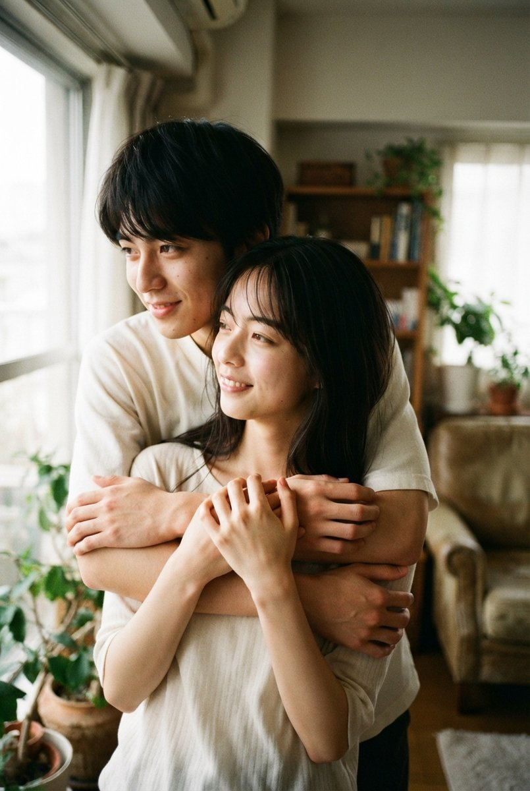
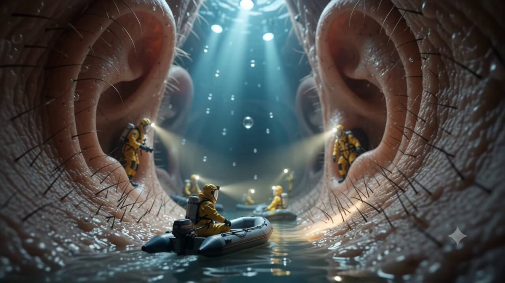
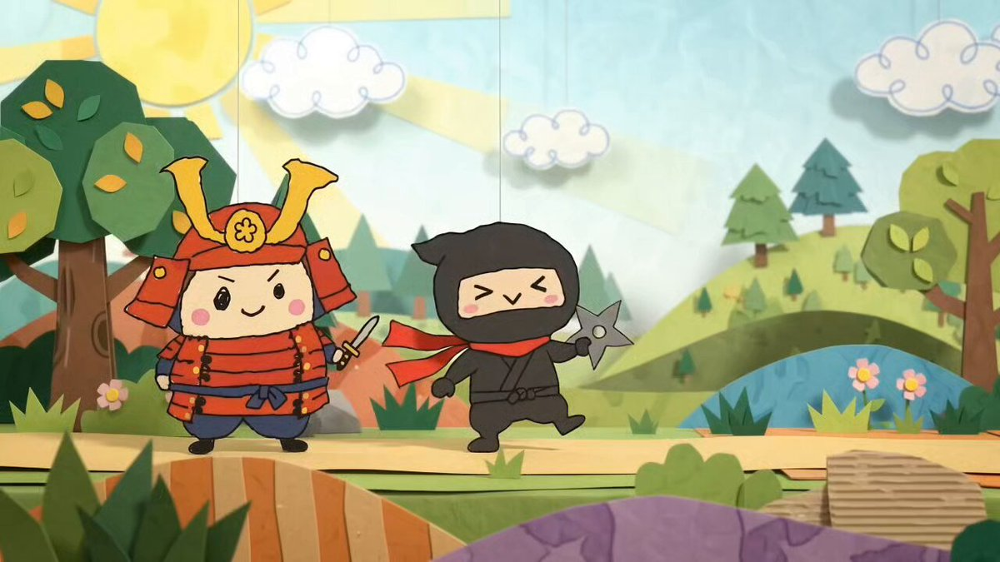
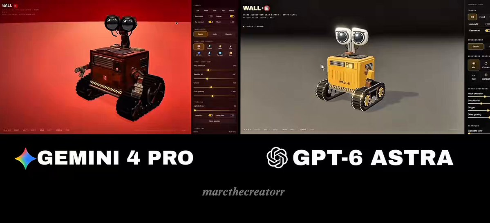
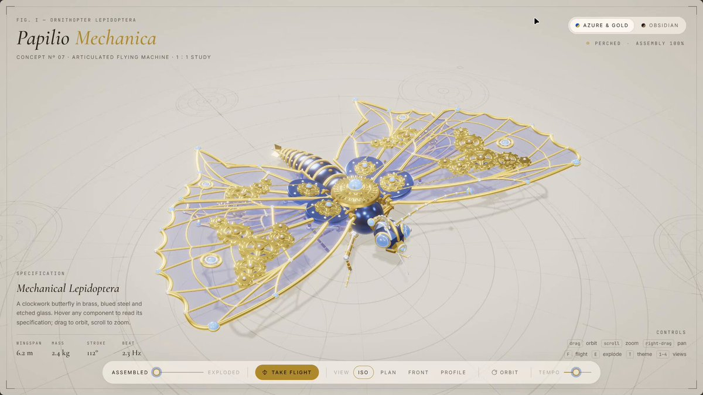
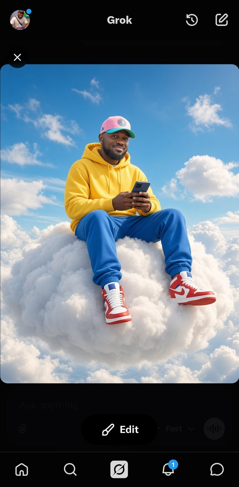

# Gemini · प्रॉम्प्ट संग्रह · Leadde.ai

[](README.md) [](README_zh.md) [](README_zh-TW.md) [](README_ja-JP.md) [](README_ko-KR.md) [](README_th-TH.md) [](README_vi-VN.md) [](README_hi-IN.md) [](README_es-ES.md) [-lightgrey)](README_es-419.md) [](README_de-DE.md) [](README_fr-FR.md) [](README_it-IT.md) [-lightgrey)](README_pt-BR.md) [](README_pt-PT.md) [](README_tr-TR.md)

**Best for:** Gemini multimodal prompts for visual reasoning, creative exploration, and production planning.

For PDF, PPT, SOP, training, and multilingual video workflows:
[Awesome Document-to-Video](https://github.com/LeaddeOpenLab/awesome-document-to-video)

> **हर दिन चुने गए उच्च गुणवत्ता वाले प्रॉम्प्ट**

AI चित्र, वीडियो और 3D निर्माण के लिए संपूर्ण प्रॉम्प्ट खोजें। शैली के अनुसार देखें, अलग-अलग भाषाएँ चुनें और मूल रचनाकार तथा स्रोत जानें।

[Leadde.ai देखें →](https://leadde.ai/?utm_source=github&utm_medium=readme&utm_campaign=prompt-library&utm_content=gemini)

## Leadde.ai का परिचय

Leadde.ai टीमों को दस्तावेज़ों, स्लाइडों और पाठ से प्रशिक्षण, नए कर्मचारियों के परिचय और विपणन के लिए AI व्यावसायिक वीडियो बनाने में मदद करता है।

दैनिक चुने हुए प्रॉम्प्ट और नई रचनात्मक प्रेरणा के लिए इस रिपॉज़िटरी को स्टार दें।

**26** प्रॉम्प्ट · नवीनतम जोड़: **2026-09-21**

<a name="catalog"></a>

## श्रेणी के अनुसार देखें

[फोटोग्राफी](#category-photography) · [सिनेमैटिक / फ़िल्म स्टिल](#category-cinematic-film-still) · [एनिमे / मंगा](#category-anime-manga) · [चित्रण](#category-illustration) · [3D रेंडर](#category-3d-render) · [अन्य](#category-other)

<a name="all-prompts"></a>

<a name="category-photography"></a>

## फोटोग्राफी

<a name="prompt-2101199107914424604"></a>

### घर के अंदर एक-दूसरे से सटे युवा जोड़े का दैनिक शैली वाला पोर्ट्रेट प्रॉम्प्ट।

लेखक：[@55hawks](https://x.com/55hawks) · [मूल पोस्ट](https://x.com/55hawks/status/2101199107914424604)

फोटोग्राफी · पोर्ट्रेट / सेल्फ़ी · कैरेक्टर · समूह / युगल · आर्किटेक्चर / इंटीरियर · प्रकाशित

**सारांश:** घर के अंदर एक-दूसरे से सटे युवा जोड़े का दैनिक शैली वाला पोर्ट्रेट प्रॉम्प्ट।



**प्रॉम्प्ट**

```text
घर के अंदर एक-दूसरे से सटे युवा प्रेमी युगल, पीछे से आलिंगनबद्ध, दोनों हाथों से धीरे से छाती के आसपास लपेटे हुए। कोमल प्राकृतिक रोशनी, यथार्थवादी त्वचा बनावट, स्मार्टफोन फोटो शैली --ar 2:3
```

[↑ श्रेणियों पर लौटें](#catalog)

---

<a name="prompt-2100410821109293122"></a>

### टोक्यो वेधशाला डेक पर हाई-एंड फैशन फोटोशूट, क्रीम रंग के सूट में महिला टोक्यो टॉवर की ओर इशारा करते हुए।

लेखक：[@ZunairaSaeedAi](https://x.com/ZunairaSaeedAi) · [मूल पोस्ट](https://x.com/ZunairaSaeedAi/status/2100410821109293122)

फोटोग्राफी · पोर्ट्रेट / सेल्फ़ी · कैरेक्टर · फ़ैशन आइटम · प्रकाशित

**सारांश:** टोक्यो वेधशाला डेक पर हाई-एंड फैशन फोटोशूट, क्रीम रंग के सूट में महिला टोक्यो टॉवर की ओर इशारा करते हुए।


**प्रॉम्प्ट**

```text
उज्ज्वल प्राकृतिक दिन के उजाले में टोक्यो, जापान में एक अति-यथार्थवादी, उच्च-स्तरीय लक्जरी फैशन संपादकीय तस्वीर बनाएं।

कांच की रेलिंग वाले एक शानदार ऊंचे रूफटॉप ऑब्जर्वेशन डेक पर एक परिष्कृत युवा महिला खड़ी है, जहाँ से टोक्यो का एक लुभावना मनोरम दृश्य दिखाई दे रहा है। उसने एक परिष्कृत ब्लेज़र और चौड़े पैरों वाली पतलून के साथ एक सुरुचिपूर्ण क्रीम-रंग की लक्जरी पोशाक पहनी है, जिसे एक प्रीमियम फैशन अभियान की तरह स्टाइल किया गया है।

उसने एक हाथ में एक लक्जरी हैंडबैग और दूसरे हाथ में एक आधुनिक Apple iPhone पकड़ा हुआ है। iPhone पकड़े हुए हाथ स्वाभाविक रूप से शहर की ओर फैला हुआ है, उसकी तर्जनी स्पष्ट रूप से टोक्यो टॉवर की ओर इशारा कर रही है, मानो वह सुरुचिपूर्ण ढंग से किसी को यह ऐतिहासिक स्थल और खूबसूरत शहर दिखा रही हो।

टोक्यो का क्षितिज अत्यधिक दिखाई देने वाला, तेज और विस्तृत होना चाहिए, जिसमें पृष्ठभूमि में प्रमुखता से स्थित कई गगनचुंबी इमारतें, भवन, सड़कें, हरियाली और टोक्यो टॉवर शामिल हैं। शहर को अत्यधिक धुंधला (ब्लर) नहीं किया जाना चाहिए। महिला और दूर के शहर के दृश्य दोनों को स्पष्ट रूप से दृश्यमान रखें।

उज्ज्वल स्वच्छ दिन का प्रकाश, नरम प्राकृतिक बादलों के साथ नीला आकाश, स्पष्ट वायुमंडलीय दृश्यता, यथार्थवादी धूप और छाया, प्रीमियम वास्तुशिल्प विवरण, यथार्थवादी त्वचा बनावट, प्राकृतिक बाल, यथार्थवादी हाथ और उंगलियां, सटीक शारीरिक अनुपात, विस्तृत कपड़े और हैंडबैग, परिष्कृत लक्जरी यात्रा सौंदर्य।

संरचना (कंपोजिशन): वर्टिकल 9:16, फुल-बॉडी फैशन पोर्ट्रेट, थोड़ा ऊंचा दृष्टिकोण, अग्रभूमि में महिला और पृष्ठभूमि में फैले विशाल टोक्यो क्षितिज के साथ संतुलित फ्रेमिंग।

फोटोग्राफी शैली: हाई-एंड लक्जरी विज्ञापन, सिनेमाई संपादकीय फोटोग्राफी, पेशेवर फुल-फ्रेम कैमरा, गहरा फील्ड डेप्थ, अग्रभूमि और पृष्ठभूमि दोनों में तीखापन, फोटोरियलिस्टिक, अति-विस्तृत, यथार्थवादी बनावट, प्राकृतिक रंग, प्रीमियम वाणिज्यिक गुणवत्ता, 8K।

महत्वपूर्ण: उसके हाथ में Apple iPhone स्पष्ट रूप से दिखाई दे, इशारा करने की मुद्रा स्वाभाविक और सुरुचिपूर्ण हो, टोक्यो टॉवर स्पष्ट रूप से पहचानने योग्य हो, और पूरे शहर के दृश्य में अधिकतम विवरण सुरक्षित रहे।

कोई टेक्स्ट नहीं, कोई वॉटरमार्क नहीं, कोई कृत्रिम धुंधलापन नहीं, कोई विकृत हाथ नहीं, कोई अतिरिक्त उंगलियां नहीं, कोई डुप्लिकेट ऑब्जेक्ट नहीं, कोई विकृत शरीर रचना नहीं, कोई कार्टून प्रभाव नहीं।
```

[↑ श्रेणियों पर लौटें](#catalog)

---

<a name="prompt-2100038181538365752"></a>

### बैले स्टूडियो में सफेद लियोटार्ड पहने और पंजों के बल खड़ी जापानी महिला नर्तकी का कैटलॉग-शैली पोर्ट्रेट जनरेशन प्रॉम्प्ट।

लेखक：[@55hawks](https://x.com/55hawks) · [मूल पोस्ट](https://x.com/55hawks/status/2100038181538365752)

फोटोग्राफी · पोर्ट्रेट / सेल्फ़ी · प्रकाशित

मूल पोस्ट：[@CyberTotal2026](https://x.com/CyberTotal2026) · [मूल पोस्ट](https://x.com/CyberTotal2026/status/2099759874318184905)

**सारांश:** बैले स्टूडियो में सफेद लियोटार्ड पहने और पंजों के बल खड़ी जापानी महिला नर्तकी का कैटलॉग-शैली पोर्ट्रेट जनरेशन प्रॉम्प्ट।


**प्रॉम्प्ट**

```text
# निर्देश
- बैले उपकरण निर्माता के लिए एक उच्च गुणवत्ता वाला कैटलॉग फ़ोटो उत्पन्न करें  
- इसे फ़ोटोजेनिक और संपादकीय (editorial) पोर्ट्रेट के रूप में प्रस्तुत करें  
- गैर-कामुक, कलात्मक और शांत अभिव्यक्ति बनाए रखें  
- SFW सुनिश्चित करने के लिए AI स्वचालित रूप से रचना, प्रकाश, दूरी और परिधान चित्रण को समायोजित करे  

# संदर्भ
- यह एक बैले स्टूडियो में अभ्यास का दृश्य है  
- शांत स्टूडियो का माहौल छाया हुआ है  
- खिड़की से आती तेज़ धूप लियोटार्ड के कपड़े पर तीखी छाया और हाइलाइट बनाती है  
- माथे पर पसीना छलकता है, जिससे अभ्यास की वास्तविकता झलकती है  
- बाल स्वाभाविक रूप से नीचे बंधी पोनीटेल में हैं  
- कैटलॉग फ़ोटो के रूप में दृश्यता पर ज़ोर देते हुए रंग ज्वलंत उच्च-संतृप्ति टोन में हैं  

# इनपुट
- संदर्भ विषय: जापानी महिला बैले डांसर  
- परिपूर्ण ऑवरग्लास फिगर और सुगठित वक्षस्थल  
- सफेद रंग का बैकलेस कैमीसोल लियोटार्ड और सफेद बैले शूज़ पहने हुए  
- तिरछी पीठ करके खड़ी है  
- दोनों हाथ कमर के पीछे हल्के से जुड़े हुए हैं  
- दोनों पैरों के पंजों के बल (en pointe) खड़ी है  
- लियोटार्ड नवीनतम तकनीक के अत्यधिक लोचदार और अत्यंत पतले कपड़े से बना है, जिसमें त्रि-आयामी कसाव और प्राकृतिक संपीड़न है, जो त्वचा के घुमावों पर पूरी तरह फिट बैठता है  
- त्वचा में प्राकृतिक रोमछिद्र, बनावट और पसीने के निशान शामिल हैं (कोई सौंदर्यीकरण सुधार नहीं)  

# आउटपुट
- एक बैले उपकरण कैटलॉग फ़ोटो जिसमें कलात्मकता और कार्यक्षमता दोनों साथ मौजूद हैं  
- तेज़ धूप से प्राकृतिक हाइलाइट और छाया, जो लियोटार्ड की बनावट को उभारती है  
- एक ऐसी रचना जो बैले स्टूडियो की शांति और अभ्यास के तनाव को दर्शाती है  
- SFW रहते हुए एक कलात्मक और परिष्कृत छाप छोड़ने वाली फ़ोटोग्राफ़िक कृति के रूप में तैयार
```

[↑ श्रेणियों पर लौटें](#catalog)

---

<a name="category-cinematic-film-still"></a>

## सिनेमैटिक / फ़िल्म स्टिल

<a name="prompt-2101892143560437894"></a>

### अनुवाद जारी है

लेखक：[@AiwithBloodline](https://x.com/AiwithBloodline) · [मूल पोस्ट](https://x.com/AiwithBloodline/status/2101892143560437894)

सिनेमैटिक / फ़िल्म स्टिल · लैंडस्केप / प्रकृति · प्रकाशित

मूल पोस्ट：[@AiwithBloodline](https://x.com/AiwithBloodline) · [मूल पोस्ट](https://x.com/AiwithBloodline/status/2101618979118658038)

**सारांश:** अनुवाद जारी है



**प्रॉम्प्ट**

```text
अनुवाद जारी है
```

[↑ श्रेणियों पर लौटें](#catalog)

---

<a name="prompt-2100486977456095594"></a>

### कैमरा कॉफ़ी कप के मैक्रो शॉट से आसानी से आगे बढ़ता है, तरल सतह को भेदकर कप के भीतर लघु भविष्यवादी तकनीकी शहर में प्रवेश करता है।

लेखक：[@MohdAdnanA86218](https://x.com/MohdAdnanA86218) · [मूल पोस्ट](https://x.com/MohdAdnanA86218/status/2100486977456095594)

सिनेमैटिक / फ़िल्म स्टिल · साइबरपंक / साइंस-फाई · भोजन / पेय · शहर का नज़ारा / सड़क · प्रकाशित

**सारांश:** कैमरा कॉफ़ी कप के मैक्रो शॉट से आसानी से आगे बढ़ता है, तरल सतह को भेदकर कप के भीतर लघु भविष्यवादी तकनीकी शहर में प्रवेश करता है।


**प्रॉम्प्ट**

```text
एक चिकनी आधुनिक कैफ़े टेबल पर रखी भाप निकलती गाढ़ी ब्लैक कॉफ़ी का एक फ़ोटोरियलिस्टिक सिनेमाई मैक्रो शॉट। 0–2 सेकंड: कैमरा धीरे-धीरे कॉफ़ी की सतह की ओर बढ़ता है, यथार्थवादी भाप, प्रतिबिंब और छोटी लहरों को कैद करता है। 2–5 सेकंड: कैमरा नाटकीय रूप से सीधे कॉफ़ी के अंदर ज़ूम करता है, एक सहज संक्रमण में चमकदार तरल सतह से होकर गुज़रता है। 5–8 सेकंड: कॉफ़ी कप के अंदर छिपे एक आश्चर्यजनक छोटे भविष्य के शहर को प्रकट करता है—ऊंची रोशनी वाली गगनचुंबी इमारतें, लघु सड़कें, चलती कारें, नन्हे पैदल यात्री, चमकते संकेत और एलिवेटेड राजमार्ग। 8–10 सेकंड: कैमरा लघु इमारतों के बीच से उड़ता है जबकि स्लीक उड़ने वाले वाहन भविष्य के क्षितिज से होकर गुज़रते हैं, और नन्हे विमान पीछे हल्के प्रकाश के निशान छोड़ते हैं। अल्ट्रा-रियलिस्टिक लघु पैमाना, सिनेमाई डेप्थ ऑफ़ फ़ील्ड, वॉल्यूमेट्रिक लाइटिंग, यथार्थवादी प्रतिबिंब, विस्तृत वास्तुकला, गतिशील कैमरा मूवमेंट, सीमलेस मैक्रो-टू-वाइड ट्रांज़िशन, 8K विवरण, फ़ोटोरियलिस्टिक टेक्सचर, भविष्यवादी माहौल, सहज गति, कोई कट नहीं, कोई टेक्स्ट नहीं, कोई वॉटरमार्क नहीं, देखने में शानदार।
```

[↑ श्रेणियों पर लौटें](#catalog)

---

<a name="prompt-2099517007934919019"></a>

### तूफानी पहाड़ी दर्रे पर बिजली और कार्बन के टुकड़ों को एक लेम्बोर्गिनी एवेंटाडोर के रूप में इकट्ठा करने का निर्देश देने वाला 10 सेकंड का JSON प्रॉम्प्ट।

लेखक：[@MrDasCreates](https://x.com/MrDasCreates) · [मूल पोस्ट](https://x.com/MrDasCreates/status/2099517007934919019)

सिनेमैटिक / फ़िल्म स्टिल · लैंडस्केप / प्रकृति · प्रकाशित

**सारांश:** तूफानी पहाड़ी दर्रे पर बिजली और कार्बन के टुकड़ों को एक लेम्बोर्गिनी एवेंटाडोर के रूप में इकट्ठा करने का निर्देश देने वाला 10 सेकंड का JSON प्रॉम्प्ट।


**प्रॉम्प्ट**

```text
{"model": "gemini-omni-1.1-flash", "duration": "10s", "aspect_ratio": "16:9", "shot": {"structure": "एकल निरंतर निर्बाध शॉट, कोई दृश्य कट नहीं", "composition": "शाम के समय एक तूफानी पहाड़ी दर्रे पर अल्ट्रा-वाइड शॉट से शुरू होता है, कार्बन-फाइबर के टुकड़ों और बिजली की ऊर्जा को आकार में घूमते हुए देखता है, केंद्र में दहाड़ती लेम्बोर्गिनी एवेंटाडोर के क्लोज-अप पर समाप्त होता है", "lens": "भव्य परिदृश्य के लिए वाइड-एंगल, फिर उत्पाद अनावरण के लिए 35mm", "frame_rate": "24fps सिनेमाई", "camera_movement": "उठते हुए टुकड़ों का पीछा करते हुए तूफान के बीच से धीमी नाटकीय पुश-इन, फिर कार में उनके जुड़ते ही एक निचला आक्रामक डॉली शॉट, इसके जमने और रेव करने पर स्थिर रहना"}, "timeline": {"0-3s": "शाम के समय विशाल तूफानी इतालवी पहाड़ी दर्रा। नुकीली चोटियाँ, घुमावदार गीला डामर, दूर की बिजली से फटते काले बादल। पथरीली चट्टानों पर हवा से उड़ती बारिश और धुंध।", "3-7s": "सैकड़ों नुकीले कार्बन-फाइबर के टुकड़े, चमकते धातु के पैनल और इलेक्ट्रिक-ब्लू ऊर्जा की लकीरें सड़क से ऊपर उठती हैं और हिंसक, सटीक कक्षाओं में घूमती हैं। वे हवा में एक लेम्बोर्गिनी एवेंटाडोर के सटीक कोणीय सिल्हूट में आपस में जुड़ जाते हैं। चिंगारी, बारिश का अपवर्तन और कड़कड़ाती ऊर्जा के किनारे।", "7-10s": "आकार रोशनी की एक लहर के साथ धड़कता है और हवा में तैरती हुई फिर गीली सड़क पर गिरती हुई एक वास्तविक मैट-ब्लैक लेम्बोर्गिनी एवेंटाडोर में तब्दील हो जाता है। हेडलाइट्स चमकती हैं, कैंची वाले दरवाजे थोड़े उठते हैं, इंजन गरजता है। कार पर टिके रहें क्योंकि बारिश शरीर पर धारियाँ बनाती है।"}, "subject": {"description": "सुपरकार सिल्हूट बनाने के लिए सैकड़ों कार्बन-फाइबर के टुकड़े और ऊर्जा के अंश उठते हैं और आक्रामक कक्षाओं में टकराते हैं", "props": "घूमते हुए टुकड़ों से बनी अंतिम लेम्बोर्गिनी एवेंटाडोर, फिर सड़क पर जमते हुए असली ब्रांडेड सुपरकार में परिवर्तित होती है"}, "scene": {"location": "गीली घुमावदार सड़क के साथ नाटकीय उच्च-पर्वतीय दर्रा", "time_of_day": "तूफानी शाम, काले बादलों से छनकर आती आखिरी सुनहरी रोशनी, बिजली की चमक", "environment": "कठोर अल्पाइन मौसम, बारिश से फिसलन भरा डामर, नुकीली चट्टानें, तेज हवा"}, "visual_details": {"action": "टुकड़े ऊपर उठते हैं, हिंसक संगठित रास्तों में घूमते हैं, कार की रूपरेखा में लॉक होते हैं, ऊर्जा के साथ धड़कते हैं, फिर तैयार एवेंटाडोर में बदल जाते हैं जो नीचे गिरती है और रेव करती है", "special_effects": "कार्बन-कण एनीमेशन, बिजली ऊर्जा ट्रेल्स, हवा में सामग्री का रूपांतरण, बारिश की परस्पर क्रिया, इंजन की गर्मी से विकृति और टायर का स्प्रे"}, "cinematography": {"lighting": "गोल्डन-ऑवर दरारों के साथ नाटकीय तूफानी प्रकाश, इलेक्ट्रिक-ब्लू ऊर्जा की चमक, गीले कार्बन शरीर पर तेज रिम लाइट", "color_palette": "मैट ब्लैक, स्टॉर्म ग्रे, इलेक्ट्रिक ब्लू, गीले डामर के प्रतिबिंब, गर्म शाम का सुनहरा रंग", "tone": "कच्ची शक्ति, इतालवी रोष, भव्य विलासिता"}, "audio": {"music": "गहरे सिनेमाई ड्रम और बढ़ते तनाव के साथ आक्रामक ऑर्केस्ट्रल हिट्स", "ambient": "पहाड़ी हवा की सांय-सांय, दूर की गड़गड़ाहट, सड़क पर बारिश", "sound_effects": "पुर्जों के लॉक होने पर तीखी धात्विक और कार्बन की आवाज, आकार पूरा होने पर विशाल V12 की दहाड़, टायर की गड़गड़ाहट और बारिश की फुहार", "mix": "शक्तिशाली, गरजता हुआ, प्रकृति बनाम मशीन एक प्रेरक संगीतमय केंद्र के साथ"}, "constraints": {"dialogue": "none", "voiceover": "none", "on_screen_text": "none", "captions": "none", "subtitles": false}}
```

[↑ श्रेणियों पर लौटें](#catalog)

---

<a name="prompt-2099370488342647240"></a>

### एक सतत शॉट जिसमें एक व्यक्ति एक पोर्टल दरवाजा खोलता है जो पेरिस, भविष्य के टोक्यो, प्राचीन रोम और एक विदेशी ग्रह से गुजरते हुए अंततः विलीन हो जाता है।

लेखक：[@MohdAdnanA86218](https://x.com/MohdAdnanA86218) · [मूल पोस्ट](https://x.com/MohdAdnanA86218/status/2099370488342647240)

सिनेमैटिक / फ़िल्म स्टिल · कैरेक्टर · प्रकाशित

**सारांश:** एक सतत शॉट जिसमें एक व्यक्ति एक पोर्टल दरवाजा खोलता है जो पेरिस, भविष्य के टोक्यो, प्राचीन रोम और एक विदेशी ग्रह से गुजरते हुए अंततः विलीन हो जाता है।


**प्रॉम्प्ट**

```text
एक ही निरंतर शॉट में 10-सेकंड का अति-यथार्थवादी सिनेमाई फंतासी वीडियो बनाएं। 20 के दशक की शुरुआत का एक सुंदर युवक, जिसके घने प्राकृतिक रूप से लहरदार गहरे काले बाल हैं, गहरी भूरी आंखें, तीखा मर्दाना जबड़ा, हल्की दाढ़ी, और एक परिष्कृत गहरा लंबा कोट पहने हुए, एक रहस्यमय कम रोशनी वाले गलियारे में एक साधारण पुराने लकड़ी के दरवाजे के सामने खड़ा है।
0–2 सेकंड: वह धीरे-धीरे पीतल के हैंडल की ओर हाथ बढ़ाता है, दरवाजा खोलता है, और सुनहरे समय (गोल्डन ऑवर) में रोमांटिक पेरिस को प्रकट करता है — एफिल टॉवर, सुरुचिपूर्ण हॉसमैन इमारतें, चमकते कैफे, गर्म वायुमंडलीय प्रकाश।
2–4 सेकंड: बिना किसी कट के, दरवाज़ा तुरंत रात के समय भविष्य के टोक्यो में बदल जाता है — गगनचुंबी नीयन इमारतें, होलोग्राफिक विज्ञापन, उड़ने वाले वाहन, बारिश से भीगी सड़कें, जीवंत प्रतिबिंब।
4–6 सेकंड: दुनिया फिर से प्राचीन रोम में बदल जाती है — विशाल कोलोसियम, संगमरमर के खंभे, रोमन वास्तुकला, मशाल की रोशनी, दूर की भीड़ और हवा में तैरती महीन धूल।
6–8 सेकंड: दरवाज़ा एक लुभावने विदेशी ग्रह में बदल जाता है — बैंगनी आसमान, विशाल चंद्रमा, चमकती अलौकिक वनस्पति, अजीब पहाड़ और दूर की भविष्यवादी संरचनाएं।
8–10 सेकंड: वह व्यक्ति दरवाजे की ओर कदम बढ़ाता है क्योंकि चारों दुनिया दरवाजे के अंदर तेजी से मिश्रित और एक साथ घूमने लगती हैं, जिससे एक शानदार अनंत-दुनिया का पोर्टल बन जाता है। वह चकित दिखता है क्योंकि कैमरा धीरे-धीरे चमकते दरवाजे की ओर आगे बढ़ता है।
शैली: फोटोरियलिस्टिक, सिनेमाई ब्लॉकबस्टर गुणवत्ता, सहज जादुई बदलाव, यथार्थवादी भौतिकी, वॉल्यूमेट्रिक लाइटिंग, वायुमंडलीय गहराई, विस्तृत वातावरण, प्राकृतिक मानवीय गति, नाटकीय कैमरा मूवमेंट, 8K HDR, उच्च गतिशील रेंज, यथार्थवादी त्वचा और कपड़ा, सिनेमाई डेप्थ ऑफ फील्ड, महाकाव्य पैमाना, कोई टेक्स्ट नहीं, कोई सबटाइटल्स नहीं, कोई वॉटरमार्क नहीं, कोई गड़बड़ियां नहीं, कोई विकृत चेहरा नहीं, कोई अतिरिक्त अंग नहीं। ठीक 10 सेकंड के लिए पूरी तरह से गतिबद्ध, जिसमें प्रत्येक दुनिया लगभग 2 सेकंड के लिए स्पष्ट रूप से दिखाई देती है।
```

[↑ श्रेणियों पर लौटें](#catalog)

---

<a name="prompt-2098277089749463207"></a>

### एक वीरान भविष्यवादी शहर से गुजरते हुए एक युवक का सिनेमाई विज्ञान-फाई दृश्य, जब उसके चारों ओर होलोग्राफिक बिलबोर्ड सक्रिय हो जाते हैं।

लेखक：[@MohdAdnanA86218](https://x.com/MohdAdnanA86218) · [मूल पोस्ट](https://x.com/MohdAdnanA86218/status/2098277089749463207)

सिनेमैटिक / फ़िल्म स्टिल · साइबरपंक / साइंस-फाई · कैरेक्टर · प्रकाशित

**सारांश:** एक वीरान भविष्यवादी शहर से गुजरते हुए एक युवक का सिनेमाई विज्ञान-फाई दृश्य, जब उसके चारों ओर होलोग्राफिक बिलबोर्ड सक्रिय हो जाते हैं।


**प्रॉम्प्ट**

```text
अल्ट्रा-यथार्थवादी सिनेमाई विज्ञान-फाई लघु फिल्म, 10 सेकंड, 16:9। वर्ष 2050 में एक बेहद सुंदर 20 वर्ष के आसपास का युवक एक वीरान भविष्यवादी महानगर में अकेला चल रहा है। उसके घने, प्राकृतिक रूप से घुंघराले काले बाल, गहरी गहरी-भूरी आंखें, तीखी मर्दाना जबड़े की रेखा, उभरी हुई गाल की हड्डियां और हल्की प्राकृतिक दाढ़ी है। उसने एक चिकना काला भविष्यवादी कोट, गहरे रंग की पतलून और न्यूनतम जूते पहने हुए हैं। उसके चारों ओर का विशाल शहर पूरी तरह वीरान है—गगनचुंबी कांच की इमारतें, खाली एलिवेटेड राजमार्ग, छोड़े गए स्वायत्त वाहन, तैरता हुआ कोहरा, बिखरा हुआ मलबा और हल्की नीली वायुमंडलीय रोशनी। 0–3 सेकंड: पीछे से एक विस्तृत सिनेमाई ट्रैकिंग शॉट जब वह एक खाली भविष्य की सड़क पर धीरे-धीरे चलता है, उसके कदमों की आहट शांत शहर में गूंजती है। 3–6 सेकंड: वह अचानक रुक जाता है और ऊपर देखता है। एक गगनचुंबी इमारत के ऊपर एक होलोग्राफिक विज्ञापन टिमटिमाता है, फिर दूसरा, फिर सैकड़ों। 6–9 सेकंड: पूरे शहर में हजारों विशाल होलोग्राफिक विज्ञापन अचानक सक्रिय हो जाते हैं—नियॉन होर्डिंग्स, तैरते हुए इंटरफेस, एनिमेटेड उत्पाद और रहस्यमय संदेश—जो उसके चारों ओर वीरान सड़कों को रोशन करते हैं। जब वह चौंककर चारों ओर देखता है तो युवक के चेहरे पर होलोग्राफिक रोशनी चमकती है। 9–10 सेकंड: उसके चेहरे का नाटकीय क्लोज़-अप क्योंकि हर होलोग्राफिक स्क्रीन एक साथ उसकी ओर मुड़ती है, जिससे एक डरावना अहसास होता है कि वह वास्तव में अकेला नहीं हो सकता है। फोटोरियलिस्टिक मानव गति, यथार्थवादी कपड़े की भौतिकी, सिनेमाई वॉल्यूमेट्रिक कोहरा, गीली परावर्तक सड़कें, विस्तृत भविष्यवादी वास्तुकला, वायुमंडलीय गहराई, सूक्ष्म लेंस फ्लेयर, यथार्थवादी होलोग्राम चमक, नाटकीय कैमरा आंदोलन, उच्च कंट्रास्ट, 8K HDR, एनामॉर्फिक सिनेमाई लुक, रहस्यमय भविष्यवादी माहौल, कोई कार्टून नहीं, कोई AI जैसा दिखने वाला चेहरा नहीं, कोई टेक्स्ट गड़बड़ी नहीं, कोई विकृत हाथ नहीं।
```

[↑ श्रेणियों पर लौटें](#catalog)

---

<a name="prompt-2097929264158945776"></a>

### सूर्यास्त के समय लावे, राख के बादलों और बिजली की चमक के साथ फटते एक विशाल ज्वालामुखी को दर्शाने वाला समय-अंकित सिनेमाई प्रॉम्प्ट।

लेखक：[@abs\_uiux](https://x.com/abs_uiux) · [मूल पोस्ट](https://x.com/abs_uiux/status/2097929264158945776)

सिनेमैटिक / फ़िल्म स्टिल · लैंडस्केप / प्रकृति · प्रकाशित

**सारांश:** सूर्यास्त के समय लावे, राख के बादलों और बिजली की चमक के साथ फटते एक विशाल ज्वालामुखी को दर्शाने वाला समय-अंकित सिनेमाई प्रॉम्प्ट।


**प्रॉम्प्ट**

```text
0–2 से: सूर्यास्त के समय एक विशाल ज्वालामुखी का विस्तृत हवाई शॉट। क्रेटर से धुआं निकलना शुरू होता है और जमीन में हल्का सा कंपन होने लगता है।

2–5 से: ज्वालामुखी अचानक फट पड़ता है, राख, धुएं और दहकते लावे का एक विशाल स्तंभ आकाश में छोड़ता है।

5–8 से: आग जैसा लावा पहाड़ की ढलान से नीचे बहने लगता है, जबकि ऊपर गहरा राख का बादल तेजी से फैलता है। कैमरा नाटकीय रूप से पीछे हटता है।

8–10 से: अंतिम अल्ट्रा-वाइड शॉट जिसमें राख के बादल के भीतर बिजली चमकती है और विस्फोट पूरे परिदृश्य को रोशन कर देता है।

शैली: फोटोरियलिस्टिक, सिनेमाई आपदा-फिल्म जैसा दृश्य, नाटकीय पैमाना, वॉल्यूमेट्रिक धुआं, चमकता लावा, यथार्थवादी मलबा, कैमरे का जोरदार हिलना, महाकाव्य जैसा साउंड डिज़ाइन।
```

[↑ श्रेणियों पर लौटें](#catalog)

---

<a name="prompt-2097152276452561325"></a>

### भोर के समय एक विशाल लकड़ी के लॉन्गशिप को तैयार करते लघु वाइकिंग योद्धाओं का अल्ट्रा-यथार्थवादी सिनेमाई 10-सेकंड का वीडियो।

लेखक：[@MohdAdnanA86218](https://x.com/MohdAdnanA86218) · [मूल पोस्ट](https://x.com/MohdAdnanA86218/status/2097152276452561325)

सिनेमैटिक / फ़िल्म स्टिल · प्रकाशित

**सारांश:** भोर के समय एक विशाल लकड़ी के लॉन्गशिप को तैयार करते लघु वाइकिंग योद्धाओं का अल्ट्रा-यथार्थवादी सिनेमाई 10-सेकंड का वीडियो।


**प्रॉम्प्ट**

```text
अल्ट्रा-यथार्थवादी सिनेमाई 10-सेकंड का वीडियो, भोर के समय वाइकिंग्स का लघु बंदरगाह। केवल कुछ इंच लंबे नन्हे वाइकिंग योद्धा युद्ध की तैयारी करते हुए एक विशाल लकड़ी के लॉन्गशिप के चारों ओर भागदौड़ कर रहे हैं। वे लघु ढालें, कुल्हाड़ियाँ, रस्सियाँ और भाले ले जा रहे हैं, विशाल लकड़ी की सीढ़ियों पर चढ़ रहे हैं, मोटी रस्सियों को कस रहे हैं, रसद लाद रहे हैं, और एक विशाल लाल-और-काले वाइकिंग पाल को उठा रहे हैं। विशाल लॉन्गशिप उनके ऊपर एक विशालकाय युद्धपोत की तरह ऊंची खड़ी है। ठंडे नॉर्डिक पानी पर कोहरा तैर रहा है, लकड़ी के घाट चरमरा रहे हैं, मशालें टिमटिमा रही हैं, और वाइकिंग झंडे हवा में नाटकीय रूप से फड़फड़ा रहे हैं।
कैमरा: लघु पैमाने पर लो-एंगल मैक्रो परिप्रेक्ष्य, व्यस्त बंदरगाह से गुजरता हुआ धीमा सिनेमाई ट्रैकिंग शॉट, विशाल लॉन्गशिप के नीचे गर्व से खड़े नन्हे योद्धाओं के एक नाटकीय वाइड शॉट के साथ समाप्त होता है।
प्रकाश: गर्म मशाल की रोशनी के साथ मिश्रित ठंडी नीली भोर की रोशनी, वॉल्यूमेट्रिक कोहरा, पानी पर यथार्थवादी परावर्तन, नाटकीय छायाएं।
शैली: अल्ट्रा-यथार्थवादी, महाकाव्य वाइकिंग फिल्म सौंदर्य, अत्यधिक विस्तृत लघु वातावरण, यथार्थवादी बनावट, सिनेमाई डेप्थ ऑफ फील्ड, प्राकृतिक गति, 4K, एनामॉर्फिक लेंस, इमर्सिव वातावरण, कोई टेक्स्ट नहीं, कोई वॉटरमार्क नहीं।
```

[↑ श्रेणियों पर लौटें](#catalog)

---

<a name="prompt-2096612096003965254"></a>

### कमर्शियल फिल्म शैली का ट्रैकिंग शॉट जहाँ एक चरित्र लगातार दिखाई देने वाली 3D टाइपोग्राफी और दृश्य मार्गों के साथ चलता है, लोगो के अनावरण में बदलने से पहले अंतरिक्ष में टेक्स्ट तत्वों के साथ बातचीत करता है।

लेखक：[@taya\_mama\_AI](https://x.com/taya_mama_AI) · [मूल पोस्ट](https://x.com/taya_mama_AI/status/2096612096003965254)

सिनेमैटिक / फ़िल्म स्टिल · 3D रेंडर · कैरेक्टर · टेक्स्ट / टाइपोग्राफी · प्रकाशित

मूल पोस्ट：[@taya\_mama\_AI](https://x.com/taya_mama_AI) · [मूल पोस्ट](https://x.com/taya_mama_AI/status/2095076567416451105)

**सारांश:** कमर्शियल फिल्म शैली का ट्रैकिंग शॉट जहाँ एक चरित्र लगातार दिखाई देने वाली 3D टाइपोग्राफी और दृश्य मार्गों के साथ चलता है, लोगो के अनावरण में बदलने से पहले अंतरिक्ष में टेक्स्ट तत्वों के साथ बातचीत करता है।


**प्रॉम्प्ट**

```text
कमर्शियल फिल्म।

पूरे अनुक्रम के दौरान प्रारंभिक पृष्ठभूमि का रंग बनाए रखें।

कैमरा एक निरंतर क्षैतिज स्क्रॉलिंग गति के साथ चरित्र को सहजता से ट्रैक करता है, जैसे-जैसे वे चलते हैं उनके साथ-साथ आगे बढ़ता है।

टेक्स्ट और जोड़ने वाली रेखाएं स्क्रीन पर धीरे-धीरे दिखाई देती हैं, जिससे एक निरंतर दृश्य मार्ग बनता है।

जैसे-जैसे चरित्र चलता है, वे अपने चारों ओर दिखाई देने वाले टेक्स्ट और ग्राफिक तत्वों को भौतिक वस्तुओं के रूप में पहचानते हैं जो वास्तव में उसी स्थान में मौजूद हैं। वे आगे बढ़ते हुए स्वाभाविक रूप से इन तत्वों के साथ बातचीत करते हैं: कभी-कभी उंगली के सिरे से पास के टेक्स्ट को छूना, ऊपर के शब्दों को देखना, ग्राफ़िक्स पर तिरछी नज़र डालना, किसी तत्व से बचने के लिए थोड़ा सा एक तरफ हट जाना, किसी के नीचे झुक जाना, या कुछ देखने के लिए संक्षेप में रुकना।

एक निरंतर रेखा, जो रेलवे ट्रैक या दृश्य मार्ग जैसी दिखती है, एक टेक्स्ट तत्व को अगले से जोड़ती है। संदर्भ छवि का टेक्स्ट मूल क्रम का पालन करते हुए इस जुड़े हुए पथ के साथ क्रमिक रूप से दिखाई देता है।

टेक्स्ट और ग्राफिक तत्वों को सपाट पृष्ठभूमि सजावट जैसा नहीं लगना चाहिए। उन्हें ठोस स्थानिक संबंधों और बातचीत के साथ चरित्र के समान त्रि-आयामी (3D) अंतरिक्ष में भौतिक रूप से मौजूद महसूस होना चाहिए।

किसी भी टेक्स्ट को दोहराएं या डुप्लिकेट न करें।

समग्र गति को तेज़, लयबद्ध और धाराप्रवाह रखें। क्षैतिज स्क्रॉलिंग गति पूरे अनुक्रम में निरंतर और निर्बाध रहनी चाहिए।

बिना किसी विकृत वर्ण, खराब टाइपोग्राफी, गलत वर्तनी या बदले हुए शब्दों के संदर्भ छवि से सभी टेक्स्ट को निष्ठापूर्वक पुन: प्रस्तुत करें।

अंतिम संक्रमण (ट्रांजिशन) के लिए, एक बड़ा अग्रभूमि ऑब्जेक्ट या ग्राफिक तत्व कैमरे के ठीक सामने बहुत करीब से गुजरता है, जिससे पूरा फ्रेम पूरी तरह से ढक जाता है और एक स्वाभाविक अग्रभूमि-ब्लर वाइप ट्रांजिशन बनता है।

जैसे ही अग्रभूमि ऑब्जेक्ट फ्रेम से हटता है, अंतिम लोगो स्क्रीन को सहजता से प्रकट करें।

कैमरे की गति सहज, गतिशील और सिनेमाई होनी चाहिए।

चरित्र और टेक्स्ट / ग्राफिक तत्वों के बीच की बातचीत को बाकी सभी चीज़ों से ऊपर प्राथमिकता दें।

बीजीएम (BGM): तेज़ गति, तेज़ बीट वाला लयबद्ध संगीत।
```

[↑ श्रेणियों पर लौटें](#catalog)

---

<a name="prompt-2097242290859241833"></a>

### एक कार्यालय के फोटोकॉपियर दृश्य में मुख्य पात्र के लिए प्राथमिक दृश्य और पहचान संदर्भ के रूप में वयस्क पुरुष की अपलोड की गई छवि का उपयोग करें जहां सूक्ष्म क्लोन निकलते हैं।

लेखक：[@abs\_uiux](https://x.com/abs_uiux) · [मूल पोस्ट](https://x.com/abs_uiux/status/2097242290859241833)

सिनेमैटिक / फ़िल्म स्टिल · कैरेक्टर · प्रकाशित

**सारांश:** एक कार्यालय के फोटोकॉपियर दृश्य में मुख्य पात्र के लिए प्राथमिक दृश्य और पहचान संदर्भ के रूप में वयस्क पुरुष की अपलोड की गई छवि का उपयोग करें जहां सूक्ष्म क्लोन निकलते हैं।


**प्रॉम्प्ट**

```text
मुख्य पात्र के लिए प्राथमिक दृश्य और पहचान संदर्भ के रूप में वयस्क पुरुष की अपलोड की गई छवि का उपयोग करें।

पहचान की निरंतरता:
पूरे वीडियो में अपलोड किए गए वयस्क पुरुष के साथ मजबूत दृश्य निरंतरता बनाए रखें। उसकी पहचान योग्य चेहरे की विशेषताओं, त्वचा की रंगत, अनुमानित उम्र, चेहरे की बनावट, हेयर स्टाइल, दाढ़ी या चेहरे के बाल (यदि हों), भौंहें, आंखें, नाक, होंठ, कान, शरीर के अनुपात और कपड़ों को सुरक्षित रखें।

दृश्य में दिखाई देने वाले सभी सूक्ष्म (लघु) संस्करण स्पष्ट रूप से उसी वयस्क पुरुष का प्रतिनिधित्व करने चाहिए और अपलोड किए गए संदर्भ के साथ दृष्टिगत रूप से सुसंगत रहने चाहिए। मूल पात्र और सूक्ष्म संस्करणों के बीच चेहरे की बनावट, हेयर स्टाइल, चेहरे के बाल, उम्र, कपड़ों या समग्र रूप-रंग में ध्यान देने योग्य परिवर्तनों से बचें।

दृश्य:
साफ-सुथरे समकालीन सजावट और यथार्थवादी पेशेवर प्रकाश व्यवस्था के साथ एक आधुनिक, प्रीमियम कार्यालय के अंदर दृश्य सेट करें।
लकड़ी की मेज पर एक उच्च स्तरीय मल्टीफ़ंक्शन फोटोकॉपियर/स्कैनर रखें।

वयस्क पुरुष एक स्वाभाविक मुस्कान के साथ आत्मविश्वास से मशीन की ओर बढ़ता है। वह स्कैनर का ढक्कन खोलता है और अपनी एक मुद्रित तस्वीर को स्कैनर के शीशे पर उल्टा (फेस-डाउन) रखता है।

वह ढक्कन बंद करता है और COPY बटन दबाता है।

कांच के नीचे एक यथार्थवादी गतिमान प्रकाश के साथ स्कैनर को सक्रिय होते हुए दिखाएं।

फिर एक चंचल जादुई परिवर्तन पेश करें: आउटपुट ट्रे से साधारण कागज की शीट आने के बजाय, उसी वयस्क पुरुष के लगभग 8-10 सूक्ष्म संस्करण मशीन से एक के बाद एक दिखाई देने लगते हैं।

प्रत्येक सूक्ष्म पुरुष लगभग 20-25 सेमी लंबा होना चाहिए और स्पष्ट रूप से अपलोड किए गए संदर्भ जैसा दिखना चाहिए, जिसमें समान हेयर स्टाइल, चेहरे के बाल, कपड़ों की शैली, त्वचा की रंगत और समग्र रूप शामिल है।

सूक्ष्म पात्र सुरक्षित रूप से लकड़ी की मेज पर कदम रखते हैं या कूदते हैं। वे मुस्कुराते हैं, मूल पुरुष की ओर हाथ हिलाते हैं, एक साथ घूमते हैं, आपस में दोस्ताना हाथ मिलाते हैं, एक-दूसरे का चंचलता से अभिवादन करते हैं, और संक्षेप में कैमरे की ओर देखते हैं।

मूल वयस्क पुरुष आश्चर्य और मनोरंजन के साथ प्रतिक्रिया करता है, मेज पर अपने स्वयं के सूक्ष्म संस्करणों को बातचीत करते हुए देखकर स्वाभाविक रूप से हंसता है।

कैमरा निर्देशन:
फोटोकॉपियर के पास आते हुए व्यक्ति के सिनेमाई मध्यम शॉट (medium shot) के साथ शुरुआत करें।

स्कैनर के शीशे पर तस्वीर रखते हुए उसका एक विस्तृत क्लोज-अप दिखाएं।

COPY बटन दबाते हुए उसकी उंगली का एक अत्यधिक क्लोज-अप (extreme close-up) दिखाएं।

कांच के नीचे घूमती स्कैनर की रोशनी को कैद करें।

पहले सूक्ष्म संस्करण के प्रकट होते ही आउटपुट ट्रे के एक नाटकीय क्लोज-अप में संक्रमण करें।

पहले सूक्ष्म पात्र के सुरक्षित रूप से मेज पर उतरने के दौरान एक संक्षिप्त स्लो-मोशन क्षण का उपयोग करें।

लकड़ी की सतह पर चलते सूक्ष्म कदमों के मैक्रो शॉट्स शामिल करें।

एक व्यापक सिनेमाई शॉट के साथ समाप्त करें जिसमें मूल वयस्क पुरुष मुस्कुराता हुआ दिखाई दे, जबकि कई सूक्ष्म संस्करण फोटोकॉपियर के चारों ओर खड़े हों और बातचीत कर रहे हों।

सहज पेशेवर कैमरा मूवमेंट, सूक्ष्म डेप्थ ऑफ फील्ड, यथार्थवादी लेंस व्यवहार और प्राकृतिक मोशन ब्लर का उपयोग करें।

दृश्य शैली:
फोटोरियलिस्टिक सिनेमाई यथार्थवाद।
अत्यधिक विस्तृत प्राकृतिक त्वचा की बनावट।
यथार्थवादी बाल और चेहरे के बाल।
कपड़े की यथार्थवादी बनावट और कपड़ों की गति।
सटीक मानवीय अनुपात।
विश्वसनीय सूक्ष्म पैमाना (miniature scale)।
प्रीमियम वाणिज्यिक प्रकाश व्यवस्था।
प्राकृतिक छाया और परावर्तन।
HDR-शैली डायनामिक रेंज।
पूरे अनुक्रम में चेहरे की उच्च निरंतरता।

महत्वपूर्ण निरंतरता नोट्स:
पूरे वीडियो में अपलोड किए गए वयस्क पुरुष को दृश्य संदर्भ के रूप में रखें।

सूक्ष्म पात्र असंबंधित लोगों के बजाय उसी व्यक्ति के सूक्ष्म रूप जैसे दिखने चाहिए।

सूक्ष्म पात्रों के बीच चेहरे के ध्यान देने योग्य बदलाव से बचें।

पात्र का लिंग, स्पष्ट आयु, हेयर स्टाइल, चेहरे के बाल, त्वचा की रंगत या पोशाक न बदलें।

असंबंधित पात्रों को शामिल न करें।

सभी मानव पात्रों को कार्टून जैसा बनाने के बजाय यथार्थवादी रखें।

कोई सबटाइटल नहीं।
कोई कैप्शन नहीं।
कोई लोगो नहीं।
कोई वॉटरमार्क नहीं।
स्क्रीन पर कोई अतिरिक्त टेक्स्ट नहीं।

पहलू अनुपात (Aspect Ratio): 9:16 लंबवत (vertical)
```

[↑ श्रेणियों पर लौटें](#catalog)

---

<a name="prompt-2097168437957263851"></a>

### एक विशाल केक फैक्ट्री के अंदर के लघु दृश्य को दर्शाने वाला 10-सेकंड का अति-यथार्थवादी सिनेमाई वीडियो प्रॉम्प्ट, जहाँ नन्हे बेकर्स मिलकर एक विशाल बहुस्तरीय जन्मदिन का केक सजा रहे हैं।

लेखक：[@AiwithBloodline](https://x.com/AiwithBloodline) · [मूल पोस्ट](https://x.com/AiwithBloodline/status/2097168437957263851)

सिनेमैटिक / फ़िल्म स्टिल · प्रकाशित

मूल पोस्ट：[@AiwithBloodline](https://x.com/AiwithBloodline) · [मूल पोस्ट](https://x.com/AiwithBloodline/status/2096937365260624328)

**सारांश:** एक विशाल केक फैक्ट्री के अंदर के लघु दृश्य को दर्शाने वाला 10-सेकंड का अति-यथार्थवादी सिनेमाई वीडियो प्रॉम्प्ट, जहाँ नन्हे बेकर्स मिलकर एक विशाल बहुस्तरीय जन्मदिन का केक सजा रहे हैं।


**प्रॉम्प्ट**

```text
एक विशाल, जादुई केक फैक्ट्री के अंदर सेट किया गया 10-सेकंड का अति-यथार्थवादी सिनेमाई मिनिएचर (लघु) वीडियो बनाएं। सफेद शेफ की वर्दी और छोटी बेकर टोपी पहने नन्हे बेकर्स एक विशाल बहुस्तरीय जन्मदिन के केक को सजाने के लिए मिलकर काम कर रहे हैं, जो उनके ऊपर बहुत ऊँचा खड़ा है।
0–3 सेकंड: फैक्ट्री की मेज पर विशाल केक का विस्तृत इस्टैब्लिशिंग शॉट, जिसमें नन्हे बेकर्स सीढ़ियों पर चढ़ रहे हैं और रंग-बिरंगे फ्रॉस्टिंग उपकरण ले जा रहे हैं।
3–7 सेकंड: क्लोज़-अप ट्रैकिंग शॉट जिसमें बेकर्स गाढ़ी क्रीम के घुमावदार पैटर्न बना रहे हैं, स्ट्रॉबेरी और स्प्रिंकल्स जोड़ रहे हैं, और सावधानी से विशाल रंगीन मोमबत्तियाँ लगा रहे हैं।
7–10 सेकंड: नाटकीय सिनेमाई पुल-बैक शॉट जो पूरी तरह से सजे हुए जन्मदिन के केक को उजागर करता है, जो फैक्ट्री की रोशनी में गर्मजोशी से चमक रहा है और नन्हे बेकर्स इसके चारों ओर जश्न मना रहे हैं।
अत्यधिक विस्तृत मिनिएचर स्केल, यथार्थवादी मानवीय हलचल, मलाईदार फ्रॉस्टिंग बनावट, रंग-बिरंगी सजावट, बेकरी की गर्म रोशनी, उथली डेप्थ ऑफ फील्ड, सिनेमाई कैमरा मूवमेंट, मैक्रो फोटोग्राफी लुक, चंचल लेकिन फोटोरियलिस्टिक, 4K, 16:9, कोई टेक्स्ट नहीं, कोई लोगो नहीं, कोई संगीत नहीं, केवल प्राकृतिक ASMR बेकरी ध्वनियाँ जैसे क्रीम पाइप करने की आवाज़, कदमों की आहट, औजारों की खनक और फैक्ट्री का शांत परिवेश।
```

[↑ श्रेणियों पर लौटें](#catalog)

---

<a name="category-anime-manga"></a>

## एनिमे / मंगा

<a name="prompt-2101472711335878834"></a>

### बच्चों के चित्र वाले पात्र को बनाए रखते हुए 2D पेपर गेम शैली के एनीमेशन निर्देश।

लेखक：[@ikura\_no\_oyaji](https://x.com/ikura_no_oyaji) · [मूल पोस्ट](https://x.com/ikura_no_oyaji/status/2101472711335878834)

एनिमे / मंगा · कैरेक्टर · प्रकाशित

**सारांश:** बच्चों के चित्र वाले पात्र को बनाए रखते हुए 2D पेपर गेम शैली के एनीमेशन निर्देश।



**प्रॉम्प्ट**

```text
संलग्न पात्र को विकृत न करें, उसे बिल्कुल वैसा ही बनाए रखें।\n2D पेपर गेम।
```

[↑ श्रेणियों पर लौटें](#catalog)

---

<a name="category-illustration"></a>

## चित्रण

<a name="prompt-2100640510083997980"></a>

### बादलों में उड़ती हुई एक व्हेल का SVG कोड बनाएँ।

लेखक：[@pankajkumar\_dev](https://x.com/pankajkumar_dev) · [मूल पोस्ट](https://x.com/pankajkumar_dev/status/2100640510083997980)

चित्रण · प्रकाशित

मूल पोस्ट：[@pankajkumar\_dev](https://x.com/pankajkumar_dev) · [मूल पोस्ट](https://x.com/pankajkumar_dev/status/2100638349296095561)

**सारांश:** बादलों में उड़ती हुई एक व्हेल का SVG कोड बनाएँ।


**प्रॉम्प्ट**

```text
बादलों में उड़ती हुई एक व्हेल के SVG के लिए कोड बनाएँ।
```

[↑ श्रेणियों पर लौटें](#catalog)

---

<a name="prompt-2097658031928705309"></a>

### घास के मैदान में रोती हुई एक्वा को दर्शाने वाला चित्रण प्रॉम्प्ट

लेखक：[@HopeAbsent](https://x.com/HopeAbsent) · [मूल पोस्ट](https://x.com/HopeAbsent/status/2097658031928705309)

चित्रण · प्रकाशित

**सारांश:** घास के मैदान में रोती हुई एक्वा को दर्शाने वाला चित्रण प्रॉम्प्ट


**प्रॉम्प्ट**

```text
घास के मैदान में रोती हुई एक्वा
```

[↑ श्रेणियों पर लौटें](#catalog)

---

<a name="category-3d-render"></a>

## 3D रेंडर

<a name="prompt-2101687900723106104"></a>

### Three.js का उपयोग करके WALL-E रोबोट का 3D एसेट बनाएं।

लेखक：[@marcthecreatorr](https://x.com/marcthecreatorr) · [मूल पोस्ट](https://x.com/marcthecreatorr/status/2101687900723106104)

3D रेंडर · प्रकाशित

मूल पोस्ट：[@marcthecreatorr](https://x.com/marcthecreatorr) · [मूल पोस्ट](https://x.com/marcthecreatorr/status/2101589499943796896)

**सारांश:** Three.js का उपयोग करके WALL-E रोबोट का 3D एसेट बनाएं।



**प्रॉम्प्ट**

```text
three.js में wall-e का 3D मॉडल बनाएं।
```

[↑ श्रेणियों पर लौटें](#catalog)

---

<a name="prompt-2101304547876700627"></a>

### Three.js में सुंदर इंटरैक्टिव मैकेनिकल तितली 3D मॉडल बनाएं।

लेखक：[@thtbee\_](https://x.com/thtbee_) · [मूल पोस्ट](https://x.com/thtbee_/status/2101304547876700627)

3D रेंडर · प्रकाशित

**सारांश:** Three.js में सुंदर इंटरैक्टिव मैकेनिकल तितली 3D मॉडल बनाएं।



**प्रॉम्प्ट**

```text
three.js में एक सुंदर यांत्रिक तितली बनाएं
```

[↑ श्रेणियों पर लौटें](#catalog)

---

<a name="prompt-2101024701044904074"></a>

### Three.js का उपयोग करके सफेद पृष्ठभूमि पर एक इंटरैक्टिव 3D ड्रैगन उत्पन्न करने का प्रॉम्प्ट।

लेखक：[@TimJayas](https://x.com/TimJayas) · [मूल पोस्ट](https://x.com/TimJayas/status/2101024701044904074)

3D रेंडर · पशु / जीव · सार / पृष्ठभूमि · प्रकाशित

**सारांश:** Three.js का उपयोग करके सफेद पृष्ठभूमि पर एक इंटरैक्टिव 3D ड्रैगन उत्पन्न करने का प्रॉम्प्ट।


**प्रॉम्प्ट**

```text
three.js का उपयोग करके एक 3D ड्रैगन बनाएं, सफेद थीम वाली पृष्ठभूमि का उपयोग करें ताकि मुख्य वस्तु स्पष्ट रूप से दिखाई दे
```

[↑ श्रेणियों पर लौटें](#catalog)

---

<a name="prompt-2096885269270237431"></a>

### एक विशाल पिज़्ज़ा को तैयार करते लघु निर्माण श्रमिकों का एक 3D एनिमेटेड दृश्य।

लेखक：[@AiwithBloodline](https://x.com/AiwithBloodline) · [मूल पोस्ट](https://x.com/AiwithBloodline/status/2096885269270237431)

3D रेंडर · भोजन / पेय · प्रकाशित

मूल पोस्ट：[@AiwithBloodline](https://x.com/AiwithBloodline) · [मूल पोस्ट](https://x.com/AiwithBloodline/status/2096811796074311791)

**सारांश:** एक विशाल पिज़्ज़ा को तैयार करते लघु निर्माण श्रमिकों का एक 3D एनिमेटेड दृश्य।


**प्रॉम्प्ट**

```text
{
  "video_duration": "10 सेकंड",
  "aspect_ratio": "16:9",
  "sequence": [
    {
      "time": "0-2 सेकंड",
      "scene": "भव्य सेटअप",
      "camera": "वाइड सिनेमैटिक एरियल पुश-इन",
      "action": "एक विशाल ताजा बेक किया हुआ पिज़्ज़ा लकड़ी की मेज पर किसी बड़े निर्माण स्थल की तरह रखा हुआ है। दर्जनों नन्हे मजदूर छोटे लोडर, क्रेन, डिलीवरी ट्रक और उपकरणों के साथ दौड़ते हुए आते हैं, जो एक बेहतरीन पिज़्ज़ा बनाने की तैयारी में जुटे हैं।",
      "sound_design": "उज्ज्वल चंचल संगीत, नन्हे इंजनों की आवाजें, घूमते पहिए, निर्माण की हल्की गतिविधियां।"
    },
    {
      "time": "2-4 सेकंड",
      "scene": "सॉस और चीज़ की परत",
      "camera": "मीडियम साइड-ट्रैकिंग शॉट",
      "action": "एक छोटा फूड ट्रक पिज़्ज़ा पर गाढ़ा लाल टमाटर सॉस पंप करता है जबकि नन्हे मजदूर छोटे स्पैटुला से इसे आसानी से फैलाते हैं। दूसरी टीम उनके पीछे-पीछे आकर पूरी सतह को कद्दूकस किए हुए मोज़ेरेला की मोटी परत से ढक देती है।",
      "sound_design": "सॉस के धीरे-धीरे गिरने की आवाज, स्पैटुला की रगड़, चीज़ की सरसराहट, खुशनुमा लयबद्ध संगीत।"
    },
    {
      "time": "4-6 सेकंड",
      "scene": "गति में टॉपिंग्स",
      "camera": "हल्के स्लो मोशन के साथ मैक्रो क्लोज़-अप",
      "action": "छोटे कन्वेयर बेल्ट पेपरोनी, मशरूम, शिमला मिर्च, जैतून और ताज़ा तुलसी सहित रंग-बिरंगी सामग्रियों को लाते हैं। नन्हे मजदूर चीज़ की सतह पर पूरी सटीकता के साथ प्रत्येक टॉपिंग को सावधानीपूर्वक सजाते हैं।",
      "sound_design": "कन्वेयर बेल्ट की गति, छोटी सामग्रियों के गिरने की आवाज, नाजुक जादुई झंकार, उत्साहित संगीतमय धुनें।"
    },
    {
      "time": "6-8 सेकंड",
      "scene": "अंतिम सामग्री को उठाना",
      "camera": "लो-एंगल ड्रामैटिक सिनेमैटिक शॉट",
      "action": "एक नन्ही क्रेन पेपरोनी के एक बड़े स्लाइस को पिज़्ज़ा के केंद्र की ओर उठाती है। नीचे मौजूद मजदूर गाइड रस्सियों को खींचते हैं और जब टॉपिंग धीरे-धीरे अपनी जगह पर आ जाती है, तो वे एक-दूसरे को इशारा करते हैं।",
      "sound_design": "छोटी क्रेन की मोटर की आवाज, रस्सी के खिंचाव की आवाज, यांत्रिक क्लिक, बढ़ता हुआ सिनेमैटिक ऑर्केस्ट्रल संगीत।"
    },
    {
      "time": "8-10 सेकंड",
      "scene": "पिज़्ज़ा का भव्य समापन",
      "camera": "स्मूथ 360-डिग्री ऑर्बिट क्लोज़-अप",
      "action": "अंतिम टॉपिंग पूरी तरह से अपनी जगह पर बैठ जाती है। नन्हे मजदूरों के जश्न मनाने और खुशी से झूमने के साथ ही इस लघु संसार में रंग-बिरंगे कंफ़ेद्दी की बौछार हो जाती है। कैमरा तैयार पिज़्ज़ा के चारों ओर घूमता है, जो एक संतोषजनक हीरो शॉट पर समाप्त होने से पहले इसके चमकदार पिघले हुए चीज़, रंग-बिरंगी टॉपिंग्स और सुनहरे क्रस्ट को दिखाता है।",
      "sound_design": "जश्न का पॉप, हर्षोल्लास भरी जयकार, नन्हीं सीटियां, प्रेरणादायक ऑर्केस्ट्रल समापन।"
    }
  ],
  "visual_style": {
    "animation_quality": "पिक्सर से प्रेरित प्रीमियम 3D एनीमेशन",
    "world_design": "एक विशाल पिज़्ज़ा के इर्द-गिर्द बनाई गई आकर्षक लघु निर्माण की दुनिया",
    "color_palette": "गर्म लाल, सुनहरे भूरे, मखमली चीज़ के रंग और उज्ज्वल रंगीन टॉपिंग्स",
    "lighting": "हल्के सिनेमैटिक हाइलाइट्स के साथ सौम्य गर्म सुनहरी रोशनी",
    "detail": "भोजन की अत्यधिक विस्तृत बनावट, लघु मशीनरी, वास्तविक रूप से पिघला हुआ चीज़, कुरकुरी टॉपिंग्स और अभिव्यंजक नन्हे पात्र",
    "camera": "सहज सिनेमैटिक गति, मैक्रो फोटोग्राफी का अहसास, सुचारु बदलाव, कम गहराई वाला क्षेत्र (शैलो डेप्थ ऑफ फील्ड)",
    "overall_feel": "प्यारा, चंचल, देखने में संतोषजनक, परिष्कृत, प्रीमियम और कल्पनाशील",
    "resolution": "720p"
  }
}
```

[↑ श्रेणियों पर लौटें](#catalog)

---

<a name="category-other"></a>

## अन्य

<a name="prompt-2101393659115503783"></a>

### पीली हुडी पहने बादल पर बैठे एक युवक की अतियथार्थवादी डिजिटल कलाकृति।

लेखक：[@richardvictor82](https://x.com/richardvictor82) · [मूल पोस्ट](https://x.com/richardvictor82/status/2101393659115503783)

पोर्ट्रेट / सेल्फ़ी · कैरेक्टर · प्रकाशित

**सारांश:** पीली हुडी पहने बादल पर बैठे एक युवक की अतियथार्थवादी डिजिटल कलाकृति।



**प्रॉम्प्ट**

```text
आसमान में ऊंचे स्थान पर एक रोएंदार सफेद बादल पर आराम से बैठे एक युवक की असली से परे (अतियथार्थवादी) डिजिटल कलाकृति, जिसने पीले रंग की हुडी, नीले जॉगर्स, लाल और सफेद स्नीकर्स और पेस्टल रंग की टोपी पहनी हुई है।
```

[↑ श्रेणियों पर लौटें](#catalog)

---

<a name="prompt-2100777289344585856"></a>

### एक तस्वीर को 90 के दशक की डिजिटल टॉय शैली और Y2K सौंदर्यशास्त्र के वर्चुअल पेट में बदलें।

लेखक：[@catapatino](https://x.com/catapatino) · [मूल पोस्ट](https://x.com/catapatino/status/2100777289344585856)

अन्य · प्रकाशित

**सारांश:** एक तस्वीर को 90 के दशक की डिजिटल टॉय शैली और Y2K सौंदर्यशास्त्र के वर्चुअल पेट में बदलें।


**प्रॉम्प्ट**

```text
मेरी तस्वीर का उपयोग करें और मुझे 90 के दशक के डिजिटल खिलौनों की शैली में एक अंडाकार डिवाइस के अंदर एक वर्चुअल पालतू जानवर में बदल दें। केंद्र में छोटी स्क्रीन, मोटा फ्रेम, पिक्सेल कला, स्क्रीन के अंदर प्यारा चरित्र, Y2K सौंदर्यशास्त्र।
```

[↑ श्रेणियों पर लौटें](#catalog)

---

<a name="prompt-2100092223094399132"></a>

### बदलती रोशनी के तहत इन्फिनिटी पूल के साथ एक खाली भूखंड का लक्ज़री आधुनिक हवेली में टाइम-लैप्स रूपांतरण।

लेखक：[@MohdAdnanA86218](https://x.com/MohdAdnanA86218) · [मूल पोस्ट](https://x.com/MohdAdnanA86218/status/2100092223094399132)

आर्किटेक्चर / इंटीरियर · प्रकाशित

**सारांश:** बदलती रोशनी के तहत इन्फिनिटी पूल के साथ एक खाली भूखंड का लक्ज़री आधुनिक हवेली में टाइम-लैप्स रूपांतरण।


**प्रॉम्प्ट**

```text
एक 10-सेकंड का अत्यधिक यथार्थवादी सिनेमाई टाइम-लैप्स वीडियो बनाएं, जिसमें एक खाली लक्ज़री निर्माण स्थल को तेजी से एक लुभावने अल्ट्रा-मॉडर्न हवेली (मैनशन) में बदलते हुए दिखाया गया हो। नाटकीय गोल्डन-ऑवर रोशनी के तहत पूरी तरह से खाली लैंडस्केप भूमि से शुरुआत करें। एक अविश्वसनीय रूप से तेज़, निर्बाध निर्माण क्रम में, ज़मीन से नींव बनती है, प्रबलित संरचनाएं ऊपर उठती हैं, सुरुचिपूर्ण दीवारें जुड़ती हैं, फर्श से छत तक की विशाल कांच की खिड़कियां पूरी तरह से अपनी जगह पर खिसकती हैं, और एक परिष्कृत सपाट छत खुद को पूरा करती है। घर के पास एक शानदार इन्फिनिटी स्विमिंग पूल मूर्त रूप लेता है जबकि इसके चारों ओर पत्थर के रास्ते और एक बड़ा छतदार चबूतरा (टेरेस) बनता है। हरे-भरे लॉन, पूरी तरह से छंटे हुए पेड़, सजावटी पौधे और सूक्ष्म लैंडस्केप प्रकाश व्यवस्था तेजी से दिखाई देती हैं। अंत में, पूरी संपत्ति एक तैयार अल्ट्रा-लक्ज़री वास्तुशिल्प हवेली बन जाती है, जिसमें गर्म इनडोर लाइटिंग, पैनोरमिक कांच की दीवारें, सूर्यास्त को दर्शाती एक इन्फिनिटी पूल, सुरुचिपूर्ण लैंडस्केपिंग और एक प्रीमियम आधुनिक ड्राइववे शामिल है। पूरी हो चुकी हवेली की ओर कैमरे के एक धीमे सिनेमाई पुश-इन के साथ समाप्त करें। फोटोरियलिस्टिक सामग्रियां, यथार्थवादी निर्माण भौतिकी, सहज वस्तु संयोजन, निर्बाध रूपांतरण, नाटकीय वॉल्यूमेट्रिक सूर्य का प्रकाश, यथार्थवादी प्रतिबिंब, वास्तुशिल्प विज़ुअलाइज़ेशन गुणवत्ता, 4K, HDR, सिनेमाई डेप्थ ऑफ फील्ड, कोई लोग नहीं, कोई टेक्स्ट नहीं, कोई लोगो नहीं, कोई वॉटरमार्क नहीं। तेज़ गति वाला लेकिन देखने में सहज, खाली ज़मीन से पूरी हवेली तक का पूरी तरह से निरंतर रूपांतरण।
```

[↑ श्रेणियों पर लौटें](#catalog)

---

<a name="prompt-2099127037352972426"></a>

### एक तैयार जंगल जगुआर गतिरोध और उसके मोकैप ब्लू-स्क्रीन समकक्ष की तुलना करने वाली वर्टिकल स्प्लिट-स्क्रीन।

लेखक：[@abs\_uiux](https://x.com/abs_uiux) · [मूल पोस्ट](https://x.com/abs_uiux/status/2099127037352972426)

अन्य · प्रकाशित

**सारांश:** एक तैयार जंगल जगुआर गतिरोध और उसके मोकैप ब्लू-स्क्रीन समकक्ष की तुलना करने वाली वर्टिकल स्प्लिट-स्क्रीन।


**प्रॉम्प्ट**

```text
*वीएफएक्स ब्रेकडाउन: जंगल में आमना-सामना*

एक सिनेमाई वीएफएक्स शॉट और उसके पर्दे के पीछे के निर्माण की तुलना करने वाला एक वर्टिकल स्प्लिट-स्क्रीन वीडियो। ऊपरी आधा भाग: एक ब्लैक टैंक टॉप और कार्गो पैंट पहने एक फिट महिला का काई लगे मोटे लकड़ी के लट्ठे पर रक्षात्मक मुद्रा में खड़े होने का एक फोटोरियलिस्टिक, उच्च-रिज़ॉल्यूशन वाला मूवी सीन। उसके सामने बाईं ओर एक विशाल, यथार्थवादी जगुआर चारों पंजों पर धीरे-धीरे उसकी ओर बढ़ता हुआ आ रहा है। पृष्ठभूमि में धुंध के साथ एक भव्य, धुंधला झरना है। प्रकाश व्यवस्था नाटकीय और सिनेमाई है। निचला आधा भाग: ब्लू स्क्रीन साउंडस्टेज पर फिल्माया गया बिल्कुल वही दृश्य। वही अभिनेत्री उसी भौतिक लट्ठे के प्रॉप पर खड़ी है। जगुआर के बजाय, सफेद मार्करों वाले काले सूट और हेलमेट कैमरे में एक पुरुष मोशन कैप्चर कलाकार चारों पंजों पर रेंग रहा है, जो जगुआर की हरकतों की पूरी तरह से नकल कर रहा है। अग्रभूमि में फिल्म क्रू, कैमरे, ट्राइपॉड और मॉनिटर दिखाई दे रहे हैं। नीली पृष्ठभूमि पर लाल ट्रैकिंग मार्कर हैं। एक्शन: जगुआर और मोकैप अभिनेता दोनों लट्ठे पर धीरे-धीरे, तनावपूर्ण और एक साथ आगे की ओर दबे पांव बढ़ते हैं। महिला सतर्क तनाव के साथ उनकी गति पर नज़र रखती है। तकनीकी: स्थिर कैमरा, आंखों के स्तर का साइड प्रोफाइल, नीचे डीप फोकस, ऊपर उथला डेप्थ ऑफ फील्ड। सीजीआई रेंडर और व्यावहारिक फुटेज के बीच सटीक संरेखण। फोटोरियलिस्टिक शैली, 4k रिज़ॉल्यूशन।
```

[↑ श्रेणियों पर लौटें](#catalog)

---

<a name="prompt-2098390370854002711"></a>

### लघु सुपरमार्केट दृश्य, विशाल खाद्य पदार्थों के बीच खरीदारी करते और चढ़ते लघु मानव।

लेखक：[@AiwithBloodline](https://x.com/AiwithBloodline) · [मूल पोस्ट](https://x.com/AiwithBloodline/status/2098390370854002711)

भोजन / पेय · प्रकाशित

मूल पोस्ट：[@AiwithBloodline](https://x.com/AiwithBloodline) · [मूल पोस्ट](https://x.com/AiwithBloodline/status/2097964006187372912)

**सारांश:** लघु सुपरमार्केट दृश्य, विशाल खाद्य पदार्थों के बीच खरीदारी करते और चढ़ते लघु मानव।


**प्रॉम्प्ट**

```text
अति-यथार्थवादी सिनेमाई मैक्रो लघु दुनिया, 10-सेकंड का वीडियो। एक हलचल भरा किराना स्टोर जहाँ चींटी के आकार के नन्हे मानव खरीदार बड़े आकार के खाद्य उत्पादों की विशाल गलियारों से होकर गुजर रहे हैं। नन्हे खरीदार विशाल टमाटरों, विशाल स्ट्रॉबेरी, ऊंचे सीरियल बॉक्स, दूध की विशाल बोतलों और बड़ी-बड़ी रोटियों व ब्रेड के बीच लघु शॉपिंग कार्ट धकेल रहे हैं। एक नन्हा खरीदार एक अकेली विशाल ब्लूबेरी ले जाने वाली कार्ट को धकेलने के लिए संघर्ष कर रहा है, जबकि दूसरा ब्रेड की एक विशाल लोफ पर चढ़ रहा है। ज़मीनी स्तर पर सहज सिनेमाई ट्रैकिंग कैमरा, कम फ़ील्ड गहराई, यथार्थवादी लघु बनावट, विस्तृत नन्हे लोग और कार्ट, सुपरमार्केट की गर्म रोशनी, किराना स्टोर की सूक्ष्म परिवेशीय ध्वनियाँ, प्राकृतिक गति, आकार का चंचल अहसास, फ़ोटोरियलिस्टिक, 8K विवरण, सिनेमाई यथार्थवाद, निर्बाध क्रिया, कोई टेक्स्ट नहीं, कोई सबटाइटिल नहीं, कोई लोगो नहीं। वर्टिकल 9:16, ठीक 10 सेकंड।
```

[↑ श्रेणियों पर लौटें](#catalog)

---

<a name="prompt-2097693389672394895"></a>

### गोधूलि वेला में समुद्र तट के होटल के कमरे में, काले लेस वाले अंतर्वस्त्र पहने खिड़की के बाहर देखती लंबे बालों वाली महिला।

लेखक：[@bestcare0221](https://x.com/bestcare0221) · [मूल पोस्ट](https://x.com/bestcare0221/status/2097693389672394895)

कैरेक्टर · प्रकाशित

**सारांश:** गोधूलि वेला में समुद्र तट के होटल के कमरे में, काले लेस वाले अंतर्वस्त्र पहने खिड़की के बाहर देखती लंबे बालों वाली महिला।


**प्रॉम्प्ट**

```text
गोधूलि वेला में, समुद्र तट दिखाई देने वाले एक होटल के कमरे में, मद्धम रोशनी के बीच, काले लंबे सीधे बालों वाली लगभग 30 वर्ष की एक सुडौल शरीर वाली महिला, काले रंग की लेस वाली अंतर्वस्त्र पहने हुए, खिड़की के पास खड़ी होकर सिर थोड़ा झुकाए खिड़की के बाहर समुद्र तट को देख रही है।
```

[↑ श्रेणियों पर लौटें](#catalog)

---

[Leadde.ai देखें →](https://leadde.ai/?utm_source=github&utm_medium=readme&utm_campaign=prompt-library&utm_content=gemini)
