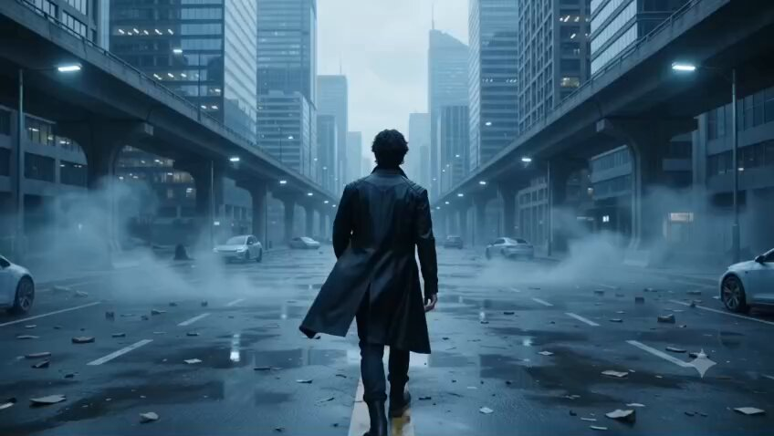
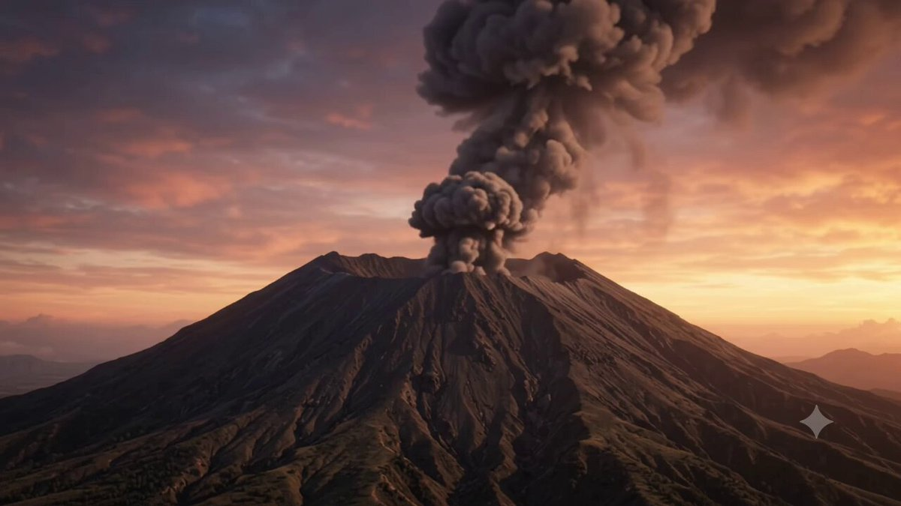
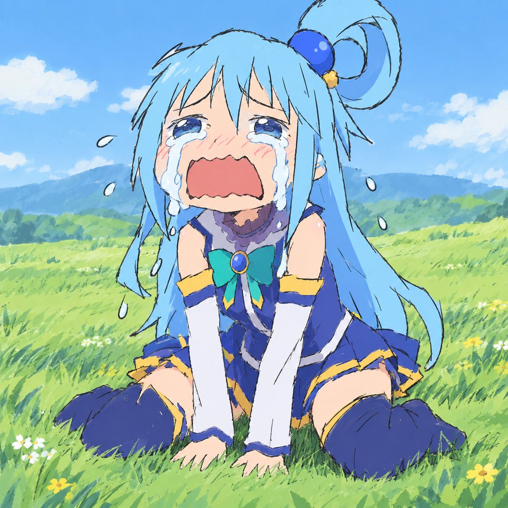
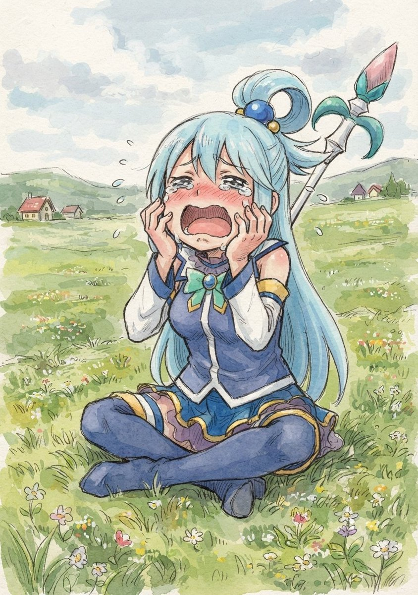
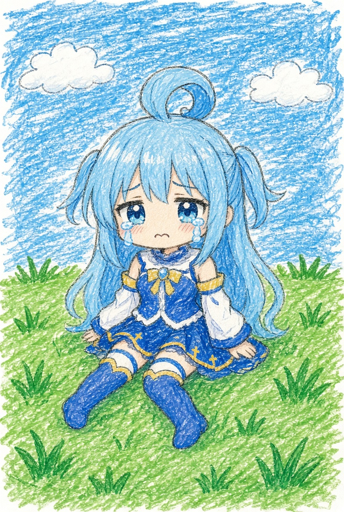
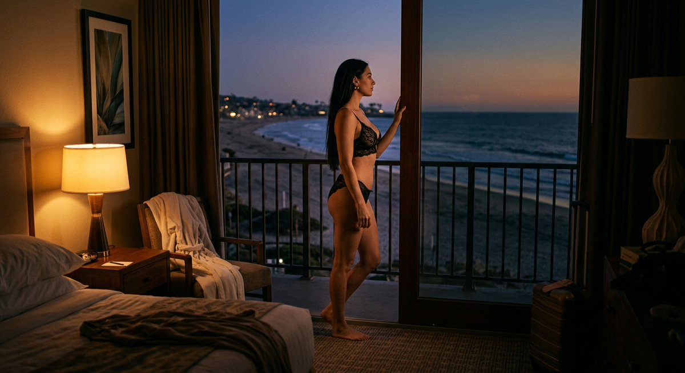

# Gemini · Raccolta di prompt · Leadde.ai

[](README.md) [](README_zh.md) [](README_zh-TW.md) [](README_ja-JP.md) [](README_ko-KR.md) [](README_th-TH.md) [](README_vi-VN.md) [](README_hi-IN.md) [](README_es-ES.md) [-lightgrey)](README_es-419.md) [](README_de-DE.md) [](README_fr-FR.md) [](README_it-IT.md) [-lightgrey)](README_pt-BR.md) [](README_pt-PT.md) [](README_tr-TR.md)

**Best for:** Gemini multimodal prompts for visual reasoning, creative exploration, and production planning.

For PDF, PPT, SOP, training, and multilingual video workflows:
[Awesome Document-to-Video](https://github.com/LeaddeOpenLab/awesome-document-to-video)

> **Prompt di qualità selezionati ogni giorno**

Scopri prompt completi per immagini, video e creazioni 3D con l’IA. Esplora gli stili, le versioni multilingue e le fonti degli autori originali.

[Esplora Leadde.ai →](https://leadde.ai/?utm_source=github&utm_medium=readme&utm_campaign=prompt-library&utm_content=gemini)

## Scopri Leadde.ai

Leadde.ai aiuta i team a trasformare documenti, diapositive e testi in video aziendali con l’IA per formazione, inserimento del personale e marketing.

Aggiungi una stella a questo repository per seguire i prompt selezionati ogni giorno e trovare nuove idee creative.

**9** Prompt · Ultima aggiunta: **2026-09-11**

<a name="catalog"></a>

## Sfoglia per categoria

[Fermo immagine cinematografico / Still fotografico](#category-cinematic-film-still) · [Illustrazione](#category-illustration) · [Rendering 3D](#category-3d-render) · [Altro](#category-other)

<a name="all-prompts"></a>

<a name="category-cinematic-film-still"></a>

## Fermo immagine cinematografico / Still fotografico

<a name="prompt-2098277089749463207"></a>

### Scena cinematografica di fantascienza di un giovane uomo che cammina attraverso una città futuristica abbandonata mentre cartelloni olografici si attivano intorno a lui.

Autore：[@MohdAdnanA86218](https://x.com/MohdAdnanA86218) · [Post originale](https://x.com/MohdAdnanA86218/status/2098277089749463207)

Fermo immagine cinematografico / Still fotografico · Cyberpunk / Sci-Fi · Personaggio · Pubblicato

**Riepilogo:** Scena cinematografica di fantascienza di un giovane uomo che cammina attraverso una città futuristica abbandonata mentre cartelloni olografici si attivano intorno a lui.



**Prompt**

```text
Cortometraggio cinematografico fantascientifico ultra-realistico, 10 secondi, 16:9. Un giovane uomo straordinariamente affascinante, sui vent'anni, cammina da solo attraverso una megalopoli futuristica abbandonata nell'anno 2050. Ha folti capelli nero corvino naturalmente mossi, profondi occhi castano scuro, una mascella maschile e scolpita, zigomi pronunciati e una barba incolta leggera e naturale. Indossa un elegante cappotto futuristico nero, pantaloni scuri e stivali minimalisti. La massiccia città intorno a lui è completamente deserta: imponenti grattacieli di vetro, autostrade sopraelevate vuote, veicoli a guida autonoma abbandonati, nebbia fluttuante, detriti sparsi e tenui luci d'atmosfera blu.
0–3 secondi: Carrellata cinematografica ampia da dietro mentre cammina lentamente lungo un viale futuristico deserto, con i suoi passi che echeggiano nella città silenziosa.
3–6 secondi: Si ferma improvvisamente e guarda verso l'alto. Una pubblicità olografica si accende a intermittenza sopra un grattacielo, poi un'altra, poi centinaia.
6–9 secondi: Migliaia di gigantesche pubblicità olografiche si attivano improvvisamente in tutta la città: cartelloni al neon, interfacce fluttuanti, prodotti animati e messaggi misteriosi, illuminando le strade abbandonate intorno a lui. Il volto dell'uomo riflette la luce olografica mentre si guarda intorno sotto shock.
9–10 secondi: Primo piano drammatico del suo volto mentre ogni schermo olografico si gira simultaneamente verso di lui, creando l'inquietante consapevolezza che potrebbe non essere davvero solo.
Movimento umano fotorealistico, fisica dei tessuti realistica, nebbia volumetrica cinematografica, strade bagnate e riflettenti, architettura futuristica dettagliata, profondità atmosferica, sottile bagliore della lente, bagliore olografico realistico, movimento di camera drammatico, alto contrasto, 8K HDR, look cinematografico anamorfico, atmosfera futuristica ricca di suspense, nessun cartone animato, nessun volto con aspetto da IA, nessun errore nei testi, nessuna mano distorta.
```

[↑ Torna alle categorie](#catalog)

---

<a name="prompt-2097929264158945776"></a>

### Prompt cinematografico scandito da timestamp che ritrae un imponente vulcano in eruzione al tramonto con lava, nubi di cenere e fulmini.

Autore：[@abs\_uiux](https://x.com/abs_uiux) · [Post originale](https://x.com/abs_uiux/status/2097929264158945776)

Fermo immagine cinematografico / Still fotografico · Paesaggio / Natura · Pubblicato

**Riepilogo:** Prompt cinematografico scandito da timestamp che ritrae un imponente vulcano in eruzione al tramonto con lava, nubi di cenere e fulmini.



**Prompt**

```text
0–2s: Ampia ripresa aerea di un imponente vulcano al tramonto. Il fumo inizia a fuoriuscire dal cratere mentre il terreno trema impercettibilmente.

2–5s: Il vulcano erutta all'improvviso, scagliando verso il cielo un'enorme colonna di cenere, fumo e lava incandescente.

5–8s: Fiumi di lava ardente scorrono lungo il fianco della montagna, mentre scure nubi di cenere si espandono rapidamente verso l'alto. La telecamera si allontana drammaticamente.

8–10s: Ripresa finale ultragrandangolare con fulmini che squarciano la nube di cenere e l'eruzione che illumina il paesaggio.

Stile: Fotorealistico, look cinematografico da disaster movie, proporzioni spettacolari, fumo volumetrico, lava incandescente, detriti realistici, forte scuotimento della telecamera, sound design epico.
```

[↑ Torna alle categorie](#catalog)

---

<a name="prompt-2097152276452561325"></a>

### Video cinematografico ultra-realistico di 10 secondi di guerrieri vichinghi in miniatura che preparano un gigantesco drakkar di legno all'alba.

Autore：[@MohdAdnanA86218](https://x.com/MohdAdnanA86218) · [Post originale](https://x.com/MohdAdnanA86218/status/2097152276452561325)

Fermo immagine cinematografico / Still fotografico · Pubblicato

**Riepilogo:** Video cinematografico ultra-realistico di 10 secondi di guerrieri vichinghi in miniatura che preparano un gigantesco drakkar di legno all'alba.


**Prompt**

```text
Video cinematografico ultra-realistico di 10 secondi, porto vichingo in miniatura all'alba. Minuscoli guerrieri vichinghi, alti ciascuno solo pochi centimetri, si affrettano attorno a un gigantesco drakkar di legno, preparandolo per la battaglia. Trasportano scudi in miniatura, asce, funi e lance, salgono su imponenti scale di legno, stringono grosse corde, caricano provviste e issano un'enorme vela vichinga rossa e nera. L'enorme drakkar si erge sopra di loro come una colossale nave da guerra. La nebbia fluttua sull'acqua fredda nordica, i moli di legno scricchiolano, le torce tremolano e le bandiere vichinghe sventolano drammaticamente nel vento.
Telecamera: prospettiva macro dal basso in scala miniaturizzata, lento movimento di macchina cinematografico che attraversa il porto affollato, per terminare con una drammatica inquadratura ampia dei minuscoli guerrieri in posa orgogliosa sotto il gigantesco drakkar.
Illuminazione: luce fredda e bluastra dell'alba mista alla calda luce delle torce, nebbia volumetrica, riflessi realistici sull'acqua, ombre drammatiche.
Stile: ultra-realistico, estetica epica da film vichingo, ambiente in miniatura altamente dettagliato, texture realistiche, profondità di campo cinematografica, movimento naturale, 4K, lente anamorfica, atmosfera immersiva, nessun testo, nessun watermark.
```

[↑ Torna alle categorie](#catalog)

---

<a name="prompt-2096612096003965254"></a>

### Carrellata in stile film commerciale in cui un personaggio cammina accanto a elementi tipografici 3D e percorsi visivi che appaiono continuamente, interagendo con gli elementi di testo nello spazio prima di passare alla rivelazione del logo.

Autore：[@taya\_mama\_AI](https://x.com/taya_mama_AI) · [Post originale](https://x.com/taya_mama_AI/status/2096612096003965254)

Fermo immagine cinematografico / Still fotografico · Rendering 3D · Personaggio · Testo / Tipografia · Pubblicato

Post originale：[@taya\_mama\_AI](https://x.com/taya_mama_AI) · [Post originale](https://x.com/taya_mama_AI/status/2095076567416451105)

**Riepilogo:** Carrellata in stile film commerciale in cui un personaggio cammina accanto a elementi tipografici 3D e percorsi visivi che appaiono continuamente, interagendo con gli elementi di testo nello spazio prima di passare alla rivelazione del logo.


**Prompt**

```text
Film commerciale.

Mantieni il colore di sfondo iniziale per tutta la sequenza.

La telecamera segue fluidamente il personaggio con un movimento di scorrimento orizzontale continuo, muovendosi al suo fianco mentre cammina.

Testo e linee di collegamento appaiono progressivamente sullo schermo, formando un percorso visivo continuo.

Mentre il personaggio cammina, riconosce il testo e gli elementi grafici che appaiono intorno a lui come oggetti fisici realmente esistenti nello stesso spazio. Interagisce naturalmente con questi elementi mentre avanza: toccando occasionalmente il testo vicino con la punta delle dita, guardando verso l'alto le parole sopra di lui, volgendo lo sguardo lateralmente verso gli elementi grafici, scostandosi leggermente per evitare un elemento, chinandosi sotto uno di essi o fermandosi brevemente per osservare qualcosa.

Una linea continua, simile a un binario ferroviario o a un percorso visivo, collega un elemento di testo al successivo. Il testo dell'immagine di riferimento appare in sequenza lungo questo percorso collegato, seguendo l'ordine originale.

Il testo e gli elementi grafici non devono sembrare decorazioni piatte di sfondo. Devono apparire fisicamente presenti nello stesso spazio tridimensionale del personaggio, con relazioni spaziali e un'interazione convincenti.

Non ripetere o duplicare alcun testo.

Mantieni il ritmo generale veloce, cadenzato e fluido. Il movimento di scorrimento orizzontale deve rimanere continuo e ininterrotto per tutta la sequenza.

Riproduci fedelmente tutto il testo dell'immagine di riferimento senza caratteri illeggibili, tipografia corrotta, errori di ortografia o modifiche alle parole.

Per la transizione finale, un grande oggetto o elemento grafico in primo piano passa molto vicino davanti alla telecamera, coprendo completamente l'intero fotogramma e creando una naturale transizione a tendina con sfocatura in primo piano.

Quando l'oggetto in primo piano libera l'inquadratura, svela senza soluzione di continuità la schermata finale con il logo.

Il movimento della telecamera deve essere fluido, dinamico e cinematografico.

Dai la massima priorità all'interazione tra il personaggio e il testo/gli elementi grafici rispetto a tutto il resto.

BGM: Musica ritmata e up-tempo con una battuta decisa.
```

[↑ Torna alle categorie](#catalog)

---

<a name="prompt-2097242290859241833"></a>

### Usa l'immagine caricata dell'uomo adulto come riferimento visivo e di identità principale per il personaggio principale in una scena con fotocopiatrice d'ufficio in cui emergono cloni in miniatura.

Autore：[@abs\_uiux](https://x.com/abs_uiux) · [Post originale](https://x.com/abs_uiux/status/2097242290859241833)

Fermo immagine cinematografico / Still fotografico · Personaggio · Pubblicato

**Riepilogo:** Usa l'immagine caricata dell'uomo adulto come riferimento visivo e di identità principale per il personaggio principale in una scena con fotocopiatrice d'ufficio in cui emergono cloni in miniatura.


**Prompt**

```text
Usa l'immagine caricata dell'uomo adulto come riferimento visivo e di identità principale per il personaggio principale. COERENZA DELL'IDENTITÀ: Mantieni una forte coerenza visiva con l'uomo adulto caricato per l'intero video. Preserva i suoi tratti somatici riconoscibili, la tonalità della pelle, l'età approssimativa, la struttura facciale, l'acconciatura, la barba o la peluria sul viso se presente, le sopracciglia, gli occhi, il naso, le labbra, le orecchie, le proporzioni del corpo e l'abbigliamento. Tutte le versioni in miniatura che appaiono nella scena devono rappresentare chiaramente lo stesso uomo adulto e rimanere visivamente coerenti con il riferimento caricato. Evita cambiamenti evidenti nella struttura facciale, nell'acconciatura, nei peli del viso, nell'età, nell'abbigliamento o nell'aspetto generale tra il personaggio originale e le versioni in miniatura. SCENA: Ambienta la scena all'interno di un ufficio moderno e di lusso con un arredamento contemporaneo pulito e un'illuminazione professionale realistica. Posiziona una fotocopiatrice/scanner multifunzione di fascia alta su una scrivania di legno. L'uomo adulto cammina con sicurezza verso la macchina con un sorriso naturale. Apre il coperchio dello scanner e posiziona una fotografia stampata di se stesso a faccia in giù sul vetro dello scanner. Chiude il coperchio e preme il pulsante COPIA. Mostra lo scanner che si attiva con una luce mobile realistica sotto il vetro. Poi introduci una giocosa trasformazione magica: invece dei normali fogli di carta che escono dal vassoio di uscita, circa 8–10 versioni in miniatura dello stesso uomo adulto iniziano ad apparire dalla macchina una dopo l'altra. Ciascun uomo in miniatura dovrebbe essere alto circa 20–25 cm e assomigliare chiaramente al riferimento caricato, inclusi la stessa acconciatura, i peli del viso, lo stile di abbigliamento, la tonalità della pelle e l'aspetto generale. I personaggi in miniatura scendono o saltellano in sicurezza sulla scrivania di legno. Sorridono, salutano con la mano verso l'uomo originale, passeggiano insieme, si scambiano strette di mano amichevoli, si salutano giocosamente e guardano brevemente verso la telecamera. L'uomo adulto originale reagisce con sorpresa e divertimento, ridendo in modo naturale mentre guarda le versioni in miniatura di se stesso interagire sulla scrivania. REGIA DELLA TELECAMERA: Inizia con un'inquadratura cinematografica a figura intera/piano medio dell'uomo che si avvicina alla fotocopiatrice. Stacca su un primo piano dettagliato di lui che posiziona la fotografia sul vetro dello scanner. Mostra un primissimo piano del suo dito che preme il pulsante COPIA. Cattura la luce dello scanner che si muove sotto il vetro. Passa a un primo piano drammatico del vassoio di uscita mentre appare la prima versione in miniatura. Usa un breve momento di slow-motion mentre il primo personaggio in miniatura atterra in sicurezza sulla scrivania. Includi riprese macro dei passi in miniatura che camminano sulla superficie di legno. Concludi con un'inquadratura cinematografica più ampia che mostra l'uomo adulto originale sorridente mentre diverse versioni in miniatura stanno in piedi e interagiscono intorno alla fotocopiatrice. Usa un movimento di macchina fluido e professionale, una sottile profondità di campo, un comportamento realistico dell'obiettivo e un motion blur naturale. STILE VISIVO: Realismo cinematografico fotorealistico. Texture della pelle naturale altamente dettagliata. Capelli e peli del viso realistici. Trama del tessuto e movimento degli abiti realistici. Proporzioni umane accurate. Scala in miniatura convincente. Illuminazione commerciale premium. Ombre e riflessi naturali. Gamma dinamica in stile HDR. Elevata coerenza facciale lungo tutta la sequenza. NOTE IMPORTANTI SULLA COERENZA: Mantieni l'uomo adulto caricato come riferimento visivo per l'intero video. I personaggi in miniatura devono sembrare rappresentazioni in miniatura della stessa persona anziché persone non correlate. Evita variazioni facciali evidenti tra i personaggi in miniatura. Non cambiare il genere, l'età apparente, l'acconciatura, i peli del viso, il tono della pelle o l'abbigliamento del personaggio. Non introdurre personaggi non correlati. Mantieni tutti i personaggi umani realistici anziché simili a cartoni animati. Nessun sottotitolo. Nessuna didascalia. Nessun logo. Nessun watermark. Nessun testo aggiuntivo sullo schermo. Aspect Ratio: 9:16 verticale
```

[↑ Torna alle categorie](#catalog)

---

<a name="prompt-2097168437957263851"></a>

### Un prompt video cinematografico ultra-realistico di 10 secondi che descrive una scena in miniatura all'interno di una gigantesca fabbrica di torte, con minuscoli pasticceri che collaborano per decorare un'enorme torta di compleanno a più piani.

Autore：[@AiwithBloodline](https://x.com/AiwithBloodline) · [Post originale](https://x.com/AiwithBloodline/status/2097168437957263851)

Fermo immagine cinematografico / Still fotografico · Pubblicato

Post originale：[@AiwithBloodline](https://x.com/AiwithBloodline) · [Post originale](https://x.com/AiwithBloodline/status/2096937365260624328)

**Riepilogo:** Un prompt video cinematografico ultra-realistico di 10 secondi che descrive una scena in miniatura all'interno di una gigantesca fabbrica di torte, con minuscoli pasticceri che collaborano per decorare un'enorme torta di compleanno a più piani.


**Prompt**

```text
Crea un video cinematografico in miniatura ultra-realistico di 10 secondi ambientato all'interno di una gigantesca e stravagante fabbrica di torte. Piccoli pasticceri che indossano uniformi bianche da chef e piccoli cappelli da fornaio lavorano insieme per decorare un'enorme torta di compleanno a più piani che svetta imponente sopra di loro.
0–3 sec: Campo lungo di apertura dell'enorme torta su un tavolo della fabbrica, con minuscoli pasticceri che salgono su scale e trasportano strumenti colorati per la glassa.
3–7 sec: Ripresa ravvicinata di inseguimento mentre i pasticceri spremono dense spirali di crema con la sac à poche, aggiungono fragole e zuccherini, e posizionano con cura candeline giganti e colorate.
7–10 sec: Drammatico carrello indietro cinematografico che rivela la torta di compleanno interamente decorata, che risplende caldamente sotto le luci della fabbrica mentre i minuscoli pasticceri festeggiano intorno ad essa.
Scala in miniatura altamente dettagliata, movimento umano realistico, consistenze cremose della glassa, decorazioni variopinte, calda illuminazione da pasticceria, profondità di campo ridotta, movimenti di camera cinematografici, resa da fotografia macro, giocoso ma fotorealistico, 4K, 16:9, nessun testo, nessun logo, nessuna musica, solo suoni ASMR naturali di pasticceria come la glassa spremuta, passi, strumenti che tintinnano e morbido ambiente di fabbrica.
```

[↑ Torna alle categorie](#catalog)

---

<a name="category-illustration"></a>

## Illustrazione

<a name="prompt-2097658031928705309"></a>

### Prompt di illustrazione che ritrae Aqua che piange in un prato

Autore：[@HopeAbsent](https://x.com/HopeAbsent) · [Post originale](https://x.com/HopeAbsent/status/2097658031928705309)

Illustrazione · Pubblicato

**Riepilogo:** Prompt di illustrazione che ritrae Aqua che piange in un prato







**Prompt**

```text
Aqua che piange in un prato
```

[↑ Torna alle categorie](#catalog)

---

<a name="category-3d-render"></a>

## Rendering 3D

<a name="prompt-2096885269270237431"></a>

### Una sequenza animata in 3D di minuscoli operai edili che assemblano una pizza gigante.

Autore：[@AiwithBloodline](https://x.com/AiwithBloodline) · [Post originale](https://x.com/AiwithBloodline/status/2096885269270237431)

Rendering 3D · Cibo / Bevande · Pubblicato

Post originale：[@AiwithBloodline](https://x.com/AiwithBloodline) · [Post originale](https://x.com/AiwithBloodline/status/2096811796074311791)

**Riepilogo:** Una sequenza animata in 3D di minuscoli operai edili che assemblano una pizza gigante.


**Prompt**

```text
{
  "video_duration": "10 secondi",
  "aspect_ratio": "16:9",
  "sequence": [
    {
      "time": "0-2 sec",
      "scene": "Grande allestimento",
      "camera": "Ripresa aerea cinematografica ampia in avvicinamento",
      "action": "Un'enorme pizza appena sfornata poggia su un tavolo di legno come un massiccio cantiere edile. Decine di minuscoli operai accorrono con pale caricatrici, gru, furgoni di consegna e attrezzature in miniatura, preparandosi a costruire la pizza perfetta.",
      "sound_design": "Musica vivace e giocosa, piccoli rumori di motore, ruote che girano, sottile attività di cantiere."
    },
    {
      "time": "2-4 sec",
      "scene": "Strato di salsa e formaggio",
      "camera": "Ripresa media con carrellata laterale",
      "action": "Un food truck in miniatura pompa ricca salsa di pomodoro rosso sulla pizza mentre minuscoli operai la stendono uniformemente con piccole spatole. Un'altra squadra segue dietro, ricoprendo la superficie con un fitto strato di mozzarella grattugiata.",
      "sound_design": "Versamento morbido della salsa, raschiamento delle spatole, fruscio del formaggio, musica ritmica allegra."
    },
    {
      "time": "4-6 sec",
      "scene": "Condimenti in movimento",
      "camera": "Primo piano macro con un leggero slow motion",
      "action": "Minuscoli nastri trasportatori trasportano ingredienti colorati tra cui salame piccante, funghi, peperoni, olive e basilico fresco. Gli operai in miniatura sistemano con cura e precisione ogni condimento sulla superficie formaggiosa.",
      "sound_design": "Movimento del nastro trasportatore, caduta di minuscoli ingredienti, delicati rintocchi magici, accenti musicali ritmati."
    },
    {
      "time": "6-8 sec",
      "scene": "Sollevamento dell'ingrediente finale",
      "camera": "Inquadratura cinematografica drammatica dal basso",
      "action": "Una gru in miniatura solleva una fetta di salame piccante gigante verso il centro della pizza. Gli operai sottostanti tirano funi guida e si scambiano segnali mentre il condimento viene posizionato lentamente al suo posto.",
      "sound_design": "Piccolo motore della gru, suoni di tensione delle corde, scatti meccanici, musica orchestrale cinematografica in crescendo."
    },
    {
      "time": "8-10 sec",
      "scene": "Gran finale della pizza",
      "camera": "Primo piano fluido con orbita a 360 gradi",
      "action": "L'ultimo condimento cade perfettamente in posizione. Un'esplosione di coriandoli colorati riempie il mondo in miniatura mentre i minuscoli operai esultano e festeggiano. La telecamera ruota intorno alla pizza completata, rivelando il suo formaggio fuso lucido, i condimenti colorati e la crosta dorata prima di terminare con una soddisfacente inquadratura da protagonista.",
      "sound_design": "Scoppio celebrativo, allegre acclamazioni, minuscoli fischietti, finale orchestrale edificante."
    }
  ],
  "visual_style": {
    "animation_quality": "Animazione 3D premium ispirata alla Pixar",
    "world_design": "Incantevole mondo di costruzioni in miniatura costruito attorno a una pizza gigante",
    "color_palette": "Rossi caldi, marroni dorati, toni cremosi di formaggio e condimenti vivaci e colorati",
    "lighting": "Illuminazione dorata calda e morbida con delicati riflessi cinematografici",
    "detail": "Texture del cibo altamente dettagliate, macchinari in miniatura, formaggio fuso realistico, condimenti freschi e minuscoli personaggi espressivi",
    "camera": "Movimento cinematografico fluido, sensazione di fotografia macro, transizioni morbide, profondità di campo ridotta",
    "overall_feel": "Carino, giocoso, visivamente soddisfacente, curato, premium e stravagante",
    "resolution": "720p"
  }
}
```

[↑ Torna alle categorie](#catalog)

---

<a name="category-other"></a>

## Altro

<a name="prompt-2097693389672394895"></a>

### Nella stanza di un hotel sulla spiaggia al tramonto, una donna dai capelli lunghi in lingerie di pizzo nero guarda fuori dalla finestra.

Autore：[@bestcare0221](https://x.com/bestcare0221) · [Post originale](https://x.com/bestcare0221/status/2097693389672394895)

Personaggio · Pubblicato

**Riepilogo:** Nella stanza di un hotel sulla spiaggia al tramonto, una donna dai capelli lunghi in lingerie di pizzo nero guarda fuori dalla finestra.



**Prompt**

```text
Al tramonto, in una stanza d'albergo con vista sulla spiaggia, in una luce fioca, una donna con lunghi capelli neri e lisci, di circa 30 anni, dalla figura formosa, che indossa un completo di lingerie di pizzo nero, sta in piedi vicino alla finestra con la testa inclinata, guardando la spiaggia fuori dalla finestra.
```

[↑ Torna alle categorie](#catalog)

---

[Esplora Leadde.ai →](https://leadde.ai/?utm_source=github&utm_medium=readme&utm_campaign=prompt-library&utm_content=gemini)
