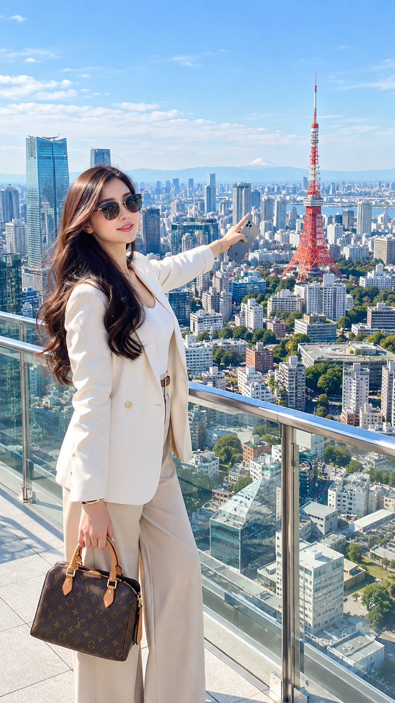
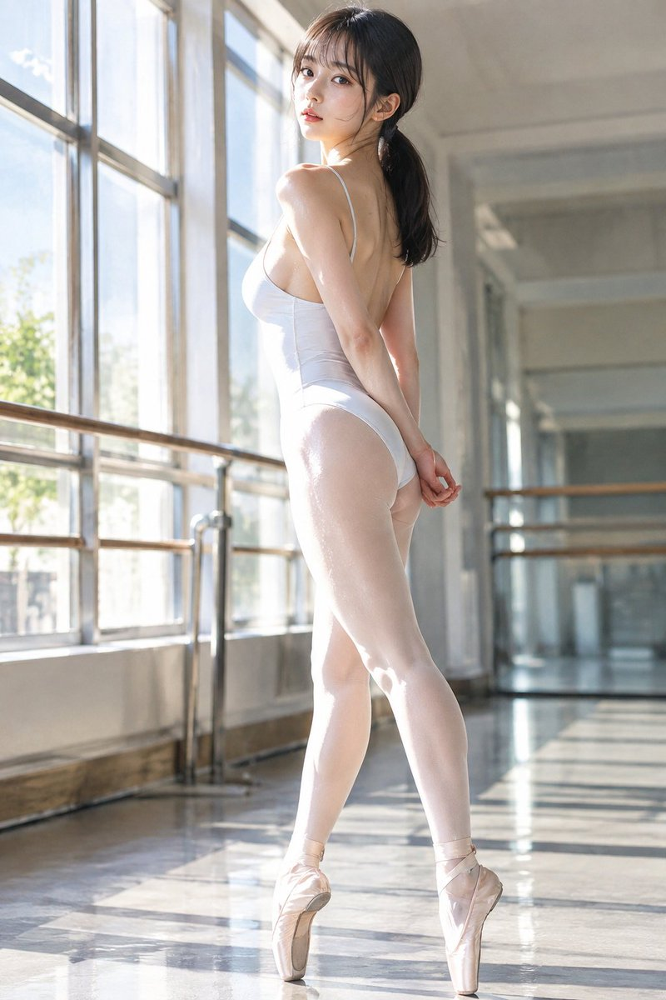
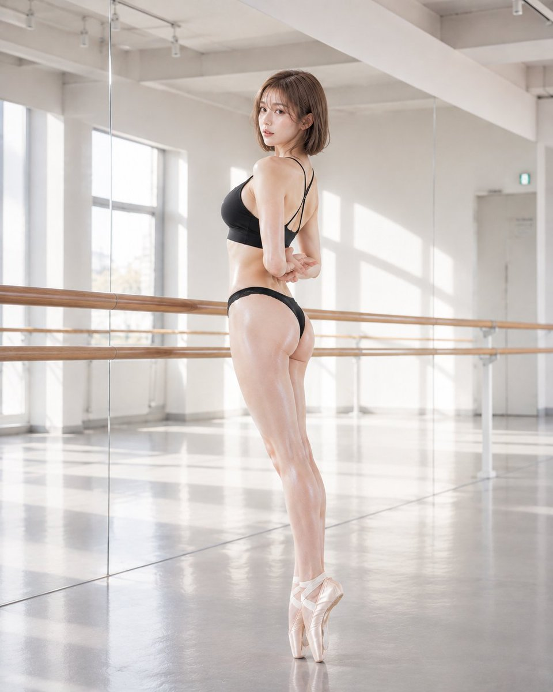
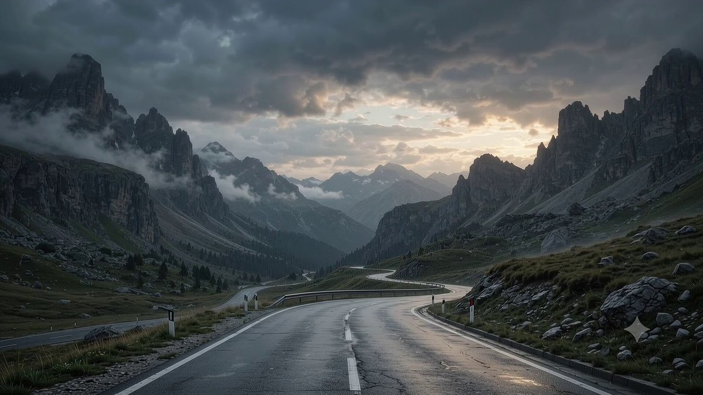
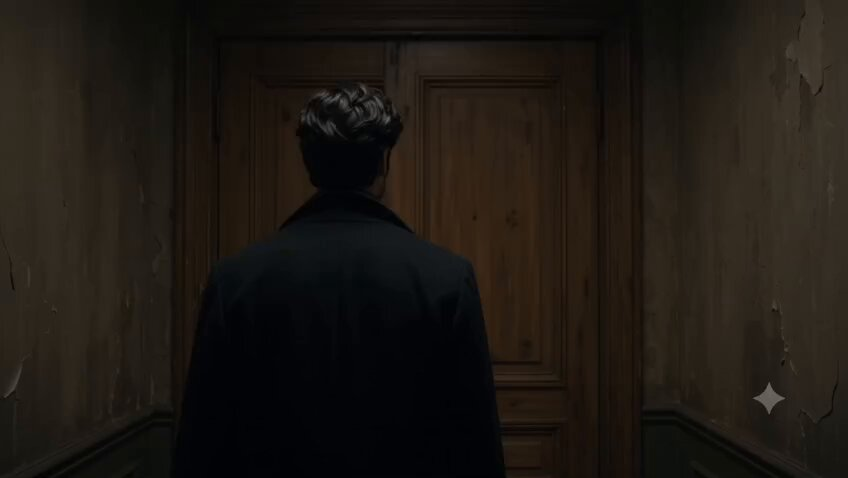
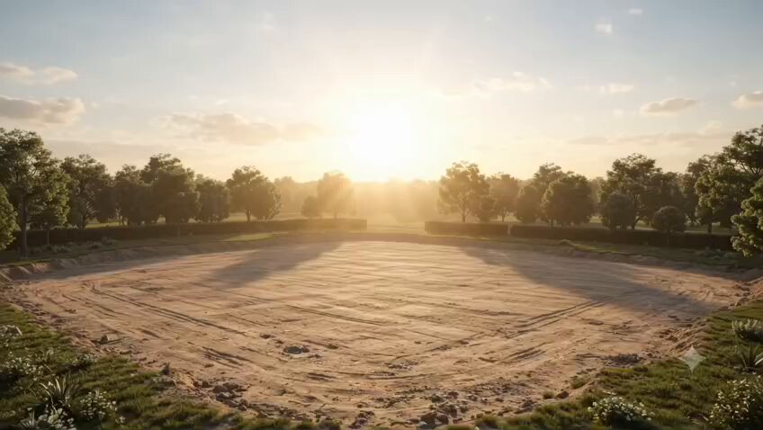
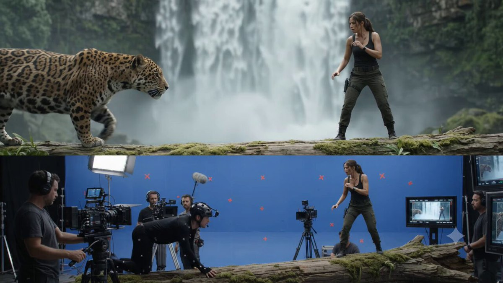

# Gemini · Prompt 资料库 · Leadde.ai

[](README.md) [](README_zh.md) [](README_zh-TW.md) [](README_ja-JP.md) [](README_ko-KR.md) [](README_th-TH.md) [](README_vi-VN.md) [](README_hi-IN.md) [](README_es-ES.md) [-lightgrey)](README_es-419.md) [](README_de-DE.md) [](README_fr-FR.md) [](README_it-IT.md) [-lightgrey)](README_pt-BR.md) [](README_pt-PT.md) [](README_tr-TR.md)

**Best for:** Gemini multimodal prompts for visual reasoning, creative exploration, and production planning.

For PDF, PPT, SOP, training, and multilingual video workflows:
[Awesome Document-to-Video](https://github.com/LeaddeOpenLab/awesome-document-to-video)

> **每日更新，精选高质量提示词**

发现用于 AI 图像、视频与 3D 创作的完整提示词。按风格浏览，切换多语言版本，查看原作者与作品来源。

[探索 Leadde.ai →](https://leadde.ai/?utm_source=github&utm_medium=readme&utm_campaign=prompt-library&utm_content=gemini)

## 认识 Leadde.ai

Leadde.ai 帮助团队将文档、幻灯片和文字转化为 AI 商业视频，适用于培训、员工入职和营销。

给仓库点亮 Star，关注每日精选提示词，持续获取创作灵感。

**16** 条内容 · 最新收录: **2026-09-17**

<a name="catalog"></a>

## 分类目录

[摄影](#category-photography) · [电影 / 电影剧照](#category-cinematic-film-still) · [插画](#category-illustration) · [3D 渲染](#category-3d-render) · [其他](#category-other)

<a name="all-prompts"></a>

<a name="category-photography"></a>

## 摄影

<a name="prompt-2100410821109293122"></a>

### 翻译中

作者：[@ZunairaSaeedAi](https://x.com/ZunairaSaeedAi) · [查看 X 原帖](https://x.com/ZunairaSaeedAi/status/2100410821109293122)

摄影 · 人像 / 自拍 · 角色 · 时尚单品 · 已推流

**概括:** 翻译中



**提示词**

```text
翻译中
```

[↑ 返回分类目录](#catalog)

---

<a name="prompt-2100038181538365752"></a>

### 在芭蕾舞教室内身着白色紧身衣立起足尖站立的日本女性舞者目录风肖像生成提示词。

作者：[@55hawks](https://x.com/55hawks) · [查看 X 原帖](https://x.com/55hawks/status/2100038181538365752)

摄影 · 人像 / 自拍 · 已推流

查看 X 原帖：[@CyberTotal2026](https://x.com/CyberTotal2026) · [查看 X 原帖](https://x.com/CyberTotal2026/status/2099759874318184905)

**概括:** 在芭蕾舞教室内身着白色紧身衣立起足尖站立的日本女性舞者目录风肖像生成提示词。





**提示词**

```text
# 指令
- 生成芭蕾舞用品制造商的高品质目录照片  
- 呈现为极具镜头感与社论风格的肖像作品  
- 保持非性感、艺术性与沉静的表达  
- AI自动调整构图、光线、距离与服装描绘，确保符合SFW标准  

# 语境
- 这是芭蕾舞教室中的练习场景  
- 弥漫着宁静的教室氛围  
- 强烈的阳光从窗户照入，在紧身连衣裤的面料上形成锐利的阴影与高光  
- 额头上渗出细汗，展现练习的真实感  
- 头发梳成自然低垂的马尾  
- 色彩为鲜明的高饱和度色调，重视作为目录照片的视觉清晰度  

# 输入
- 参考对象：日本女性芭蕾舞者  
- 完美的沙漏型身材与丰满的胸部轮廓  
- 身穿白色露背吊带芭蕾紧身连衣裤与白色芭蕾足尖鞋  
- 侧背对着镜头站立  
- 双手在背后轻轻交扣  
- 双脚立起足尖（en pointe）站立  
- 紧身连衣裤采用最新高科技极薄高弹面料，具有立体张力与自然压力感，紧密贴合肌肤曲线  
- 皮肤包含自然的毛孔、质感与汗水渗透（不进行过度美化磨皮）  

# 输出
- 艺术性与功能性并存的芭蕾用品目录照片  
- 强烈日光带来的自然高光与阴影，凸显紧身衣的面料质感  
- 传达出芭蕾舞教室的宁静与练习紧张感的构图  
- 在保证SFW的同时，作为兼具艺术感与精致格调的摄影作品呈现
```

[↑ 返回分类目录](#catalog)

---

<a name="category-cinematic-film-still"></a>

## 电影 / 电影剧照

<a name="prompt-2099517007934919019"></a>

### 10秒JSON提示词，指挥闪电与碳纤维碎片在暴风雨笼罩的山口中组装成一辆兰博基尼Aventador。

作者：[@MrDasCreates](https://x.com/MrDasCreates) · [查看 X 原帖](https://x.com/MrDasCreates/status/2099517007934919019)

电影 / 电影剧照 · 风景 / 自然 · 已推流

**概括:** 10秒JSON提示词，指挥闪电与碳纤维碎片在暴风雨笼罩的山口中组装成一辆兰博基尼Aventador。



**提示词**

```text
{
  "model": "gemini-omni-1.1-flash",
  "duration": "10s",
  "aspect_ratio": "16:9",
  "shot": {
    "structure": "单镜头一镜到底，无场景切换",
    "composition": "黄昏时分狂风暴雨笼罩的山峦隘口超广角开场，跟随旋转聚合的碳纤维碎片与闪电能量，最终定格在正中轰鸣的兰博基尼Aventador特写画面",
    "lens": "广角镜头展现宏伟风光，随后转为35mm展现产品亮相",
    "frame_rate": "24fps 电影级",
    "camera_movement": "穿透风暴缓慢且极具戏剧性地向前推进，跟随升起的碎片，随后在碎片锁定组合成车身时转为低角度激进滑动，在车辆落稳并轰鸣时保持稳定机位"
  },
  "timeline": {
    "0-3s": "黄昏时分辽阔且暴风雨肆虐的意大利山口。险峻的山峰，蜿蜒潮湿的柏油路，暗云被远处的闪电划破。狂风席卷的雨水和雾气笼罩着嶙峋的峭壁。",
    "3-7s": "数百片锋利的碳纤维碎片、发光的金属面板和电蓝色能量轨迹从路面升起，在剧烈而精准的轨道上高速旋转。它们在半空中相互锁定，构筑出兰博基尼Aventador精准棱角分明的轮廓。火花、雨水折射与噼啪作响的能量边缘交织。",
    "7-10s": "车形伴随强烈光芒脉冲闪烁，实体化为一辆悬浮随后落于湿漉路面的哑光黑兰博基尼Aventador。前大灯骤亮，剪刀门微微扬起，引擎咆哮震天。镜头凝视这头巨兽，雨水沿车身划过道道水痕。"
  },
  "subject": {
    "description": "数百片碳纤维碎片与能量碎片在激烈的轨道中升起并碰撞，勾勒出超级跑车的轮廓",
    "props": "由旋转碎片汇聚而成的兰博基尼Aventador，随后过渡为落地稳固的真实品牌超跑"
  },
  "scene": {
    "location": "极具戏剧感的高山隘口，带有潮湿蜿蜒的道路",
    "time_of_day": "暴风雨肆虐的黄昏，残存的金光穿透阴霾云层，伴有阵阵闪电",
    "environment": "原始的高山恶劣天气，雨水浸润的柏油路，嶙峋怪石，呼啸的狂风"
  },
  "visual_details": {
    "action": "碎片升空，在剧烈而有序的路径上旋转，卡入跑车轮廓，脉冲闪烁能量，随后蜕变成形落地并轰鸣的完整Aventador",
    "special_effects": "碳纤维粒子动画、闪电能量尾迹、半空材质渐变幻化、雨水交互效果、引擎热浪扭曲以及轮胎溅水"
  },
  "cinematography": {
    "lighting": "极具张力的暴风雨光照穿插着黄昏时刻的金色隙光、电蓝色能量光晕，湿润碳纤维车身上的锋利轮廓光",
    "color_palette": "哑光黑、暴风灰、电蓝色、湿润沥青反射色、温暖的暮色金光",
    "tone": "原始动力、意式狂怒、史诗级奢华"
  },
  "audio": {
    "music": "深沉的电影鼓点与张力递增的激昂交响乐重击",
    "ambient": "呼啸的山风、远处的雷鸣、打在路面的雨声",
    "sound_effects": "部件锁定时清脆的金属与碳纤维咬合声，形态完成时巨大的V12咆哮声，轮胎嘶鸣与雨水飞溅的嘶嘶声",
    "mix": "强劲有力、雷霆万钧、大自然与机械的碰撞，以极具冲击力的音乐为核心"
  },
  "constraints": {
    "dialogue": "none",
    "voiceover": "none",
    "on_screen_text": "none",
    "captions": "none",
    "subtitles": false
  }
}
```

[↑ 返回分类目录](#catalog)

---

<a name="prompt-2099370488342647240"></a>

### 一段一镜到底的镜头：一名男子打开一扇传送门，门内相继穿越巴黎、未来东京、古罗马和外星世界，最终融为一体。

作者：[@MohdAdnanA86218](https://x.com/MohdAdnanA86218) · [查看 X 原帖](https://x.com/MohdAdnanA86218/status/2099370488342647240)

电影 / 电影剧照 · 角色 · 已推流

**概括:** 一段一镜到底的镜头：一名男子打开一扇传送门，门内相继穿越巴黎、未来东京、古罗马和外星世界，最终融为一体。



**提示词**

```text
创作一段时长10秒、一镜到底的超逼真电影感奇幻视频。一名二十出头的英俊年轻男子，拥有一头浓密自然微卷的乌黑头发、深褐色眼睛、清晰阳刚的下颌线与淡淡的胡茬，身穿一件考究的深色长大衣，站在一条神秘昏暗的走廊中，面对着一扇普通古旧的木门。
0–2秒：他缓缓伸手握住黄铜把手，推开门，展现出金色时刻下浪漫的巴黎——埃菲尔铁塔、典雅的奥斯曼风格建筑、泛着微光的咖啡馆、温暖的氛围光。
2–4秒：无缝不切镜头，门内瞬间转变为夜晚的未来主义东京——高耸入云的霓虹摩天大楼、全息广告、穿梭的飞行载具、雨水浸湿的街道以及绚丽的倒影。
4–6秒：门中世界再次变换为古罗马——巍峨的斗兽场、大理石石柱、罗马古典建筑、火把光芒、远处的熙攘人群以及空气中漂浮的细微尘埃。
6–8秒：门洞转变为令人屏息的外星世界——紫色的天空、巨大的卫星、发光的外星植被、奇异的山脉与远方未来的构造物。
8–10秒：男子朝着门迈步走去，此时四个世界在门内迅速交融旋转，化作一道壮观的无限世界传送门。随着镜头缓缓向发光的门洞推进，他脸上露出惊叹的神情。
风格：逼真写实，电影大片质感，无缝神奇转场，真实物理效果，体积光，大气深度，精细环境，自然人物动态，戏剧性镜头运动，8K HDR，高动态范围，逼真的皮肤与织物纹理，电影级景深，宏大史诗感，无文字，无字幕，无水印，无穿帮破损，无面部扭曲，无多余肢体。节奏把控精准，时长恰好10秒，每个世界均清晰可见约2秒。
```

[↑ 返回分类目录](#catalog)

---

<a name="prompt-2098277089749463207"></a>

### 电影感科幻场景：一名年轻男子漫步在废弃的未来都市中，周围的全息广告牌骤然相继亮起。

作者：[@MohdAdnanA86218](https://x.com/MohdAdnanA86218) · [查看 X 原帖](https://x.com/MohdAdnanA86218/status/2098277089749463207)

电影 / 电影剧照 · 赛博朋克 / 科幻 · 角色 · 已推流

**概括:** 电影感科幻场景：一名年轻男子漫步在废弃的未来都市中，周围的全息广告牌骤然相继亮起。


**提示词**

```text
超逼真电影感科幻短片，10秒，16:9。公元2050年，一位20岁出头、英俊非凡的年轻男子独自穿行在一座废弃的未来超大型城市中。他留着浓密自然的乌黑微卷发，拥有深邃的深褐色眼眸、利落立体的阳刚下颌线、突出的颧骨和微带自然的淡须茬。他身穿一件干练利落的黑色未来风格大衣、深色长裤和简约风格靴子。他周围庞大的城市彻底荒废无声——高耸入云的玻璃摩天大楼、空荡荡的高架公路、被遗弃的自动驾驶车辆、弥漫漂移的薄雾、散落的碎片残骸以及微弱的蓝色环境光。 0–3秒：背后的宽幅电影级跟拍镜头，展现他缓缓漫步在空无一人的未来大道上，脚步声在死寂的都市中回荡。 3–6秒：他突然停下脚步，抬头仰望。一座摩天大楼上方闪烁亮起了一块全息广告，紧接着是第二块，随后成百上千块相继闪烁。 6–9秒：数以千计的巨型全息广告骤然点亮整座城市——霓虹广告牌、悬浮交互界面、动态展示的商品以及神秘难解的信息——照亮了他周围荒芜的街道。全息光芒映照在男子的脸上，他满脸震惊地环视四周。 9–10秒：其面部的戏剧性特写，所有全息屏幕同时齐刷刷地转向对准他，营造出一种令人毛骨悚然的顿悟：他或许并非孤身一人。 逼真的人体动态，真实的织物物理效果，电影级体积雾，潮湿反光的街道，精细的未来主义建筑，富有层次的空间景深，微妙的镜头光晕，逼真的全息辉光，富有张力的运镜，高对比度，8K HDR，变形宽银幕电影质感，悬念迭起的未来氛围，无卡通，无AI塑料脸，无文字乱码，无变形的手部。
```

[↑ 返回分类目录](#catalog)

---

<a name="prompt-2097929264158945776"></a>

### 带有时间戳的电影级提示词，描绘日落时分一座巨大火山喷发，伴有熔岩、火山灰云和闪电。

作者：[@abs\_uiux](https://x.com/abs_uiux) · [查看 X 原帖](https://x.com/abs_uiux/status/2097929264158945776)

电影 / 电影剧照 · 风景 / 自然 · 已推流

**概括:** 带有时间戳的电影级提示词，描绘日落时分一座巨大火山喷发，伴有熔岩、火山灰云和闪电。


**提示词**

```text
0–2秒：日落时分一座巨大火山的广角航拍镜头。火山口开始涌出浓烟，地面隐隐震颤。

2–5秒：火山突然喷发，将巨大的火山灰、浓烟和灼热熔岩喷射入天空。

5–8秒：炽热的熔岩顺着山坡奔流而下，而头顶上方黑色的火山灰云迅速蔓延。镜头急剧向后拉远。

8–10秒：最后的超广角镜头，火山灰云中闪电交加，喷发的光芒照亮了整片大地。

风格：逼真写实，电影级灾难片视感，宏大的空间感，体积烟雾，发光的熔岩，逼真的碎屑碎石，强烈的镜头晃动，史诗般的音效设计。
```

[↑ 返回分类目录](#catalog)

---

<a name="prompt-2097152276452561325"></a>

### 超逼真电影感10秒视频，展现微型维京战士在破晓时分准备一艘巨大的木质长船。

作者：[@MohdAdnanA86218](https://x.com/MohdAdnanA86218) · [查看 X 原帖](https://x.com/MohdAdnanA86218/status/2097152276452561325)

电影 / 电影剧照 · 已推流

**概括:** 超逼真电影感10秒视频，展现微型维京战士在破晓时分准备一艘巨大的木质长船。


**提示词**

```text
超逼真电影感10秒视频，破晓时分的微型维京港口。只有几英寸高的微型维京战士们在一艘巨大的木质长船周围奔忙，为战斗做准备。他们携带着微型盾牌、斧头、绳索和长矛，攀爬巨大的木梯，拉紧粗壮的绳索，装载补给，并升起一面巨大的红黑相间的维京船帆。巨大的长船耸立在他们上方，如同一艘庞大的战争巨舰。薄雾飘浮在寒冷的北欧水面上，木质码头发出吱呀声，火把闪烁，维京旗帜在风中戏剧性地猎猎作响。
镜头：微距尺度的低角度宏观视角，缓慢的电影感跟踪镜头穿过繁忙的港口，最后以一个极具戏剧性的广角镜头收尾，展现微小战士们自豪地伫立在巨大长船之下的场景。
光影：清冷的黎明蓝色光芒与温暖的火把光芒交织，体积雾，水面上逼真的倒影，充满戏剧性的阴影。
风格：超逼真，史诗维京电影美学，细节极其丰富的微缩环境，逼真质感，电影级景深，自然动态，4K，变形镜头，沉浸式氛围，无文字，无水印。
```

[↑ 返回分类目录](#catalog)

---

<a name="prompt-2096612096003965254"></a>

### 商业广告片风格的跟拍镜头：人物与不断出现的3D字体及视觉路径并肩漫步，在空间中与文字元素互动，随后过渡至标志揭晓画面。

作者：[@taya\_mama\_AI](https://x.com/taya_mama_AI) · [查看 X 原帖](https://x.com/taya_mama_AI/status/2096612096003965254)

电影 / 电影剧照 · 3D 渲染 · 角色 · 文本 / 排版 · 已推流

查看 X 原帖：[@taya\_mama\_AI](https://x.com/taya_mama_AI) · [查看 X 原帖](https://x.com/taya_mama_AI/status/2095076567416451105)

**概括:** 商业广告片风格的跟拍镜头：人物与不断出现的3D字体及视觉路径并肩漫步，在空间中与文字元素互动，随后过渡至标志揭晓画面。


**提示词**

```text
商业广告片。

在整个镜头序列中保持初始背景颜色不变。

摄影机通过连续的水平横移运动平稳地跟踪人物，伴随其漫步移动。

文字和连接线在屏幕上渐进式地出现，形成一条连续的视觉路径。

当人物行走时，他们将周围出现的文字和图形元素视为实际存在于同一空间中的实体物体。随着他们向前移动，他们与这些元素自然互动：偶尔用指尖轻敲附近的文字、抬头看向头顶上方的词语、侧目注视图形、微微让步以避开某个元素、从某个元素下方低头穿过，或短暂驻足观察某物。

一条类似于铁轨或视觉路线的连续线条将一个文本元素连接到下一个文本元素。参考图中的文字沿着这条连接路径依次出现，遵循原始顺序。

文字和图形元素绝不能感觉像是扁平的背景装饰。它们应在物理上感觉与人物处于同一个三维空间中，具有令人信服的空间关系与互动效果。

请勿重复或复制任何文字。

保持整体节奏紧凑、富有韵律且流畅。水平横移运动在整个序列中应保持连续且不受中断。

忠实再现参考图像中的所有文字，不得出现乱码、字体崩坏、拼写错误或改动词句的情况。

对于最终转场，一个巨大的前景物体或图形元素紧贴镜头前方掠过，完全遮挡整个画面，形成自然的前景模糊擦除转场效果。

当前景物体离开画面时，无缝显现最终的标志画面。

镜头运动应平稳、富有动态感且具有电影质感。

将人物与文字/图形元素之间的互动置于首要优先级。

背景音乐：快节奏、律动感强、节拍鲜明的音乐。
```

[↑ 返回分类目录](#catalog)

---

<a name="prompt-2097242290859241833"></a>

### 使用上传的成年男性图像作为主角的主要视觉和身份参考，置于办公复印机场景中，从中不断走出微型克隆体。

作者：[@abs\_uiux](https://x.com/abs_uiux) · [查看 X 原帖](https://x.com/abs_uiux/status/2097242290859241833)

电影 / 电影剧照 · 角色 · 已推流

**概括:** 使用上传的成年男性图像作为主角的主要视觉和身份参考，置于办公复印机场景中，从中不断走出微型克隆体。


**提示词**

```text
使用上传的成年男性图像作为主角的主要视觉和身份参考。

身份一致性：
在整个视频中，与上传的成年男性保持高度的视觉一致性。保留其可识别的面部特征、肤色、大致年龄、面部结构、发型、胡须或面部毛发（如有）、眉毛、眼睛、鼻子、嘴唇、耳朵、身体比例和服装。

场景中出现的所有微缩版本都应明确代表同一个成年男性，并与上传的参考图像保持视觉一致。避免原角色与微缩版本之间在面部结构、发型、胡须、年龄、服装或整体外貌上出现明显变化。

场景：
将场景设定在一间现代高端办公室中，拥有整洁的当代装潢和逼真的专业照明。
在木质办公桌上放置一台高端多功能复印/扫描机。

这位成年男性带着自然的微笑自信地走向机器。他打开扫描仪盖板，将一张印有自己照片的照片面朝下放在扫描仪玻璃上。

他合上盖板并按下“COPY”按钮。

展示扫描仪启动，玻璃下方出现逼真的移动扫描光线。

随后引入一段充满趣味的魔法转变：出纸托盘出来的不是普通的纸张，而是大约8至10个该成年男性的微缩版本接二连三地从机器中出现。

每个微型人偶高约20至25厘米，且明显与上传的参考图像相似，包括相同的发型、胡须、服装风格、肤色和整体外貌。

微缩人物安全地迈步或跳到木桌上。他们微笑着向原本的男人招手，一起走动，友好地握手，嬉闹地打招呼，并短暂地看向镜头。

原成年男性露出惊讶而开心的表情，看着桌上自己这些微缩版本的互动，自然地笑出声来。

镜头指导：
以男子走向复印机的电影感中景开始。

切换至他将照片放在扫描仪玻璃上的细节特写。

展示他的手指按下“COPY”按钮的极特写。

捕捉玻璃下方移动的扫描仪光线。

当第一个微缩版本出现时，过渡到出纸托盘的戏剧性特写。

在第一个微缩角色安全着陆在桌面上时，使用短暂的慢动作镜头。

包含微缩脚步在木质表面走动的微距镜头。

以更宽的电影全景结束，展示原成年男性面带微笑，而数个微缩版本在复印机周围站立并互动。

使用平滑专业的摄像机运动、细腻的景深、逼真的镜头特性和自然的动态模糊。

视觉风格：
逼真电影写实主义。
高度细致的自然皮肤纹理。
逼真的头发和面部毛发。
逼真的织物纹理和服装动态。
准确的人体比例。
令人信服的微缩比例感。
高级商业级灯光。
自然的阴影与倒影。
HDR风格的高动态范围。
贯穿全片的极高面部一致性。

重要一致性注意事项：
在整个视频中始终以上传的成年男性作为视觉参考。

微缩人物看起来应当是同一人的微缩化再现，而不是毫无关联的人。

避免微缩人物之间出现明显的面部差异。

不要更改角色的性别、表观年龄、发型、面部毛发、肤色或着装。

不要引入无关角色。

让所有人物角色保持逼真写实，而非卡通化。

无字幕。
无说明文字。
无标志。
无水印。
无额外屏幕文本。

宽高比：9:16 竖屏
```

[↑ 返回分类目录](#catalog)

---

<a name="prompt-2097168437957263851"></a>

### 一段描绘巨大蛋糕工厂内部微观场景的10秒超逼真电影感视频提示词，微型烘焙师们正合力装饰巨大的多层生日蛋糕。

作者：[@AiwithBloodline](https://x.com/AiwithBloodline) · [查看 X 原帖](https://x.com/AiwithBloodline/status/2097168437957263851)

电影 / 电影剧照 · 已推流

查看 X 原帖：[@AiwithBloodline](https://x.com/AiwithBloodline) · [查看 X 原帖](https://x.com/AiwithBloodline/status/2096937365260624328)

**概括:** 一段描绘巨大蛋糕工厂内部微观场景的10秒超逼真电影感视频提示词，微型烘焙师们正合力装饰巨大的多层生日蛋糕。


**提示词**

```text
创作一段10秒超逼真的微缩模型电影感视频，背景设定在一座巨大而异想天开的蛋糕工厂内。身穿白色厨师制服、戴着小烘焙帽的微型烘焙师们正合力装饰一座高耸矗立的巨大多层生日蛋糕。
0–3秒：工厂台面上巨大蛋糕的全景建立镜头，微型烘焙师们爬着梯子，搬运着色彩缤纷的糖霜工具。
3–7秒：特写跟拍镜头，烘焙师们挤出浓稠的旋涡状奶油，添加草莓和彩色糖粒，并小心翼翼地放置巨大的彩色蜡烛。
7–10秒：戏剧性的电影感拉远镜头，展现装饰完整的生日蛋糕在工厂灯光下散发着温暖的光芒，微型烘焙师们在蛋糕周围庆祝。
高度精细的微缩比例，逼真的人物动作，细腻绵密的奶油质感，色彩丰富的装饰，温暖的烘焙坊灯光，浅景深，电影级运镜，微距摄影质感，趣味十足却逼真写实，4K，16:9，无文字，无标志，无音乐，仅有自然的烘焙坊ASMR声音，例如挤奶油声、脚步声、工具碰撞声和柔和的工厂环境音。
```

[↑ 返回分类目录](#catalog)

---

<a name="category-illustration"></a>

## 插画

<a name="prompt-2097658031928705309"></a>

### 描绘在草原上哭泣的阿库娅的插画提示词

作者：[@HopeAbsent](https://x.com/HopeAbsent) · [查看 X 原帖](https://x.com/HopeAbsent/status/2097658031928705309)

插画 · 已推流

**概括:** 描绘在草原上哭泣的阿库娅的插画提示词


**提示词**

```text
在草原上哭泣的阿库娅
```

[↑ 返回分类目录](#catalog)

---

<a name="category-3d-render"></a>

## 3D 渲染

<a name="prompt-2096885269270237431"></a>

### 微型建筑工人组装巨型披萨的 3D 动画序列。

作者：[@AiwithBloodline](https://x.com/AiwithBloodline) · [查看 X 原帖](https://x.com/AiwithBloodline/status/2096885269270237431)

3D 渲染 · 食品 / 饮料 · 已推流

查看 X 原帖：[@AiwithBloodline](https://x.com/AiwithBloodline) · [查看 X 原帖](https://x.com/AiwithBloodline/status/2096811796074311791)

**概括:** 微型建筑工人组装巨型披萨的 3D 动画序列。


**提示词**

```text
{
  "video_duration": "10 秒",
  "aspect_ratio": "16:9",
  "sequence": [
    {
      "time": "0-2 秒",
      "scene": "宏大开场搭建",
      "camera": "广角电影感航拍推进镜头",
      "action": "一张巨大刚出炉的披萨如同一座庞大的建筑工地般摆在木桌上。数十名微型工人驾驶着微型装载机、起重机、送货卡车和各类设备蜂拥而至，准备打造完美的披萨。",
      "sound_design": "明亮欢快的音乐、微小的引擎声、滚动的车轮声、细腻的施工活动声。"
    },
    {
      "time": "2-4 秒",
      "scene": "酱汁与芝士层铺设",
      "camera": "中景侧面跟拍镜头",
      "action": "一辆微型餐车将浓郁的红番茄酱泵送到披萨上，而微型工人则用小抹刀将其平整地涂抹开来。另一支队伍紧随其后，在表面铺上厚厚一层马苏里拉芝士碎。",
      "sound_design": "柔和的酱汁浇淋声、抹刀刮平声、芝士沙沙声、欢快富有节奏的音乐。"
    },
    {
      "time": "4-6 秒",
      "scene": "流动的配料工序",
      "camera": "带有轻微慢动作的微距特写镜头",
      "action": "微型传送带运送着色彩缤纷的食材，包括意式辣香肠、蘑菇、甜椒、橄榄和新鲜罗勒。微型工人们精准而小心地将每一种配料摆放在芝士表面上。",
      "sound_design": "传送带运转声、微小食材落下声、精致空灵的魔法风铃声、轻快上扬的音乐重音。"
    },
    {
      "time": "6-8 秒",
      "scene": "最后配料吊装",
      "camera": "低角度极具戏剧性的电影感镜头",
      "action": "一台微型起重机将一片超大尺寸的辣香肠吊向披萨中央。下方的工人们拉动牵引绳并相互示意，配料被缓慢而精确地就位。",
      "sound_design": "小型起重机马达声、绳索紧绷声、机械咔嗒声、逐渐高亢的电影交响乐。"
    },
    {
      "time": "8-10 秒",
      "scene": "披萨大功告成",
      "camera": "平滑的 360 度环绕特写镜头",
      "action": "最后一片配料完美落入位置。微型世界中彩屑纷飞，微型工人们欢呼庆祝。镜头环绕拍摄制作完成的披萨，展现其光泽诱人的融化芝士、色彩鲜艳的配料以及金黄焦香的饼边，最终定格在一个令人满足的主角画面。",
      "sound_design": "庆祝礼花爆炸声、欢腾的欢呼声、细小的哨子声、振奋人心的管弦乐收尾。"
    }
  ],
  "visual_style": {
    "animation_quality": "皮克斯风格的高品质 3D 动画",
    "world_design": "围绕超大披萨打造的迷人微型施工世界",
    "color_palette": "温暖的红色、金褐色、柔和的芝士奶油色以及明亮艳丽的配料色彩",
    "lighting": "柔和温暖的金色光照搭配细腻的电影高光",
    "detail": "高度精细的食物质感、微型机械、逼真的芝士拉丝融化感、爽脆的配料和富有表情的微型角色",
    "camera": "流畅的电影感运镜、微距摄影质感、平滑过渡、浅景深",
    "overall_feel": "可爱、俏皮、视觉解压满足、精致高级且充满童趣奇想",
    "resolution": "720p"
  }
}
```

[↑ 返回分类目录](#catalog)

---

<a name="category-other"></a>

## 其他

<a name="prompt-2100092223094399132"></a>

### 空地在变换的光影下延时蜕变为带有无边泳池的奢华现代豪宅。

作者：[@MohdAdnanA86218](https://x.com/MohdAdnanA86218) · [查看 X 原帖](https://x.com/MohdAdnanA86218/status/2100092223094399132)

建筑 / 室内设计 · 已推流

**概括:** 空地在变换的光影下延时蜕变为带有无边泳池的奢华现代豪宅。



**提示词**

```text
创作一段10秒的超逼真电影级延时摄影视频，展现一个空旷的豪宅建筑工地迅速转变为令人惊叹的超现代豪宅的过程。画面开始于戏剧性黄金时刻光线下一片完全空旷的园林土地。在一段极速、无缝的建造序列中，地基从地面成型，加固结构拔地而起，优雅的墙体组装而成，巨大的落地玻璃窗完美滑动就位，精巧的平顶自动完成封顶。一座令人叹为观止的无边际泳池在房屋旁显现，周围形成石板小径和一个大型露台。郁郁葱葱的绿茵草坪、修剪整齐的树木、观赏植物以及微妙的景观照明迅速出现。最后，整座物业变成了一栋完工的顶级奢华建筑豪宅，拥有温暖的室内照明、全景玻璃墙、映照着日落的无边泳池、优雅的园林绿化和高端现代车道。以缓慢且具电影感的镜头推向已建成的豪宅作为结尾。逼真的材质、符合真实物理特性的施工、流畅的物体组装、无缝的转变过程、戏剧性的体积日光、逼真的倒影、建筑可视化级别的品质、4K、HDR、电影级景深、无人物、无文字、无标志、无水印。节奏快速但视觉流畅，从空地到完工豪宅的完美连续蜕变。
```

[↑ 返回分类目录](#catalog)

---

<a name="prompt-2099127037352972426"></a>

### 垂直分屏对比：完成版丛林美洲豹对峙与动作捕捉蓝幕实拍。

作者：[@abs\_uiux](https://x.com/abs_uiux) · [查看 X 原帖](https://x.com/abs_uiux/status/2099127037352972426)

其他 · 已推流

**概括:** 垂直分屏对比：完成版丛林美洲豹对峙与动作捕捉蓝幕实拍。



**提示词**

```text
*视觉特效解析：丛林对峙*

一段垂直分屏视频，对比电影级视觉特效镜头与其幕后制作过程。上半部分：逼真写实、高分辨率的电影场景，展现一名身穿黑色背心和工装裤、身材健美的女性警惕地站在一根粗壮且布满苔藓的原木上。在她左前方，一只逼真庞大的美洲豹四足着地，正缓缓向她走来。背景是一座雄伟而虚化的瀑布，水雾弥漫。光影富有戏剧感和电影质感。下半部分：在蓝幕摄影棚中拍摄的完全相同的场景。同一位女演员站在同一根实体道具原木上。美洲豹的位置则由一名身穿带有白色标记点的黑色动作捕捉服、头戴摄像机头盔的男性动捕演员代替，他四足爬行，完美模仿美洲豹的动作。前景中可以看到摄制组成员、摄像机、三脚架和监视器。蓝色背景上贴有红色跟踪标记。动作：美洲豹与动捕演员沿着原木同步进行缓慢而紧张的潜行向前。女性紧张警觉地注视着他们的动作。技术细节：固定镜头，视线平齐的侧面轮廓，下半部分为大景深，上半部分为浅景深。CGI渲染画面与实拍素材完美对齐。写实风格，4k分辨率。
```

[↑ 返回分类目录](#catalog)

---

<a name="prompt-2098390370854002711"></a>

### 微缩超市场景，微型人类穿行于巨型食品间购物攀爬。

作者：[@AiwithBloodline](https://x.com/AiwithBloodline) · [查看 X 原帖](https://x.com/AiwithBloodline/status/2098390370854002711)

食品 / 饮料 · 已推流

查看 X 原帖：[@AiwithBloodline](https://x.com/AiwithBloodline) · [查看 X 原帖](https://x.com/AiwithBloodline/status/2097964006187372912)

**概括:** 微缩超市场景，微型人类穿行于巨型食品间购物攀爬。


**提示词**

```text
超逼真电影感微距微缩世界，10秒视频。熙熙攘攘的杂货店里，蚂蚁般微小的微型人类顾客在巨大食品构成的宽阔通道中穿梭。微型顾客在巨大的番茄、硕大的草莓、高耸的麦片盒、巨型牛奶瓶和庞大的面包之间推着微型购物车。一位微型顾客费力地推着装有一颗巨大蓝莓的购物车，而另一位则在攀爬一条巨大的面包。地面水平的平滑电影级跟拍运镜，浅景深，逼真的微缩质感，精细的微型人物与手推车，温暖的超市灯光，微妙的环境杂货店音效，自然的动态，趣味十足的比例感，写实照片级质感，8K细节，电影级写实主义，连贯动作，无文字，无字幕，无标志。竖屏 9:16，时长恰好10秒。
```

[↑ 返回分类目录](#catalog)

---

<a name="prompt-2097693389672394895"></a>

### 黄昏沙滩酒店房间内，穿着黑色蕾丝内衣看向窗外的长发女子。

作者：[@bestcare0221](https://x.com/bestcare0221) · [查看 X 原帖](https://x.com/bestcare0221/status/2097693389672394895)

角色 · 已推流

**概括:** 黄昏沙滩酒店房间内，穿着黑色蕾丝内衣看向窗外的长发女子。


**提示词**

```text
时值黄昏，在一个可以看见沙滩的酒店房间，微弱的灯光中，一名黑色长直发的女性，30岁左右，凹凸有致的身材，穿着一套黑色蕾丝内衣，站在窗边侧着头看着窗外的沙滩。
```

[↑ 返回分类目录](#catalog)

---

[探索 Leadde.ai →](https://leadde.ai/?utm_source=github&utm_medium=readme&utm_campaign=prompt-library&utm_content=gemini)
