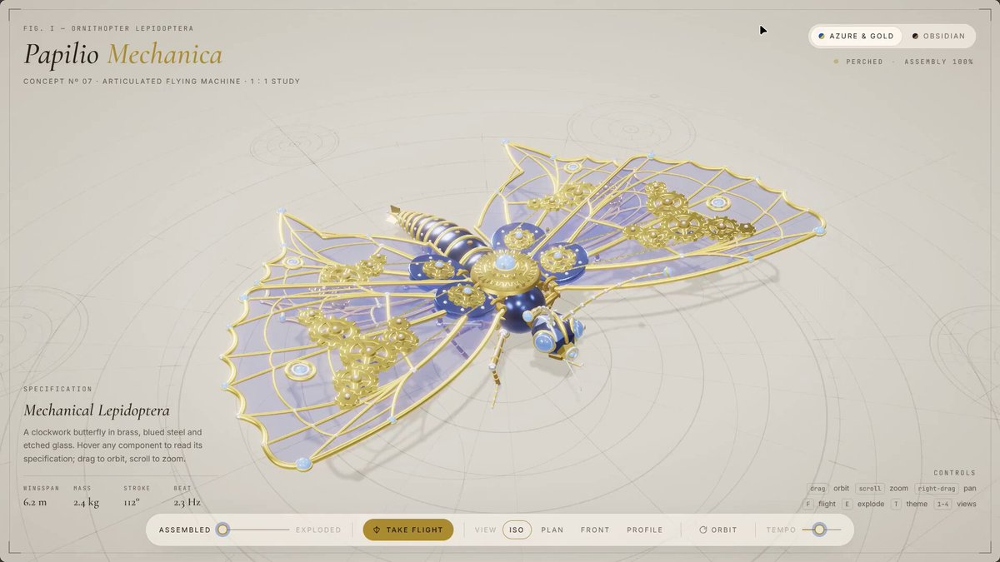

<a name="prompt-2102349105724846399"></a>

### 在 Three.js 中构建一只精美的机械蝴蝶。

作者：[@AIBoticssq](https://x.com/AIBoticssq) · [查看 X 原帖](https://x.com/AIBoticssq/status/2102349105724846399)

3D 渲染 · 已推流

查看 X 原帖：[@AIBoticssq](https://x.com/AIBoticssq) · [查看 X 原帖](https://x.com/AIBoticssq/status/2100916466694414727)

**概括:** 在 Three.js 中构建一只精美的机械蝴蝶。



**提示词**

```text
在 Three.js 中构建一只精美的机械蝴蝶。
```
